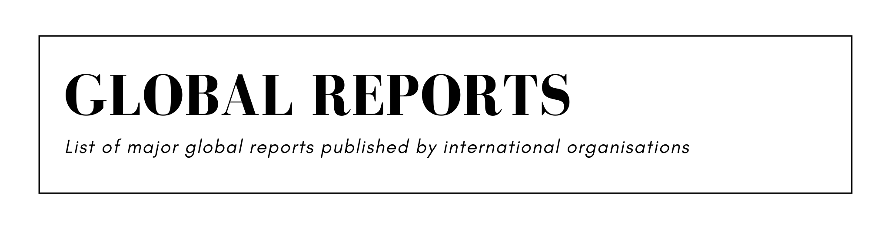

| Report   *former names in italic*                                                                                                                                                                     | Publisher                                         | Since     |
|:----------------------------------------------------------------------------------------------------------------------------------------------------------------------------------------------------------|:--------------------------------------------------|:----------|
| [Climate Transparency Report](https://www.climate-transparency.org/g20-climate-performance)   *Brown to Green Report*                                                                                 | Climate Transparency                              | 2015      |
| [Commodities and Development Report](https://unctad.org/publications-search?f[0]=product%3A588)                                                                                                           | UNCTAD                                            | 2012      |
| [Connecting to Compete](https://lpi.worldbank.org/report)                                                                                                                                                 | World Bank                                        | 2007      |
| [Corruption Perceptions Index](https://www.transparency.org/en/cpi)                                                                                                                                       | Transparency International                        | 1995      |
| [Death Sentences and Executions](https://www.amnesty.org/en/search/%22Death%20sentences%20and%20executions%22/)                                                                                           | Amnesty International                             | 1991      |
| [Democracy Index](https://www.eiu.com/n/?s=Democracy+Index&eiu_initial_search=1&nsi=cd74a060ea)                                                                                                           | Economist Intelligence Unit                       | 2006      |
| [Digital Economy Report](https://unctad.org/topic/ecommerce-and-digital-economy/digital-economy-report)   *Information Economy Report*                                                                | UNCTAD                                            | 2005      |
| [Doing Business](https://www.worldbank.org/en/businessready/doing-business-legacy)                                                                                                                        | World Bank                                        | 2004–2020 |
| [E-Government Survey](https://publicadministration.desa.un.org/publications/category/UN%20E-Government%20Surveys)   *Benchmarking E-government*                                                       | UNDESA                                            | 2001      |
| [Ecological Threat Report](https://www.visionofhumanity.org/maps/ecological-threat-report)                                                                                                                | Institute for Economics & Peace                   | 2020      |
| [Emissions Gap Report](https://www.unep.org/resources/emissions-gap-report)                                                                                                                               | UNEP                                              | 2010      |
| [Enabling the Business of Agriculture](https://eba.worldbank.org/en/reports)                                                                                                                              | World Bank                                        | 2015–2019 |
| [Energy Technology Perspectives](https://www.iea.org/reports/energy-technology-perspectives-2023#previous-editions)                                                                                       | International Energy Agency                       | 2006      |
| [Environmental Performance Index](https://epi.yale.edu/)                                                                                                                                                  | Yale University, Columbia University              | 2006      |
| [External Sector Report](https://www.imf.org/en/Publications/SPROLLs/External-Sector-Reports)                                                                                                             | International Monetary Fund                       | 2012      |
| [Financing for Sustainable Development Report](https://financing.desa.un.org/iatf/home/)   *Financing for Development*                                                                                | UNDESA                                            | 2016      |
| [Fiscal Monitor](https://www.imf.org/en/Publications/FM)                                                                                                                                                  | International Monetary Fund                       | 2009      |
| [Freedom in the World](https://freedomhouse.org/report/freedom-world)                                                                                                                                     | Freedom House                                     | 1978      |
| [Freedom on the Net](https://freedomhouse.org/report/freedom-net)                                                                                                                                         | Freedom House                                     | 2009      |
| [Frontiers](https://www.unep.org/resources/frontiers)                                                                                                                                                     | UNEP                                              | 2016      |
| [Global Assessment Report on Disaster Risk Reduction](https://www.undrr.org/gar)                                                                                                                          | UNDRR                                             | 2009      |
| [Global Catastrophic Risks](https://globalchallenges.org/library-archive/?category=reports-and-briefs)                                                                                                    | Global Challenges Foundation                      | 2016      |
| [Global Childhood Report](https://resourcecentre.savethechildren.net/)   *End of Childhood Report*                                                                                                    | Save the Children                                 | 2017      |
| [Global Corruption Barometer](https://www.transparency.org/en/gcb)                                                                                                                                        | Transparency International                        | 2003      |
| [Global Corruption Report](https://www.transparency.org/en/)                                                                                                                                              | Transparency International                        | 2001–2016 |
| [Global Cybersecurity Index](https://www.itu.int/en/ITU-D/Cybersecurity/Pages/global-cybersecurity-index.aspx)                                                                                            | UNITU                                             | 2015      |
| [Global Drug Survey](https://www.globaldrugsurvey.com/)                                                                                                                                                   | Global Drug Survey                                | 2014      |
| [Global Economic Prospects](https://www.worldbank.org/en/publication/global-economic-prospects)                                                                                                           | World Bank                                        | 1991      |
| [Global Education Monitoring Report](https://www.unesco.org/gem-report/en/publications)   *Education for All Global Monitoring Report*                                                                | UNESCO                                            | 2002      |
| [Global Energy Review](https://www.iea.org/search/analysis?q=global%20energy%20review)   *Global Energy & CO2 Status Report*                                                                          | International Energy Agency                       | 2017      |
| [Global Environment Outlook](https://www.unep.org/publications-data)                                                                                                                                      | UNEP                                              | 1997      |
| [Global Financial Development Report](https://www.worldbank.org/en/publication/gfdr)                                                                                                                      | World Bank                                        | 2013–2020 |
| [Global Financial Stability Report](https://www.imf.org/en/publications/gfsr)                                                                                                                             | International Monetary Fund                       | 2002      |
| [Global Food Policy Report](https://gfpr.ifpri.info/)                                                                                                                                                     | International Food Policy Research Institute      | 2011      |
| [Global Food Security Index](https://impact.economist.com/sustainability/project/food-security-index/)                                                                                                    | Economist Impact                                  | 2012      |
| [Global Gender Gap Report](https://www.weforum.org/search/?query=Global+Gender+Gap+Report)                                                                                                                | World Economic Forum                              | 2006      |
| [Global Girlhood Report](https://resourcecentre.savethechildren.net/)                                                                                                                                     | Save the Children                                 | 2020      |
| [Global Hunger Index](https://www.globalhungerindex.org/)                                                                                                                                                 | Concern Worldwide, Welthungerhilfe                | 2006      |
| [Global Innovation Index](https://www.wipo.int/global_innovation_index/en/)                                                                                                                               | World Intellectual Property Organization          | 2007      |
| [Global Microscope](https://www.eiu.com/landing/Global-Microscope)                                                                                                                                        | Economist Intelligence Unit                       | 2009–2020 |
| [Global Multidimensional Poverty Index](https://ophi.org.uk/multidimensional-poverty-index/)                                                                                                              | Oxford Poverty and Human Development Initiative   | 2010      |
| [Global Nutrition Report](https://globalnutritionreport.org/)                                                                                                                                             | World Health Organization                         | 2014      |
| [Global Peace Index](https://www.visionofhumanity.org/resources/)                                                                                                                                         | Institute for Economics & Peace                   | 2007      |
| [Global Preparedness for Health Emergencies](https://www.gpmb.org/reports)                                                                                                                                | Global Preparedness Monitoring Board              | 2019      |
| [Global Report on Food Crises](https://www.fsinplatform.org/)                                                                                                                                             | Food Security Information Network                 | 2017      |
| [Global Report on Internal Displacement](https://www.internal-displacement.org/)                                                                                                                          | Internal Displacement Monitoring Centre           | 2016      |
| [Global Report on Trafficking in Persons](https://www.unodc.org/unodc/en/data-and-analysis/glotip.html)                                                                                                   | UNODC                                             | 2009      |
| [Global Retail Development Index](https://www.kearney.com/industry/consumer-retail/global-retail-development-index)                                                                                       | Kearney                                           | 2004      |
| [Global Slavery Index](https://www.walkfree.org/global-slavery-index/)                                                                                                                                    | Walk Free Foundation                              | 2013      |
| [Global Startup Ecosystem Report](https://startupgenome.com/)                                                                                                                                             | Startup Genome                                    | 2012      |
| [Global Study on Homicide](https://www.unodc.org/unodc/en/data-and-analysis/global-study-on-homicide.html)                                                                                                | UNODC                                             | 2011      |
| [Global Sustainable Development Report](https://sdgs.un.org/gsdr)                                                                                                                                         | UNDESA                                            | 2014      |
| [Global Talent Competitiveness Index](https://www.insead.edu/global-talent-competitiveness-index)                                                                                                         | INSEAD                                            | 2013      |
| [Global Terrorism Index](https://www.visionofhumanity.org/resources/)                                                                                                                                     | Institute for Economics & Peace                   | 2012      |
| [Global Trends](https://www.ipsos.com/en/global-trends)                                                                                                                                                   | Ipsos                                             | 2014      |
| [Global Trends in Forced Displacement](https://www.unhcr.org/global-trends)   *Global Refugee Trends*                                                                                                 | UNHCR                                             | 2003      |
| [Global Wage Report](https://www.ilo.org/global/publications/lang--en/index.htm)                                                                                                                          | International Labour Organization                 | 2008      |
| [Global Wealth Report](https://www.credit-suisse.com/about-us/en/reports-research/global-wealth-report.html)                                                                                              | Credit Suisse Research Institute                  | 2010      |
| [Goalkeepers Report](https://www.gatesfoundation.org/goalkeepers/)                                                                                                                                        | Bill & Melinda Gates Foundation                   | 2017      |
| [How's Life?](https://www.oecd-ilibrary.org/economics/how-s-life_23089679)                                                                                                                                | OECD                                              | 2011      |
| [Human Capital Index](https://www.worldbank.org/en/publication/human-capital)                                                                                                                             | World Bank                                        | 2013      |
| [Human Development Report](https://hdr.undp.org/reports-and-publications)                                                                                                                                 | UNDP                                              | 1990      |
| [Human Freedom Index](https://www.cato.org/search/category/human-freedom-index)                                                                                                                           | Cato Institute, Fraser Institute                  | 2015      |
| [Industrial Development Report](https://www.unido.org/publications/industrial-development-report-series)                                                                                                  | UNIDO                                             | 2002      |
| [International Debt Statistics](https://openknowledge.worldbank.org/collections/8f676469-d666-503c-98c7-31495fc450ab)   *Global Development Finance*                                                  | World Bank                                        | 2005      |
| [International IP Index](https://www.valueingenuity.com/ip-index/)                                                                                                                                        | Global Innovation Policy Center                   | 2012      |
| [Levels and Trends in Child Mortality Report](https://childmortality.org/)                                                                                                                                | UNIGME                                            | 2006      |
| [Living Planet Report](https://livingplanet.panda.org/)                                                                                                                                                   | World Wildlife Fund                               | 1998      |
| [Measuring the Information Society](https://www.itu.int/pub/D-IND-ICTOI)                                                                                                                                  | UNITU                                             | 2007–2018 |
| [Millennium Development Goals Report](https://www.un.org/millenniumgoals/reports.shtml)                                                                                                                   | UN                                                | 2005–2015 |
| [Nuclear Technology Review](https://www.iaea.org/publications/reports)                                                                                                                                    | International Atomic Energy Agency                | 2002      |
| [Outlook on the Global Agenda](https://www.weforum.org/search/?query=Outlook+on+the+Global+Agenda)                                                                                                        | World Economic Forum                              | 2011–2015 |
| [Paying Taxes](https://www.pwc.com/gx/en/services/tax/publications/paying-taxes-2020.html)                                                                                                                | PwC, World Bank                                   | 2007–2020 |
| [PISA](https://www.oecd.org/pisa/publications/)                                                                                                                                                           | OECD                                              | 2000      |
| [Positive Peace Report](https://www.visionofhumanity.org/resources/)                                                                                                                                      | Institute for Economics & Peace                   | 2017      |
| [Postal Development Report](https://www.upu.int/en/Universal-Postal-Union/Activities/Research-Publications/Integrated-Index-for-Postal-Development)                                                       | Universal Postal Union                            | 2017      |
| [Reshaping Cultural Policies](https://www.unesco.org/creativity/en/publications)                                                                                                                          | UNESCO                                            | 2015      |
| [Review of Maritime Transport](https://unctad.org/topic/transport-and-trade-logistics/review-of-maritime-transport)                                                                                       | UNCTAD                                            | 1968      |
| [Rural Development Report](https://www.ifad.org/ruraldevelopmentreport/)   *Rural Poverty Report*                                                                                                     | International Fund for Agricultural Development   | 2001      |
| [Social Progress Index](https://www.socialprogress.org/)                                                                                                                                                  | Social Progress Imperative                        | 2014      |
| [State and Trends of Carbon Pricing](https://openknowledge.worldbank.org/collections/d9ab9a14-0168-54e9-9ff2-b84a1c83fb43)   *State and Trends of the Carbon Market*                                  | World Bank                                        | 2003      |
| [State of Global Air](https://www.stateofglobalair.org/)                                                                                                                                                  | Health Effects Institute                          | 2017      |
| [State of Global Aviation Safety](https://www.icao.int/safety/Pages/Safety-Report.aspx)                                                                                                                   | International Civil Aviation Organization         | 2011      |
| [State of the Global Climate](https://library.wmo.int/records/?refine[Collection][]=General+Information%24%24%24Climate+Statements%24%24%24Global%3A+Annual)                                              | World Meteorological Organisation                 | 1993      |
| [State of the World's Mothers](https://resourcecentre.savethechildren.net/)                                                                                                                               | State of the World's Mothers                      | 2000–2015 |
| [State of World Population](https://www.unfpa.org/publications)                                                                                                                                           | UNFPA                                             | 1998      |
| [Technology and Innovation Report](https://unctad.org/topic/science-technology-and-innovation/technology-innovation-report)                                                                               | UNCTAD                                            | 2010      |
| [The Future of Jobs Report](https://www.weforum.org/publications/)                                                                                                                                        | World Economic Forum                              | 2016      |
| [The Global Competitiveness Report](https://www.weforum.org/publications/)                                                                                                                                | World Economic Forum                              | 2008      |
| [The Global E-waste Monitor](https://ewastemonitor.info/global-e-waste-monitors/)                                                                                                                         | UNITAR                                            | 2014      |
| [The Global Enabling Trade Report](https://www.weforum.org/publications/)                                                                                                                                 | World Economic Forum                              | 2008–2016 |
| [The Global Risks Report](https://www.weforum.org/global-risks/archive/)   *Global Risks*                                                                                                             | World Economic Forum                              | 2006      |
| [The Least Developed Countries Report](https://unctad.org/publications-search?f[0]=product%3A392)                                                                                                         | UNCTAD                                            | 1995      |
| [The Network Readiness Index](https://networkreadinessindex.org/)   *The Global Information Technology Report*                                                                                        | Portulans Institute                               | 2001      |
| [The Space Report](https://www.thespacereport.org/)                                                                                                                                                       | Space Foundation                                  | 2018      |
| [The State of Agricultural Commodity Markets](https://www.fao.org/publications/home/fao-flagship-publications/the-state-of-agricultural-commodity-markets/en)                                             | UNFAO                                             | 2004      |
| [The State of Artistic Freedom](https://freemuse.org/)                                                                                                                                                    | Freemuse                                          | 2018      |
| [The State of Food and Agriculture](https://www.fao.org/publications/home/fao-flagship-publications/the-state-of-food-and-agriculture/en)                                                                 | UNFAO                                             | 1947      |
| [The State of Food Security and Nutrition](https://www.fao.org/publications/home/fao-flagship-publications/the-state-of-food-security-and-nutrition-in-the-world/en)   *The State of Food Insecurity* | UNFAO                                             | 1999      |
| [The State of the World's Human Rights](https://www.amnesty.org/en/search/The%20State%20of%20the%20World%27s%20Human%20Rights/)   *Amnesty International Report*                                      | Amnesty International                             | 1961      |
| [The State of the World’s Children](https://www.unicef.org/reports/state-of-worlds-children)                                                                                                              | UNICEF                                            | 1980      |
| [The State of the World’s Forests](https://www.fao.org/publications/home/fao-flagship-publications/the-state-of-the-worlds-forests/en)                                                                    | UNFAO                                             | 1995      |
| [The State of World Fisheries and Aquaculture](https://www.fao.org/publications/home/fao-flagship-publications/the-state-of-world-fisheries-and-aquaculture/en)                                           | UNFAO                                             | 1994      |
| [The Sustainable Development Goals Report](https://unstats.un.org/sdgs)                                                                                                                                   | UNDESA                                            | 2016      |
| [The World's Women](https://unstats.un.org/unsd/demographic-social/products/worldswomen/index.cshtml)                                                                                                     | UNDESA                                            | 1970      |
| [Trade and Development Report](https://unctad.org/topic/macroeconomics/trade-development-report)                                                                                                          | UNCTAD                                            | 1981      |
| [Travel & Tourism Development Index](https://www.weforum.org/publications/)   *The Travel & Tourism Competitiveness Report*                                                                           | World Economic Forum                              | 2008      |
| [Trends in International Arms Transfers](https://www.sipri.org/publications)                                                                                                                              | Stockholm International Peace Research Institute  | 2008      |
| [Trends in World Military Expenditure](https://www.sipri.org/publications)                                                                                                                                | Stockholm International Peace Research Institute  | 2012      |
| [UNESCO Science Report](https://www.unesco.org/reports/science/2021/en/report-series)   *World Science Report*                                                                                        | UNESCO                                            | 1993      |
| [Uranium: Resources, Production and Demand (Red Book)](https://www.oecd-ilibrary.org/nuclear-energy/uranium_20725310)                                                                                     | OECD                                              | 2009      |
| [Women, Business and the Law](https://wbl.worldbank.org/en/reports)                                                                                                                                       | World Bank                                        | 2010      |
| [World Air Quality Report](https://www.iqair.com/world-most-polluted-cities)                                                                                                                              | IQAir                                             | 2018      |
| [World Cities Report](https://unhabitat.org/wcr/)   *State of the World's Cities*                                                                                                                     | UNHABITAT                                         | 2001      |
| [World Development Report](https://www.worldbank.org/en/publication/wdr/wdr-archive)                                                                                                                      | World Bank                                        | 1978      |
| [World Drug Report](https://www.unodc.org/unodc/en/data-and-analysis/drug-use-new.html)   *Global Illicit Drug Trends*                                                                                | UNODC                                             | 1997      |
| [World Economic League Table](https://cebr.com/?s=World+Economic+League+Table)                                                                                                                            | Centre for Economics and Business Research        | 2010      |
| [World Economic Outlook](https://www.imf.org/en/publications/weo)                                                                                                                                         | International Monetary Fund                       | 1993      |
| [World Economic Situation and Prospects](https://unctad.org/publications-search?Operator=and&keys=World+Economic+Situation+and+Prospects)                                                                 | UNDESA                                            | 1999      |
| [World Employment and Social Outlook](https://www.ilo.org/global/publications/books/lang--en/index.htm)   *World of Work*                                                                             | International Labour Organization                 | 2008      |
| [World Energy Investment](https://www.iea.org/search/analysis?q=%22world%20energy%20investment%22)                                                                                                        | International Energy Agency                       | 2016      |
| [World Energy Outlook](https://www.iea.org/search?q=World%20Energy%20Outlook)                                                                                                                             | International Energy Agency                       | 2006      |
| [World Happiness Report](https://worldhappiness.report/)                                                                                                                                                  | Sustainable Development Solutions Network         | 2012      |
| [World Health Report](https://www.who.int/publications)                                                                                                                                                   | World Health Organization                         | 1995–2013 |
| [World Health Statistics](https://www.who.int/data/gho/publications/world-health-statistics)                                                                                                              | World Health Organization                         | 2005      |
| [World Inequality Report](https://inequalitylab.world/en/)                                                                                                                                                | World Inequality Lab                              | 2018      |
| [World Intellectual Property Report](https://www.wipo.int/publications/en/series/index.jsp?id=38)                                                                                                         | World Intellectual Property Organization          | 2011      |
| [World Investment Report](https://unctad.org/topic/investment/world-investment-report)                                                                                                                    | UNCTAD                                            | 1991      |
| [World Migration Report](https://worldmigrationreport.iom.int/all-world-migration-reports)                                                                                                                | International Organization for Migration          | 2000      |
| [World Oil Outlook](https://www.opec.org/opec_web/en/publications/340.htm)                                                                                                                                | OPEC                                              | 2007      |
| [World Public Sector Report](https://publicadministration.desa.un.org/publications/category/World%20Public%20Sector%20Reports)                                                                            | UNDESA                                            | 2001      |
| [World Social Protection Report](https://www.ilo.org/global/research/global-reports/lang--en/index.htm)                                                                                                   | International Labour Organization                 | 2014      |
| [World Social Report](https://social.desa.un.org/wsr-reports)   *Report on the World Social Situation*                                                                                                | UNDESA                                            | 1997      |
| [World Social Science Report](https://unesdoc.unesco.org/)                                                                                                                                                | UNESCO                                            | 1999–2016 |
| [World Trade Report](https://www.wto.org/english/res_e/reser_e/wtr_e.htm)                                                                                                                                 | World Trade Organization                          | 2003      |
| [World Trade Statistical Review](https://www.wto.org/english/res_e/statis_e/wts_e.htm)                                                                                                                    | World Trade Organization                          | 2016      |
| [World Water Development Report](https://www.unesco.org/en/wwap/wwdr)                                                                                                                                     | UNESCO                                            | 2003      |
| [World Wealth Report](https://www.capgemini.com/insights/research-library/world-wealth-report/)                                                                                                           | Capgemini                                         | 1997      |
| [World Wildlife Crime Report](https://www.unodc.org/unodc/en/data-and-analysis/wildlife.html)                                                                                                             | UNODC                                             | 2016      |
| [World Youth Report](https://social.desa.un.org/issues/youth/united-nations-world-youth-report-wyr)                                                                                                       | UNDESA                                            | 2003      |
| [WorldRiskReport](https://weltrisikobericht.de/en/)                                                                                                                                                       | Bündnis Entwicklung Hilft, Ruhr University Bochum | 2011      |

