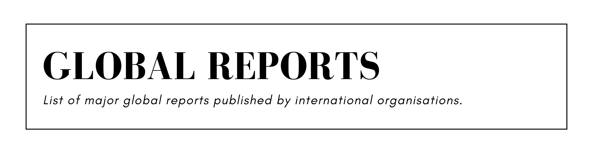

## Table of Contents

- [A World at Risk](#a-world-at-risk)
- [Brown to Green Report](#brown-to-green-report)
- [Commodities and Development Report](#commodities-and-development-report)
- [Connecting to Compete](#connecting-to-compete)
- [Corruption Perceptions Index](#corruption-perceptions-index)
- [Death Sentences and Executions](#death-sentences-and-executions)
- [Democracy Index](#democracy-index)
- [Digital Economy Report](#digital-economy-report)
- [Doing Business](#doing-business)
- [Education for All Global Monitoring Report](#education-for-all-global-monitoring-report)
- [E-Government Survey](#e-government-survey)
- [Emissions Gap Report](#emissions-gap-report)
- [Enabling the Business of Agriculture](#enabling-the-business-of-agriculture)
- [Energy Progress Report](#energy-progress-report)
- [Energy Technology Perspectives](#energy-technology-perspectives)
- [Environmental Performance Index](#environmental-performance-index)
- [External Sector Report](#external-sector-report)
- [Financing for Sustainable Development Report](#financing-for-sustainable-development-report)
- [Freedom in the World](#freedom-in-the-world)
- [Freedom on the Net](#freedom-on-the-net)
- [Frontiers](#frontiers)
- [Global Assessment Report on Disaster Risk Reduction](#global-assessment-report-on-disaster-risk-reduction)
- [Global Catastrophic Risks](#global-catastrophic-risks)
- [Global Childhood Report](#global-childhood-report)
- [Global Corruption Barometer](#global-corruption-barometer)
- [Global Corruption Report](#global-corruption-report)
- [Global Cybersecurity Index](#global-cybersecurity-index)
- [Global Drug Survey](#global-drug-survey)
- [Global Education Monitoring Report](#global-education-monitoring-report)
- [Global Energy Review](#global-energy-review)
- [Global Environment Outlook](#global-environment-outlook)
- [Global Financial Development Report](#global-financial-development-report)
- [Global Food Policy Report](#global-food-policy-report)
- [Global Food Security Index](#global-food-security-index)
- [Global Gender Gap Report](#global-gender-gap-report)
- [Global Hunger Index](#global-hunger-index)
- [Global Sustainable Development Report](#global-sustainable-development-report)
- [Global Trends](#global-trends)
- [Global Wage Report](#global-wage-report)
- [How's Life?](#hows-life)
- [Human Development Report](#human-development-report)
- [International Debt Statistics](#international-debt-statistics)
- [Paying Taxes](#paying-taxes)
- [PISA](#pisa)
- [Postal Development Report](#postal-development-report)
- [Re|Shaping Cultural Policies](#reshaping-cultural-policies)
- [Review of Maritime Transport](#review-of-maritime-transport)
- [State and Trends of Carbon Pricing](#state-and-trends-of-carbon-pricing)
- [State of the World's Mothers](#state-of-the-worlds-mothers)
- [Technology and Innovation Report](#technology-and-innovation-report)
- [The Future of Jobs Report](#the-future-of-jobs-report)
- [The Global Competitiveness Report](#the-global-competitiveness-report)
- [The Global E-waste Monitor](#the-global-e-waste-monitor)
- [The Global Enabling Trade Report](#the-global-enabling-trade-report)
- [The Global Risks Report](#the-global-risks-report)
- [The Least Developed Countries Report](#the-least-developed-countries-report)
- [The Network Readiness Index](#the-network-readiness-index)
- [The State of Agricultural Commodity Markets](#the-state-of-agricultural-commodity-markets)
- [The State of Artistic Freedom](#the-state-of-artistic-freedom)
- [The State of Food and Agriculture](#the-state-of-food-and-agriculture)
- [The State of Food Security and Nutrition](#the-state-of-food-security-and-nutrition)
- [The State of the World's Human Rights](#the-state-of-the-worlds-human-rights)
- [The State of the World’s Forests](#the-state-of-the-worlds-forests)
- [The State of World Fisheries and Aquaculture](#the-state-of-world-fisheries-and-aquaculture)
- [The Sustainable Development Goals Report](#the-sustainable-development-goals-report)
- [The Travel & Tourism Competitiveness Report](#the-travel--tourism-competitiveness-report)
- [The World's Women](#the-worlds-women)
- [Tracking Clean Energy Progress](#tracking-clean-energy-progress)
- [Trade and Development Report](#trade-and-development-report)
- [UNESCO Science Report](#unesco-science-report)
- [UNHCR Global Report](#unhcr-global-report)
- [UNHCR Global Trends](#unhcr-global-trends)
- [Women, Business and the Law](#women-business-and-the-law)
- [World Development Report](#world-development-report)
- [World Economic Situation and Prospects](#world-economic-situation-and-prospects)
- [World Employment and Social Outlook](#world-employment-and-social-outlook)
- [World Energy Outlook](#world-energy-outlook)
- [World Happiness Report](#world-happiness-report)
- [World Investment Report](#world-investment-report)
- [World Public Sector Report](#world-public-sector-report)
- [World Social Protection Report](#world-social-protection-report)
- [World Social Report](#world-social-report)
- [World Social Science Report](#world-social-science-report)
- [World Water Development Report](#world-water-development-report)
- [World Youth Report](#world-youth-report)
- [Worldwide Cost of Living](#worldwide-cost-of-living)

## A World at Risk

> Global Preparedness Monitoring Board ([source](https://apps.who.int/gpmb/annual_report.html))

- 2019 A World at Risk – Annual report on global preparedness for health emergencies ([full](https://apps.who.int/gpmb/assets/annual_report/GPMB_Annual_Report_English.pdf), [summary](https://apps.who.int/gpmb/assets/annual_report/GPMB_Annual_Report_Exec_Summary_Foreword_and_About_English.pdf), [web](https://apps.who.int/gpmb/annual_report.html))

## Brown to Green Report

> Climate Transparency ([source](https://www.climate-transparency.org/g20-climate-performance))

- 2019 Brown to Green Report – The G20 transition to a net-zero emissions economy ([full](https://www.climate-transparency.org/wp-content/uploads/2019/11/Brown-to-Green-Report-2019.pdf), [web](https://www.climate-transparency.org/g20-climate-performance/g20report2019))
- 2018 Brown to Green Report – The G20 transition to a low-carbon economy ([full](https://www.climate-transparency.org/wp-content/uploads/2019/01/2018-BROWN-TO-GREEN-REPORT-FINAL.pdf), [web](https://www.climate-transparency.org/g20-climate-performance/g20report2018))
- 2017 Brown to Green Report – The G20 transition to a low-carbon economy ([full](https://www.climate-transparency.org/wp-content/uploads/2017/07/Brown-to-Green-Report-2017_web.pdf), [web](https://www.climate-transparency.org/g20-climate-performance/g20report2017))
- 2016 Brown to Green Report – Assessing the G20 transition to a low-carbon economy ([full](https://www.climate-transparency.org/wp-content/uploads/2016/09/Brown-to-Green-Assessing-the-G20-transition-to-a-low-carbon-economy.pdf), [web](https://www.climate-transparency.org/g20-climate-performance/g20report2016))
- 2015 Brown to Green Report – G20 climate action: A turning point? ([full](https://www.climate-transparency.org/wp-content/uploads/2016/02/ClimTransp_FullReport_2015.pdf), [summary](https://www.climate-transparency.org/wp-content/uploads/2016/02/ClimTransp_Summary_2015.pdf), [web](https://www.climate-transparency.org/g20-climate-performance/g20report2015))

## Commodities and Development Report

> United Nations Conference on Trade and Development ([source](https://unctad.org/en/Pages/SUC/Commodities/Commodities-Strategic-Reports.aspx))

- 2019 Commodities and Development Report – Commodity dependence, climate change and the Paris Agreement ([full](https://unctad.org/en/PublicationsLibrary/ditccom2019d3_en.pdf), [web](https://unctad.org/en/pages/PublicationWebflyer.aspx?publicationid=2499))
- 2017 Commodities and Development Report – Commodity markets, economic growth and development ([full](https://unctad.org/en/PublicationsLibrary/suc2017d1_en.pdf), [summary](https://unctad.org/en/PublicationsLibrary/suc2017d1_overview_en.pdf), [web](https://unctad.org/en/pages/PublicationWebflyer.aspx?publicationid=1916))
- 2015 Commodities and Development Report – Smallholder farmers and sustainable commodity development ([full](https://unctad.org/en/PublicationsLibrary/suc2014d5_en.pdf), [web](https://unctad.org/en/pages/PublicationWebflyer.aspx?publicationid=1431))
- 2012 Commodities and Development Report – Perennial problems, new challenges and evolving perspectives ([full](https://unctad.org/en/PublicationsLibrary/suc2011d9_en.pdf), [summary](https://unctad.org/en/PublicationsLibrary/suc2011d9_overview_en.pdf), [web](https://unctad.org/en/pages/PublicationWebflyer.aspx?publicationid=503))

## Connecting to Compete

> World Bank Group ([source](https://openknowledge.worldbank.org/discover?rpp=10&etal=0&query=%22connecting+to+compete%22&scope=/&group_by=none&page=1&sort_by=score&order=desc))

- 2018 Connecting to Compete – Trade logistics in the global economy ([full](https://openknowledge.worldbank.org/bitstream/handle/10986/29971/LPI2018.pdf?sequence=1&isAllowed=y), [web](https://openknowledge.worldbank.org/handle/10986/29971))
- 2016 Connecting to Compete – Trade logistics in the global economy ([full](https://openknowledge.worldbank.org/bitstream/handle/10986/24598/Connecting0to00n0the0global0economy.pdf?sequence=1&isAllowed=y), [web](https://openknowledge.worldbank.org/handle/10986/24598))
- 2014 Connecting to Compete – Trade logistics in the global economy ([full](https://openknowledge.worldbank.org/bitstream/handle/10986/20399/904190WP0LPI0R00Box385316B00PUBLIC0.pdf?sequence=1&isAllowed=y), [web](https://openknowledge.worldbank.org/handle/10986/20399))
- 2012 Connecting to Compete – Trade logistics in the global economy ([full](https://openknowledge.worldbank.org/bitstream/handle/10986/12689/704170ESW00P120BLIC00LPI020120final.pdf?sequence=1&isAllowed=y), [web](https://openknowledge.worldbank.org/handle/10986/12689))
- 2010 Connecting to Compete – Trade logistics in the global economy ([full](https://openknowledge.worldbank.org/bitstream/handle/10986/24599/558520WP0P10181LIC10LPI20101for1web.pdf?sequence=1&isAllowed=y), [web](https://openknowledge.worldbank.org/handle/10986/24599))
- 2007 Connecting to Compete – Trade logistics in the global economy ([full](https://openknowledge.worldbank.org/bitstream/handle/10986/24600/430050WP0Conne1e0Box32734401PUBLIC1.pdf?sequence=1&isAllowed=y), [web](https://openknowledge.worldbank.org/handle/10986/24600))

## Corruption Perceptions Index

> Transparency International ([source](https://www.transparency.org/en/cpi))

- 2019 Corruption Perceptions Index ([full](https://images.transparencycdn.org/images/2019_CPI_Report_EN.pdf), [web](https://www.transparency.org/en/cpi/2019))
- 2018 Corruption Perceptions Index ([full](https://images.transparencycdn.org/images/2018_CPI_Executive_Summary.pdf), [web](https://www.transparency.org/en/cpi/2018))
- 2017 Corruption Perceptions Index ([full](https://images.transparencycdn.org/images/2017_CPI_Brochure_EN.pdf), [web](https://www.transparency.org/en/cpi/2017))
- 2016 Corruption Perceptions Index ([full](https://images.transparencycdn.org/images/2016_CPIReport_EN.pdf), [web](https://www.transparency.org/en/cpi/2016))
- 2015 Corruption Perceptions Index ([full](https://images.transparencycdn.org/images/2015_CorruptionPerceptionsIndex_Report_EN.pdf), [web](https://www.transparency.org/en/cpi/2015))
- 2014 Corruption Perceptions Index ([full](https://images.transparencycdn.org/images/2014_CPIBrochure_EN.pdf), [web](https://www.transparency.org/en/cpi/2014))
- 2013 Corruption Perceptions Index ([full](https://images.transparencycdn.org/images/2013_CPIBrochure_EN.pdf), [web](https://www.transparency.org/en/cpi/2013))
- 2012 Corruption Perceptions Index ([full](https://images.transparencycdn.org/images/2012_CPI_brochure_EN.pdf), [web](https://www.transparency.org/en/cpi/2012))
- 2011 Corruption Perceptions Index ([full](https://images.transparencycdn.org/images/2011_CPI_EN.pdf), [web](https://www.transparency.org/en/cpi/2011))
- 2010 Corruption Perceptions Index ([full](https://images.transparencycdn.org/images/2010_CPI_EN.pdf), [web](https://www.transparency.org/en/cpi/2010))
- 2009 Corruption Perceptions Index ([web](https://www.transparency.org/en/cpi/2009))
- 2008 Corruption Perceptions Index ([web](https://www.transparency.org/en/cpi/2008))
- 2007 Corruption Perceptions Index ([web](https://www.transparency.org/en/cpi/2007))
- 2006 Corruption Perceptions Index ([web](https://www.transparency.org/en/cpi/2006))
- 2005 Corruption Perceptions Index ([web](https://www.transparency.org/en/cpi/2005))
- 2004 Corruption Perceptions Index ([web](https://www.transparency.org/en/cpi/2004))
- 2003 Corruption Perceptions Index ([web](https://www.transparency.org/en/cpi/2003))
- 2002 Corruption Perceptions Index ([web](https://www.transparency.org/en/cpi/2002))
- 2001 Corruption Perceptions Index ([web](https://www.transparency.org/en/cpi/2001))
- 2000 Corruption Perceptions Index ([web](https://www.transparency.org/en/cpi/2000))
- 1999 Corruption Perceptions Index ([web](https://www.transparency.org/en/cpi/1999))
- 1998 Corruption Perceptions Index ([web](https://www.transparency.org/en/cpi/1998))
- 1997 Corruption Perceptions Index ([full](https://images.transparencycdn.org/images/1997_CPI_EN_200407_145431.pdf), [web](https://www.transparency.org/en/cpi/1997))
- 1996 Corruption Perceptions Index ([full](https://images.transparencycdn.org/images/1996_CPI_EN.pdf), [web](https://www.transparency.org/en/cpi/1996))
- 1995 Corruption Perceptions Index ([full](https://images.transparencycdn.org/images/1995_CPI_EN.pdf), [web](https://www.transparency.org/en/cpi/1995))

## Death Sentences and Executions

> Amnesty International ([source](https://www.amnesty.org/en/search/?q=%22Death+Sentences+and+Executions%22&sort=date&issue=1583&documentType=Annual+Report&documentType=Report))

- 2019 Death Sentences and Executions ([full](https://www.amnesty.org/download/Documents/ACT5018472020ENGLISH.PDF), [web](https://www.amnesty.org/en/documents/act50/1847/2020/en/))
- 2018 Death Sentences and Executions ([full](https://www.amnesty.org/download/Documents/ACT5098702019ENGLISH.PDF), [web](https://www.amnesty.org/en/documents/act50/9870/2019/en/))
- 2017 Death Sentences and Executions ([full](https://www.amnesty.org/download/Documents/ACT5079552018ENGLISH.PDF), [web](https://www.amnesty.org/en/documents/act50/7955/2018/en/))
- 2016 Death Sentences and Executions ([full](https://www.amnesty.org/download/Documents/ACT5057402017ENGLISH.PDF), [web](https://www.amnesty.org/en/documents/act50/5740/2017/en/))
- 2015 Death Sentences and Executions ([full](https://www.amnesty.org/download/Documents/ACT5034872016ENGLISH.PDF), [web](https://www.amnesty.org/en/documents/act50/3487/2016/en/))
- 2014 Death Sentences and Executions ([full](https://www.amnesty.org/download/Documents/ACT5000012015ENGLISH.PDF), [web](https://www.amnesty.org/en/documents/act50/0001/2015/en/))
- 2013 Death Sentences and Executions ([full](https://www.amnesty.org/download/Documents/4000/act500012014en.pdf), [web](https://www.amnesty.org/en/documents/act50/001/2014/en/))
- 2012 Death Sentences and Executions ([full](https://www.amnesty.org/download/Documents/8000/act500012013en.pdf), [web](https://www.amnesty.org/en/documents/act50/001/2013/en/))
- 2011 Death Sentences and Executions ([full](https://www.amnesty.org/download/Documents/16000/act500012012en.pdf), [web](https://www.amnesty.org/en/documents/act50/001/2012/en/))
- 2010 Death Sentences and Executions ([full](https://www.amnesty.org/download/Documents/24000/act500012011en.pdf), [web](https://www.amnesty.org/en/documents/act50/001/2011/en/))
- 2009 Death Sentences and Executions ([full](https://www.amnesty.org/download/Documents/36000/act500012010en.pdf), [web](https://www.amnesty.org/en/documents/act50/001/2010/en/))
- 2008 Death Sentences and Executions ([full](https://www.amnesty.org/download/Documents/44000/act500032009en.pdf), [web](https://www.amnesty.org/en/documents/act50/003/2009/en/))
- 2007 Death Sentences and Executions ([part 1](https://www.amnesty.org/download/Documents/48000/act500012008eng.pdf), [web](https://www.amnesty.org/en/documents/act50/001/2008/en/), [part 2](https://www.amnesty.org/download/Documents/ACT500022008ENGLISH.pdf), [web](https://www.amnesty.org/en/documents/act50/002/2008/en/))
- 2006 Death Sentences and Executions ([part 1](https://www.amnesty.org/download/Documents/56000/act500042007en.pdf), [web](https://www.amnesty.org/en/documents/act50/004/2007/en/), [part 2](https://www.amnesty.org/download/Documents/56000/act500052007en.pdf), [web](https://www.amnesty.org/en/documents/act50/005/2007/en/))
- 2005 Death Sentences and Executions ([part 1](https://www.amnesty.org/download/Documents/68000/act500022006en.pdf), [web](https://www.amnesty.org/en/documents/ACT50/002/2006/en/), [part 2](https://www.amnesty.org/download/Documents/68000/act500052006en.pdf), [web](https://www.amnesty.org/en/documents/act50/005/2006/en/))
- 2004 Death Sentences and Executions ([part 1](https://www.amnesty.org/download/Documents/80000/act500052005en.pdf), [web](https://www.amnesty.org/en/documents/ACT50/005/2005/en/), [part 2](https://www.amnesty.org/download/Documents/80000/act500012005en.pdf), [web](https://www.amnesty.org/en/documents/act50/001/2005/en/))
- 2003 Death Sentences and Executions ([part 1](https://www.amnesty.org/download/Documents/88000/act500062004en.pdf), [web](https://www.amnesty.org/en/documents/ACT50/006/2004/en/), [part 2](https://www.amnesty.org/download/Documents/88000/act500072004en.pdf), [web](https://www.amnesty.org/en/documents/act50/007/2004/en/))
- 2002 Death Sentences and Executions ([part 1](https://www.amnesty.org/download/Documents/100000/act510012003en.pdf), [web](https://www.amnesty.org/en/documents/ACT51/001/2003/en/), [part 2](https://www.amnesty.org/download/Documents/100000/act500022003en.pdf), [web](https://www.amnesty.org/en/documents/act50/002/2003/en/))
- 2001 Death Sentences and Executions ([part 1](https://www.amnesty.org/download/Documents/112000/act510012002en.pdf), [web](https://www.amnesty.org/en/documents/ACT51/001/2002/en/), [part 2](https://www.amnesty.org/download/Documents/ACT5000012002ENGLISH.PDF), [web](https://www.amnesty.org/en/documents/act50/0001/2002/en/))
- 2000 Death Sentences and Executions ([part 1](https://www.amnesty.org/download/Documents/120000/act510022001en.pdf), [web](https://www.amnesty.org/en/documents/ACT51/002/2001/en/), [part 2](https://www.amnesty.org/download/Documents/120000/act500012001en.pdf), [web](https://www.amnesty.org/en/documents/act50/001/2001/en/))
- 1999 Death Sentences and Executions ([part 1](https://www.amnesty.org/download/Documents/132000/act500082000en.pdf), [web](https://www.amnesty.org/en/documents/ACT50/008/2000/ar/), [part 2](https://www.amnesty.org/download/Documents/132000/act500042000en.pdf), [web](https://www.amnesty.org/en/documents/act50/004/2000/en/))
- 1998 Death Sentences and Executions ([part 1](https://www.amnesty.org/download/Documents/140000/act510011999en.pdf), [web](https://www.amnesty.org/en/documents/ACT51/001/1999/en/), [part 2](https://www.amnesty.org/download/Documents/140000/act500041999en.pdf), [web](https://www.amnesty.org/en/documents/act50/004/1999/en/))
- 1997 Death Sentences and Executions ([part 1](https://www.amnesty.org/download/Documents/148000/act510011998en.pdf), [web](https://www.amnesty.org/en/documents/ACT51/001/1998/en/), [part 2](https://www.amnesty.org/download/Documents/148000/act500041998en.pdf), [web](https://www.amnesty.org/en/documents/act50/004/1998/en/))
- 1996 Death Sentences and Executions ([part 1](https://www.amnesty.org/download/Documents/156000/act510011997en.pdf), [web](https://www.amnesty.org/en/documents/act51/001/1997/en/), [part 2](https://www.amnesty.org/download/Documents/156000/act500051997en.pdf), [web](https://www.amnesty.org/en/documents/act50/005/1997/en/))
- 1995 Death Sentences and Executions ([part 1](https://www.amnesty.org/download/Documents/ACT510011996ENGLISH.pdf), [web](https://www.amnesty.org/en/documents/ACT51/001/1996/en/), [part 2](https://www.amnesty.org/download/Documents/164000/act500071996en.pdf), [web](https://www.amnesty.org/en/documents/act50/007/1996/en/))
- 1994 Death Sentences and Executions ([part 1](https://www.amnesty.org/download/Documents/172000/act510011995en.pdf), [web](https://www.amnesty.org/en/documents/ACT51/001/1995/en/), [part 2](https://www.amnesty.org/download/Documents/172000/act500071995en.pdf), [web](https://www.amnesty.org/en/documents/act50/007/1995/en/))
- 1993 Death Sentences and Executions ([full](https://www.amnesty.org/download/Documents/184000/act510011994en.pdf), [web](https://www.amnesty.org/en/documents/act51/001/1994/en/))
- 1992 Death Sentences and Executions ([full](https://www.amnesty.org/download/Documents/192000/act510011993en.pdf), [web](https://www.amnesty.org/en/documents/ACT51/001/1993/en/))
- 1991 Death Sentences and Executions ([full](https://www.amnesty.org/download/Documents/196000/act510011992en.pdf), [web](https://www.amnesty.org/en/documents/act51/001/1992/en/))

## Democracy Index

> Economist Intelligence Unit ([source](https://www.eiu.com/topic/democracy-index))

- 2019 Democracy Index – A year of democratic setbacks and popular protest ([full](https://www.in.gr/wp-content/uploads/2020/01/Democracy-Index-2019.pdf), [web](https://www.eiu.com/public/topical_report.aspx?campaignid=democracyindex2019))
- 2018 Democracy Index – Me too? Political participation, protest and democracy ([full](https://275rzy1ul4252pt1hv2dqyuf-wpengine.netdna-ssl.com/wp-content/uploads/2019/01/Democracy_Index_2018.pdf), [web](https://www.eiu.com/public/topical_report.aspx?campaignid=Democracy2018))
- 2017 Democracy Index – Free speech under attack ([full](https://spcommreports.ohchr.org/TMResultsBase/DownLoadFile?gId=34079), [web](https://www.eiu.com/public/topical_report.aspx?campaignid=democracyindex2017))
- 2016 Democracy Index – Revenge of the “deplorables” ([full](https://www.transparency.org.nz/docs/2017/Democracy_Index_2016.pdf), [web](https://www.eiu.com/public/topical_report.aspx?campaignid=democracyindex2016))
- 2015 Democracy Index – Democracy in an age of anxiety ([full](https://www.yabiladi.com/img/content/EIU-Democracy-Index-2015.pdf), [web](https://www.eiu.com/public/topical_report.aspx?campaignid=democracyindex2015))
- 2014 Democracy Index – Democracy and its discontents  ([full](https://www.sudestada.com.uy/Content/Articles/421a313a-d58f-462e-9b24-2504a37f6b56/Democracy-index-2014.pdf), [web](https://www.eiu.com/public/topical_report.aspx?campaignid=Democracy0115))
- 2013 Democracy Index – Democracy in limbo ([full](https://thepeoplesconvention.org/wp-content/uploads/2015/04/TheEconomist-DemocracyIndex2013.pdf), [web](https://www.eiu.com/public/topical_report.aspx?campaignid=Democracy0814))
- 2012 Democracy Index – Democracy at a standstill ([full](https://civitanaorg.files.wordpress.com/2014/05/democracy-index-2012.pdf), [web](https://www.eiu.com/public/topical_report.aspx?campaignid=DemocracyIndex12))
- 2011 Democracy Index – Democracy under stress ([full](https://www.sida.se/globalassets/global/about-sida/sa-arbetar-vi/eiu_democracy_index_dec2011.pdf), [web](https://www.eiu.com/public/topical_report.aspx?campaignid=DemocracyIndex2011))
- 2010 Democracy Index – Democracy in retreat ([full](https://graphics.eiu.com/PDF/Democracy_Index_2010_web.pdf), [web](https://www.eiu.com/public/topical_report.aspx?campaignid=demo2010))
- 2009 n/a
- 2008 Democracy Index ([full](https://graphics.eiu.com/PDF/Democracy%20Index%202008.pdf))
- 2007 n/a
- 2006 Democracy Index ([full](https://www.economist.com/media/pdf/DEMOCRACY_INDEX_2007_v3.pdf))

## Digital Economy Report

> United Nations Conference on Trade and Development ([source](https://unctad.org/en/Pages/DTL/STI_and_ICTs/ICT4D-Report.aspx))

- 2019 Digital Economy Report – Value creation and capture: Implications for developing countries ([full](https://unctad.org/en/PublicationsLibrary/der2019_en.pdf), [summary](https://unctad.org/en/PublicationsLibrary/der2019_overview_en.pdf), [web](https://unctad.org/en/pages/PublicationWebflyer.aspx?publicationid=2466))
- 2017 Information Economy Report – Digitalization, trade and development ([full](https://unctad.org/en/PublicationsLibrary/ier2017_en.pdf), [summary](https://unctad.org/en/PublicationsLibrary/ier2017_overview_en.pdf), [web](https://unctad.org/en/pages/PublicationWebflyer.aspx?publicationid=1872))
- 2015 Information Economy Report – Unlocking the potential of e-commerce for developing countries ([full](https://unctad.org/en/PublicationsLibrary/ier2015_en.pdf), [summary](https://unctad.org/en/PublicationsLibrary/ier2015overview_en.pdf), [web](https://unctad.org/en/pages/PublicationWebflyer.aspx?publicationid=1146))
- 2013 Information Economy Report – The cloud economy and developing countries ([full](https://unctad.org/en/PublicationsLibrary/ier2013_en.pdf), [summary](https://unctad.org/en/PublicationsLibrary/ier2013overview_en.pdf), [web](https://unctad.org/en/pages/PublicationWebflyer.aspx?publicationid=710))
- 2012 Information Economy Report – The software industry and developing countries ([full](https://unctad.org/en/PublicationsLibrary/ier2012_en.pdf), [summary](https://unctad.org/en/PublicationsLibrary/ier2012overview_en.pdf), [web](https://unctad.org/en/pages/PublicationWebflyer.aspx?publicationid=271))
- 2011 Information Economy Report – ICTs as an enabler for private sector development ([full](https://unctad.org/en/PublicationsLibrary/ier2011_en.pdf), [summary](https://unctad.org/en/Docs/ier2011overview_en.pdf))
- 2010 Information Economy Report – ICTs, enterprises and poverty alleviation ([full](https://unctad.org/en/Docs/ier2010_en.pdf), [summary](https://unctad.org/en/Docs/ier2010overview_embargo2010_en.pdf), [web](https://unctad.org/en/pages/PublicationArchive.aspx?publicationid=1575))
- 2009 Information Economy Report – Trends and outlook in turbulent times ([full](https://unctad.org/en/Docs/ier2009_en.pdf), [web](https://unctad.org/en/pages/PublicationArchive.aspx?publicationid=1574))
- 2007/08 Information Economy Report – Science and technology for development: The new paradigm of ICT ([full](https://unctad.org/en/Docs/sdteecb20071_en.pdf), [summary](https://unctad.org/en/Docs/sdteecb20071overview_en.pdf), [web](https://unctad.org/en/pages/PublicationArchive.aspx?publicationid=1563))
- 2006 Information Economy Report – The development perspective ([full](https://unctad.org/en/Docs/sdteecb20061_en.pdf), [summary](https://unctad.org/en/Docs/sdteecb20061overview_en.pdf), [web](https://unctad.org/en/pages/PublicationArchive.aspx?publicationid=1549))
- 2005 Information Economy Report – ([full](https://unctad.org/en/Docs/sdteedc20051_en.pdf), [summary](https://unctad.org/en/Docs/sdteecb20051overview_en.pdf), [web](https://unctad.org/en/pages/PublicationArchive.aspx?publicationid=1540))

## Doing Business

> World Bank Group ([source](https://www.doingbusiness.org/en/reports/global-reports/doing-business-2020))

- 2020 Doing Business ([full](https://openknowledge.worldbank.org/bitstream/handle/10986/32436/9781464814402.pdf), [summary](https://openknowledge.worldbank.org/bitstream/handle/10986/32436/211440ov.pdf), [web](https://www.doingbusiness.org/en/reports/global-reports/doing-business-2020))
- 2019 Doing Business – Training for reform ([full](https://www.doingbusiness.org/content/dam/doingBusiness/media/Annual-Reports/English/DB2019-report_web-version.pdf), [summary](https://www.doingbusiness.org/content/dam/doingBusiness/media/Annual-Reports/English/DB19-Chapters/DB19-Overview.pdf), [web](https://www.doingbusiness.org/en/reports/global-reports/doing-business-2019))
- 2018 Doing Business – Reforming to create jobs ([full](https://www.doingbusiness.org/content/dam/doingBusiness/media/Annual-Reports/English/DB2018-Full-Report.pdf), [summary](https://www.doingbusiness.org/content/dam/doingBusiness/media/Annual-Reports/English/DB18-Chapters/DB18-Overview.pdf), [web](https://www.doingbusiness.org/en/reports/global-reports/doing-business-2018))
- 2017 Doing Business – Equal opportunity for all ([full](https://www.doingbusiness.org/content/dam/doingBusiness/media/Annual-Reports/English/DB17-Report.pdf), [summary](https://www.doingbusiness.org/content/dam/doingBusiness/media/Annual-Reports/English/DB17-Chapters/DB17-Overview.pdf), [web](https://www.doingbusiness.org/en/reports/global-reports/doing-business-2017))
- 2016 Doing Business – Measuring regulatory quality and efficiency ([full](https://www.doingbusiness.org/content/dam/doingBusiness/media/Annual-Reports/English/DB16-Full-Report.pdf), [summary](https://www.doingbusiness.org/content/dam/doingBusiness/media/Annual-Reports/English/DB16-Chapters/DB16-Overview.pdf), [web](https://www.doingbusiness.org/en/reports/global-reports/doing-business-2016))
- 2015 Doing Business – Going beyond efficiency ([full](https://www.doingbusiness.org/content/dam/doingBusiness/media/Annual-Reports/English/DB15-Full-Report.pdf), [summary](https://www.doingbusiness.org/content/dam/doingBusiness/media/Annual-Reports/English/DB15-Chapters/DB15-Overview.pdf), [web](https://www.doingbusiness.org/en/reports/global-reports/doing-business-2015))
- 2014 Doing Business – Understanding regulations for small and medium-size enterprises ([full](https://www.doingbusiness.org/content/dam/doingBusiness/media/Annual-Reports/English/DB14-Full-Report.pdf), [summary](https://www.doingbusiness.org/content/dam/doingBusiness/media/Annual-Reports/English/DB14-Chapters/DB14-Overview.pdf), [web](https://www.doingbusiness.org/en/reports/global-reports/doing-business-2014))
- 2013 Doing Business – Smarter regulations for small and medium-size enterprises ([full](https://www.doingbusiness.org/content/dam/doingBusiness/media/Annual-Reports/English/DB13-full-report.pdf), [summary](https://www.doingbusiness.org/content/dam/doingBusiness/media/Annual-Reports/English/DB13-Chapters/Executive-Summary.pdf), [web](https://www.doingbusiness.org/en/reports/global-reports/doing-business-2013))
- 2012 Doing Business – Doing business in a more transparent world ([full](https://www.doingbusiness.org/content/dam/doingBusiness/media/Annual-Reports/English/DB12-FullReport.pdf), [summary](https://www.doingbusiness.org/content/dam/doingBusiness/media/Annual-Reports/English/DB12-Chapters/Executive-Summary.pdf), [web](https://www.doingbusiness.org/en/reports/global-reports/doing-business-2012))
- 2011 Doing Business – Making a difference for entrepreneurs ([full](https://www.doingbusiness.org/content/dam/doingBusiness/media/Annual-Reports/English/DB11-FullReport.pdf), [summary](https://www.doingbusiness.org/content/dam/doingBusiness/media/Annual-Reports/English/DB11-Chapters/DB11-ExecSum.pdf), [web](https://www.doingbusiness.org/en/reports/global-reports/doing-business-2011))
- 2010 Doing Business – Reforming through difficult times ([full](https://www.doingbusiness.org/content/dam/doingBusiness/media/Annual-Reports/English/DB10-FullReport.pdf), [web](https://www.doingbusiness.org/en/reports/global-reports/doing-business-2010))
- 2009 Doing Business ([full](https://www.doingbusiness.org/content/dam/doingBusiness/media/Annual-Reports/English/DB09-FullReport.pdf), [web](https://www.doingbusiness.org/en/reports/global-reports/doing-business-2009))
- 2008 Doing Business ([full](https://www.doingbusiness.org/content/dam/doingBusiness/media/Annual-Reports/English/DB08-FullReport.pdf), [web](https://www.doingbusiness.org/en/reports/global-reports/doing-business-2008))
- 2007 Doing Business – How to reform ([full](https://www.doingbusiness.org/content/dam/doingBusiness/media/Annual-Reports/English/DB07-FullReport.pdf), [web](https://www.doingbusiness.org/en/reports/global-reports/doing-business-2007))
- 2006 Doing Business – Creating jobs ([full](https://www.doingbusiness.org/content/dam/doingBusiness/media/Annual-Reports/English/DB06-FullReport.pdf), [web](https://www.doingbusiness.org/en/reports/global-reports/doing-business-2006))
- 2005 Doing Business – Removing obstacles to growth ([full](https://www.doingbusiness.org/content/dam/doingBusiness/media/Annual-Reports/English/DB05-FullReport.pdf), [web](https://www.doingbusiness.org/en/reports/global-reports/doing-business-2005))
- 2004 Doing Business – Understanding regulations ([full](https://www.doingbusiness.org/content/dam/doingBusiness/media/Annual-Reports/English/DB04-FullReport.pdf), [web](https://www.doingbusiness.org/en/reports/global-reports/doing-business-2004))

## Education for All Global Monitoring Report

> UNESCO ([source](https://en.unesco.org/gem-report/allreports))

- 2015 EFA Global Monitoring Report – Education for All 2000–2015: Achievements and challenges ([full](https://unesdoc.unesco.org/ark:/48223/pf0000232205/PDF/232205eng.pdf.multi), [summary](https://unesdoc.unesco.org/ark:/48223/pf0000232565/PDF/232565eng.pdf.multi), [web](https://en.unesco.org/gem-report/report/2015/education-all-2000-2015-achievements-and-challenges))
  - Youth version ([full](https://unesdoc.unesco.org/ark:/48223/pf0000232581/PDF/232581eng.pdf.multi))
  - Gender summary ([full](https://unesdoc.unesco.org/ark:/48223/pf0000234809/PDF/234809eng.pdf.multi))
- 2013/2014 EFA Global Monitoring Report – Teaching and learning: Achieving quality for all ([full](https://unesdoc.unesco.org/ark:/48223/pf0000225660/PDF/225660eng.pdf.multi), [summary](https://unesdoc.unesco.org/ark:/48223/pf0000225654/PDF/225654eng.pdf.multi), [web](https://en.unesco.org/gem-report/report/2014/teaching-and-learning-achieving-quality-all))
  - Gender summary ([full](https://unesdoc.unesco.org/ark:/48223/pf0000226662/PDF/226662eng.pdf.multi))
- 2012 EFA Global Monitoring Report – Youth and skills: Putting education to work ([full](https://unesdoc.unesco.org/ark:/48223/pf0000218003/PDF/218003eng.pdf.multi), [summary](https://unesdoc.unesco.org/ark:/48223/pf0000217509/PDF/217509eng.pdf.multi), [web](https://en.unesco.org/gem-report/report/2012/youth-and-skills-putting-education-work))
  - Youth version ([full](https://unesdoc.unesco.org/ark:/48223/pf0000218409/PDF/218409eng.pdf.multi))
  - Gender overview ([full](https://unesdoc.unesco.org/ark:/48223/pf0000218569/PDF/218569eng.pdf.multi))
- 2011 EFA Global Monitoring Report – The Hidden crisis: Armed conflict and education ([full](https://unesdoc.unesco.org/ark:/48223/pf0000190743/PDF/190743eng.pdf.multi), [summary](https://unesdoc.unesco.org/ark:/48223/pf0000191186/PDF/191186eng.pdf.multi), [web](https://en.unesco.org/gem-report/report/2011/hidden-crisis-armed-conflict-and-education))
  - Gender overview ([full](https://unesdoc.unesco.org/ark:/48223/pf0000212003/PDF/212003eng.pdf.multi))
- 2010 EFA Global Monitoring Report – Reaching the marginalized ([full](https://unesdoc.unesco.org/ark:/48223/pf0000186606/PDF/186606eng.pdf.multi), [summary](https://unesdoc.unesco.org/ark:/48223/pf0000186525/PDF/186525eng.pdf.multi), [web](https://en.unesco.org/gem-report/report/2010/reaching-marginalized))
- 2009 EFA Global Monitoring Report – Overcoming inequality: Why governance matters ([full](https://unesdoc.unesco.org/ark:/48223/pf0000177683/PDF/177683eng.pdf.multi), [summary](https://unesdoc.unesco.org/ark:/48223/pf0000177609/PDF/177609eng.pdf.multi), [web](https://en.unesco.org/gem-report/report/2009/overcoming-inequality-why-governance-matters))
- 2008 EFA Global Monitoring Report – Education for All by 2015: Will we make it? ([full](https://unesdoc.unesco.org/ark:/48223/pf0000154743/PDF/154743eng.pdf.multi), [summary](https://unesdoc.unesco.org/ark:/48223/pf0000154820/PDF/154820eng.pdf.multi), [web](https://en.unesco.org/gem-report/report/2008/education-all-2015-will-we-make-it))
- 2007 EFA Global Monitoring Report – Strong foundations: Early childhood care and education ([full](https://unesdoc.unesco.org/ark:/48223/pf0000147794/PDF/147794eng.pdf.multi), [summary](https://unesdoc.unesco.org/ark:/48223/pf0000147785/PDF/147785eng.pdf.multi), [web](https://en.unesco.org/gem-report/report/2007/strong-foundations-early-childhood-care-education))
- 2006 EFA Global Monitoring Report – Literacy for life ([full](https://unesdoc.unesco.org/ark:/48223/pf0000141639/PDF/141639eng.pdf.multi), [summary](https://unesdoc.unesco.org/ark:/48223/pf0000144270/PDF/144270eng.pdf.multi), [web](https://en.unesco.org/gem-report/report/2006/literacy-life))
- 2005 EFA Global Monitoring Report – The quality imperative ([full](https://unesdoc.unesco.org/ark:/48223/pf0000137333/PDF/137333eng.pdf.multi), [summary](https://unesdoc.unesco.org/ark:/48223/pf0000137334/PDF/137334eng.pdf.multi), [web](https://en.unesco.org/gem-report/report/2005/education-all-quality-imperative))
- 2003/04 EFA Global Monitoring Report – Gender and education for all: The leap to equality ([full](https://unesdoc.unesco.org/ark:/48223/pf0000132513/PDF/132513eng.pdf.multi), [summary](https://unesdoc.unesco.org/ark:/48223/pf0000132550/PDF/132550eng.pdf.multi), [web](https://en.unesco.org/gem-report/report/2003/gender-and-education-all-leap-equality))
- 2002 EFA Global Monitoring Report – Education for All: Is the world on track? ([full](https://unesdoc.unesco.org/ark:/48223/pf0000129053/PDF/129053eng.pdf.multi), [summary](https://unesdoc.unesco.org/ark:/48223/pf0000129777/PDF/129777eng.pdf.multi), [web](https://en.unesco.org/gem-report/report/2002/education-all-world-track))

## E-Government Survey

> United Nations Department of Economic and Social Affairs ([source](https://publicadministration.un.org/en/Research/UN-e-Government-Surveys))

- 2020 E-Government Survey – Digital government in the decade of action for sustainable development ([full](https://publicadministration.un.org/egovkb/Portals/egovkb/Documents/un/2020-Survey/2020%20UN%20E-Government%20Survey%20(Full%20Report).pdf))
- 2018 E-Government Survey – Gearing e-government to support transformation towards sustainable and resilient societies ([full](https://publicadministration.un.org/egovkb/Portals/egovkb/Documents/un/2018-Survey/E-Government%20Survey%202018_FINAL%20for%20web.pdf))
- 2016 E-Government Survey – E-Government in support of sustainable development ([full](https://publicadministration.un.org/egovkb/Portals/egovkb/Documents/un/2016-Survey/E-Government%20Survey%202016.pdf))
- 2014 E-Government Survey – E-Government for the future we want  ([full](https://publicadministration.un.org/egovkb/Portals/egovkb/Documents/un/2014-Survey/E-Gov_Complete_Survey-2014.pdf))
- 2012 E-Government Survey – E-Government for the people ([full](https://publicadministration.un.org/egovkb/Portals/egovkb/Documents/un/2012-Survey/Complete-Survey.pdf))
- 2010 E-Government Survey – Leveraging e-government at a time of financial and economic crisis ([full](https://publicadministration.un.org/egovkb/Portals/egovkb/Documents/un/2010-Survey/Complete-survey.pdf))
- 2008 E-Government Survey – From e-government to connected governance ([full](https://publicadministration.un.org/egovkb/portals/egovkb/Documents/un/2008-Survey/unpan028607.pdf))
- 2007 n/a
- 2006 n/a
- 2005 E-Government Survey – From e-government to e-inclusion ([full](https://publicadministration.un.org/egovkb/Portals/egovkb/Documents/un/2005-Survey/Complete-survey.pdf))
- 2004 E-Government Survey – Towards access for opportunity ([full](https://publicadministration.un.org/egovkb/Portals/egovkb/Documents/un/2004-Survey/Complete-Survey.pdf))
- 2003 E-Government Survey ([full](https://publicadministration.un.org/egovkb/Portals/egovkb/Documents/un/2003-Survey/Complete-Survey.pdf))
- 2002 n/a
- 2001 Benchmarking E-government – A global perspective ([full](https://publicadministration.un.org/egovkb/Portals/egovkb/Documents/un/English.pdf))

## Emissions Gap Report

> United Nations Environment Programme ([source](https://wedocs.unep.org/discover?query=Emissions+gap+Report&filtertype=author&filter_relational_operator=equals&filter=United+Nations+Environment+Programme))

- 2019 Emissions Gap Report ([full](https://wedocs.unep.org/bitstream/handle/20.500.11822/30797/EGR2019.pdf?sequence=1&isAllowed=y), [summary](https://wedocs.unep.org/bitstream/handle/20.500.11822/30798/EGR19ESEN.pdf?sequence=13), [web](https://www.unenvironment.org/resources/emissions-gap-report-2019))
  - Lessons from a decade of emissions gap assessments ([full](https://wedocs.unep.org/bitstream/handle/20.500.11822/30022/EGR10.pdf?sequence=1&isAllowed=y))
- 2018 Emissions Gap Report ([full](https://wedocs.unep.org/bitstream/handle/20.500.11822/26895/EGR2018_FullReport_EN.pdf?sequence=1&isAllowed=y), [summary](https://wedocs.unep.org/bitstream/handle/20.500.11822/26879/EGR2018_ESEN.pdf?sequence=10&isAllowed=y), [web](https://www.unenvironment.org/resources/emissions-gap-report-2018))
- 2017 Emissions Gap Report ([full](https://wedocs.unep.org/bitstream/handle/20.500.11822/22070/EGR_2017.pdf?sequence=1&isAllowed=y), [summary](https://wedocs.unep.org/bitstream/handle/20.500.11822/22101/EGR_2017_ES.pdf?sequence=1&isAllowed=y), [web](https://www.unenvironment.org/resources/emissions-gap-report-2017))
- 2016 Emissions Gap Report ([full](http://wedocs.unep.org/bitstream/handle/20.500.11822/10016/emission_gap_report_2016.pdf?sequence=1&isAllowed=y), [web](https://www.unenvironment.org/resources/emissions-gap-report-2016))
- 2015 Emissions Gap Report ([full](https://uneplive.unep.org/media/docs/theme/13/EGR_2015_301115_lores.pdf), [summary](http://wedocs.unep.org/bitstream/handle/20.500.11822/7450/_The_Emissions_Gap_Report_2015_1.pdf?sequence=4&isAllowed=y), [web](https://www.unenvironment.org/resources/emissions-gap-report-2015))
- 2014 Emissions Gap Report ([full](https://climateanalytics.org/media/unep_emissions_gap_report_2014.pdf), [web](https://www.unenvironment.org/resources/emissions-gap-report-2014))
- 2013 Emissions Gap Report ([full](http://wedocs.unep.org/bitstream/handle/20.500.11822/8345/-The%20emissions%20gap%20report%202013_%20a%20UNEP%20synthesis%20report-2013EmissionsGapReport%202013.pdf?sequence=3&isAllowed=y), [web](https://www.unenvironment.org/resources/emissions-gap-report-2013))
- 2012 Emissions Gap Report ([full](https://climateanalytics.org/media/2012gapreport.pdf), [summary](http://wedocs.unep.org/bitstream/handle/20.500.11822/32425/EGR12_ES.pdf?sequence=1&isAllowed=y))
- 2011 Emissions Gap Report ([full](http://wedocs.unep.org/bitstream/handle/20.500.11822/7996/-Bridging%20the%20Emissions%20Gap_%20%20%20A%20UNEP%20Synthesis%20Report-20111075.pdf?sequence=3&isAllowed=y))
- 2010 Emissions Gap Report – Are the Copenhagen Accord pledges sufficient to limit global warming to 2° C or 1.5° C? ([full](http://wedocs.unep.org/bitstream/handle/20.500.11822/7929/-The_emissions_gap_report_are_the_Copenhagen_accord_pledges_sufficient_to_limit_global_warming_to_2c_or_15c-2010TheEmissionsGapReport_2010.pdf.pdf?sequence=3&isAllowed=y))

## Enabling the Business of Agriculture

> World Bank Group ([source](https://eba.worldbank.org/en/reports))

- 2019 Enabling the Business of Agriculture ([full](https://openknowledge.worldbank.org/bitstream/handle/10986/31804/9781464813870.pdf), [web](https://eba.worldbank.org/en/reports))
- 2018 n/a
- 2017 Enabling the Business of Agriculture ([full](http://pubdocs.worldbank.org/en/929581534213514304/EBA17-Full-Report17.pdf), [web](https://eba.worldbank.org/en/reports/2019))
- 2016 Enabling the Business of Agriculture ([full](http://pubdocs.worldbank.org/en/574871534213082636/EBA16-Full-Report.pdf), [web](https://eba.worldbank.org/en/reports/2016))
- 2015 Enabling the Business of Agriculture ([full](http://pubdocs.worldbank.org/en/730321534212740878/EBA15-Full-Report.pdf), [web](https://eba.worldbank.org/en/reports/2015))

## Energy Progress Report

> International Energy Agency, International Renewable Energy Agency, UN Statistics Division, World Bank Group, World Health Organization ([source](https://trackingsdg7.esmap.org/downloads))

- 2019 Energy Progress Report – Tracking SDG7 ([full](https://trackingsdg7.esmap.org/data/files/download-documents/2019-tracking_sdg7-complete-rev030320.pdf), [summary](https://trackingsdg7.esmap.org/data/files/download-documents/2019-tracking_sdg7-execsumm-withoutembargoed.pdf))
- 2018 Energy Progress Report – Tracking SDG7 ([full](https://trackingsdg7.esmap.org/data/files/download-documents/tracking_sdg7-the_energy_progress_report_full_report.pdf), [summary](https://trackingsdg7.esmap.org/data/files/download-documents/executive_summary.pdf))
- 2017 Global Tracking Framework – Progress toward sustainable energy ([full](https://trackingsdg7.esmap.org/data/files/download-documents/eegp17-01_gtf_full_report_for_web_0516.pdf), [summary](https://trackingsdg7.esmap.org/data/files/download-documents/eegp17-01_gtf_summary_final_for_web_posting_0331.pdf))
- 2015 Global Tracking Framework – Progress toward sustainable energy ([full](https://trackingsdg7.esmap.org/data/files/download-documents/gtf-2105-full-report.pdf), [summary](https://trackingsdg7.esmap.org/data/files/download-documents/gtf-2015-summary-report.pdf))
- 2013 Global Tracking Framework – Progress toward sustainable energy ([full](https://trackingsdg7.esmap.org/data/files/download-documents/gtf-2013-full-report.pdf), [summary](https://trackingsdg7.esmap.org/data/files/download-documents/gtf-2013-es-english.pdf))

## Energy Technology Perspectives

> International Energy Agency ([source](https://www.iea.org/topics/energy-technology-perspectives))

- 2017 Energy Technology Perspectives – Catalysing energy technology transformations ([web](https://www.iea.org/reports/energy-technology-perspectives-2017))
- 2016 Energy Technology Perspectives – Towards sustainable urban energy systems ([web](https://www.iea.org/reports/energy-technology-perspectives-2016))
- 2015 Energy Technology Perspectives – Mobilising innovation to accelerate climate action ([web](https://www.iea.org/reports/energy-technology-perspectives-2015))
- 2014 Energy Technology Perspectives – Harnessing electricity’s potential ([web](https://www.iea.org/reports/energy-technology-perspectives-2014))
- 2012 Energy Technology Perspectives – Pathways to a clean energy system ([web](https://www.iea.org/reports/energy-technology-perspectives-2012))
- 2010 Energy Technology Perspectives – Scenarios and strategies to 2050 ([web](https://www.iea.org/reports/energy-technology-perspectives-2010))
- 2008 Energy Technology Perspectives – Scenarios and strategies to 2050 ([web](https://www.iea.org/reports/energy-technology-perspectives-2008))
- 2006 Energy Technology Perspectives – Scenarios and strategies to 2050 ([web](https://www.iea.org/reports/energy-technology-perspectives-2006))

## Environmental Performance Index

> Yale University, Columbia University ([source](https://epi.yale.edu/downloads))

- 2020 Environmental Performance Index ([summary](https://epi.yale.edu/downloads/epipolicymakersummaryr9.pdf), [web](https://epi.yale.edu/epi-results/2020/component/epi))
- 2018 Environmental Performance Index ([full](https://epi.yale.edu/downloads/epi2018reportv06191901.pdf), [summary](https://epi.yale.edu/downloads/epi2018policymakerssummaryv01.pdf), [web](https://sedac.ciesin.columbia.edu/data/set/epi-environmental-performance-index-2018))
- 2016 Environmental Performance Index ([full](http://www.indiaenvironmentportal.org.in/files/file/Yale%20EPI%202016_Report.pdf), [web](https://sedac.ciesin.columbia.edu/data/set/epi-environmental-performance-index-2016))
- 2014 Environmental Performance Index ([full](http://www.ciesin.org/documents/2014_epi_report.pdf), [web](https://sedac.ciesin.columbia.edu/data/set/epi-environmental-performance-index-2014))
- 2012 Environmental Performance Index ([full](http://ciesin.columbia.edu/documents/2012-epi-full-report.pdf), [web](https://sedac.ciesin.columbia.edu/data/set/epi-environmental-performance-index-pilot-trend-2012))
- 2010 Environmental Performance Index ([full](http://www.ciesin.org/documents/EPI_2010_report.pdf), [summary](http://ciesin.columbia.edu/repository/epi/data/2010EPI_summary.pdf), [web](https://sedac.ciesin.columbia.edu/data/set/epi-environmental-performance-index-2010))
- 2008 Environmental Performance Index ([full](http://www.sustentabilidad.uai.edu.ar/pdf/negocios/2008EPI_Text.pdf), [web](https://sedac.ciesin.columbia.edu/data/set/epi-environmental-performance-index-2008))
- 2006 Environmental Performance Index ([full](http://ciesin.columbia.edu/repository/epi/data/2006EPI_Report_Full.pdf), [web](https://sedac.ciesin.columbia.edu/data/set/epi-pilot-environmental-performance-index-2006))

## External Sector Report

> International Monetary Fund ([source](https://www.imf.org/en/Publications/SPROLLs/External-Sector-Reports#sort=%40imfdate%20descending))

- 2020 External Sector Report – Global imbalances and the COVID-19 crisis ([full](https://www.imf.org/~/media/Files/Publications/ESR/2020/English/text.ashx?la=en), [summary](https://www.imf.org/~/media/Files/Publications/ESR/2020/English/execsum.ashx?la=en), [web](https://www.imf.org/en/Publications/ESR/Issues/2020/07/28/2020-external-sector-report))
- 2019 External Sector Report – The dynamics of external adjustment ([full](https://www.imf.org/~/media/Files/Publications/ESR/2019/English/text.ashx?la=en), [summary](https://www.imf.org/~/media/Files/Publications/ESR/2019/English/execsum.ashx?la=en), [web](https://www.imf.org/en/Publications/ESR/Issues/2019/07/03/2019-external-sector-report))
- 2018 External Sector Report – Tackling global imbalances amid rising trade tensions ([full](https://www.imf.org/~/media/Files/Publications/ESR/2018/text.ashx?la=en), [summary](https://www.imf.org/~/media/Files/Publications/ESR/2018/esr-summingup.ashx?la=en), [web](https://www.imf.org/en/Publications/ESR/Issues/2018/07/19/2018-external-sector-report))
- 2017 External Sector Report ([full](https://www.imf.org/~/media/Files/Publications/PP/2017/2017-external-sector-report.ashx), [web](https://www.imf.org/en/Publications/Policy-Papers/Issues/2017/07/27/2017-external-sector-report))
- 2016 External Sector Report ([full](https://www.imf.org/~/media/Websites/IMF/imported-full-text-pdf/external/np/pp/eng/2016/_072716.ashx), [web](https://www.imf.org/en/Publications/Policy-Papers/Issues/2016/12/31/2016-External-Sector-Report-PP5057))
- 2015 External Sector Report ([full](https://www.imf.org/~/media/Websites/IMF/imported-full-text-pdf/external/np/pp/eng/2015/_062615.ashx), [web](https://www.imf.org/en/Publications/Policy-Papers/Issues/2016/12/31/2015-External-Sector-Report-PP4972))
- 2014 External Sector Report ([full](https://www.imf.org/~/media/Websites/IMF/imported-full-text-pdf/external/np/pp/eng/2014/_062614.ashx), [web](https://www.imf.org/en/Publications/Policy-Papers/Issues/2016/12/31/2014-Pilot-External-Sector-Report-PP4879))
- 2013 External Sector Report ([full](https://www.imf.org/~/media/Websites/IMF/imported-full-text-pdf/external/np/pp/eng/2013/_062013.ashx), [web](https://www.imf.org/en/Publications/Policy-Papers/Issues/2016/12/31/2013-Pilot-External-Sector-Report-PP4789))
- 2012 External Sector Report ([full](https://www.imf.org/~/media/Websites/IMF/imported-full-text-pdf/external/np/pp/eng/2012/_070212.ashx), [web](https://www.imf.org/en/Publications/Policy-Papers/Issues/2016/12/31/Pilot-External-Sector-Report-PP4674))

## Financing for Sustainable Development Report

> United Nations Inter-agency Task Force on Financing for Development ([source](https://developmentfinance.un.org/report))

- 2020 Financing for Sustainable Development Report ([full](https://developmentfinance.un.org/sites/developmentfinance.un.org/files/FSDR_2020.pdf), [summary](https://developmentfinance.un.org/sites/developmentfinance.un.org/files/FSDR2020_Overview.pdf), [web](https://developmentfinance.un.org/fsdr2020))
- 2019 Financing for Sustainable Development Report ([full](https://developmentfinance.un.org/sites/developmentfinance.un.org/files/FSDR2019.pdf), [summary](https://developmentfinance.un.org/sites/developmentfinance.un.org/files/FSDR2019_Overview.pdf), [web](https://developmentfinance.un.org/fsdr2019))
- 2018 Financing for Development – Progress and prospects ([full](https://developmentfinance.un.org/sites/developmentfinance.un.org/files/Report_IATF_2018.pdf), [summary](https://developmentfinance.un.org/sites/developmentfinance.un.org/files/Report_IATF_2018_Overview.pdf), [web](https://developmentfinance.un.org/iatf2018))
- 2017 Financing for Development – Progress and prospects ([full](https://developmentfinance.un.org/sites/developmentfinance.un.org/files/Report_IATF-2017.pdf), [summary](https://developmentfinance.un.org/system/files/Report_IATF-2017_summary.pdf), [web](https://developmentfinance.un.org/iatf2017))
- 2016 Inaugural Report – ([full](https://developmentfinance.un.org/sites/developmentfinance.un.org/files/Report_IATF-2016-full.pdf), [web](https://developmentfinance.un.org/iatf-2016-report))

## Freedom in the World

> Freedom House ([source](https://freedomhouse.org/report/freedom-world))

- 2020 Freedom in the World – A leaderless struggle for democracy ([summary](https://freedomhouse.org/sites/default/files/2020-02/FIW_2020_REPORT_BOOKLET_Final.pdf), [web](https://freedomhouse.org/report/freedom-world/2020/leaderless-struggle-democracy))
- 2019 Freedom in the World – Democracy in retreat ([summary](https://freedomhouse.org/sites/default/files/Feb2019_FH_FITW_2019_Report_ForWeb-compressed.pdf), [web](https://freedomhouse.org/report/freedom-world/2019/democracy-retreat))
- 2018 Freedom in the World – Democracy in crisis ([full](https://freedomhouse.org/sites/default/files/2020-02/FreedomintheWorld2018COMPLETEBOOK.pdf), [summary](https://freedomhouse.org/sites/default/files/2020-02/FH_FIW_Report_2018_Final.pdf), [web](https://freedomhouse.org/report/freedom-world/2018/democracy-crisis))
- 2017 Freedom in the World – Populists and autocrats: The dual threat to global democracy ([full](https://freedomhouse.org/sites/default/files/2020-02/Freedom_in_the_World_2017_complete_book.pdf), [summary](https://freedomhouse.org/sites/default/files/2020-02/FH_FIW_2017_Report_Final.pdf), [web](https://freedomhouse.org/report/freedom-world/2017/populists-and-autocrats-dual-threat-global-democracy))
- 2016 Freedom in the World – Anxious dictators, wavering democracies: Global freedom under pressure ([full](https://freedomhouse.org/sites/default/files/2020-02/Freedom_in_the_World_2016_complete_book.pdf), [summary](https://freedomhouse.org/sites/default/files/2020-02/FH_FITW_Report_2016.pdf), [web](https://freedomhouse.org/report/freedom-world/2016/anxious-dictators-wavering-democracies-global-freedom-under-pressure))
- 2015 Freedom in the World – Discarding democracy: Return to the iron fist ([full](https://freedomhouse.org/sites/default/files/2020-02/Freedom_in_the_World_2015_complete_book.pdf), [summary](https://freedomhouse.org/sites/default/files/2020-02/01152015_FIW_2015_final.pdf), [web](https://freedomhouse.org/report/freedom-world/2015/discarding-democracy-return-iron-fi)
- 2014 Freedom in the World – The democratic leadership gap ([full](https://freedomhouse.org/sites/default/files/2020-02/Freedom_in_the_World_2014_complete_book.pdf), [summary](https://freedomhouse.org/sites/default/files/2020-02/Freedom_in_the_World_2014_Booklet.pdf), [web](https://freedomhouse.org/report/freedom-world/2014/democratic-leadership-gap))
- 2013 Freedom in the World – Democratic breakthroughs in the balance ([full](https://freedomhouse.org/sites/default/files/2020-02/Freedom_in_the_World_2013_complete_book.pdf), [summary](https://freedomhouse.org/sites/default/files/2020-02/FIW_2013_Booklet.pdf), [web](https://freedomhouse.org/report/freedom-world/2013/democratic-breakthroughs-balance))
- 2012 Freedom in the World – The Arab uprisings and their global repercussions ([full](https://freedomhouse.org/sites/default/files/2020-02/Freedom_in_the_World_2012_complete_book.pdf), [summary](https://freedomhouse.org/sites/default/files/2020-02/FIW_2012_Booklet.pdf), [web](https://freedomhouse.org/report/freedom-world/2012/arab-uprisings-and-their-global-repercussions))
- 2011 Freedom in the World – The authoritarian challenge to democracy ([full](https://freedomhouse.org/sites/default/files/2020-02/Freedom_in_the_World_2011_complete_book.pdf), [summary](https://freedomhouse.org/sites/default/files/2020-02/FIW_2011_Report_PDF.pdf), [web](https://freedomhouse.org/report/freedom-world/2011/authoritarian-challenge-democracy))
- 2010 Freedom in the World – Global erosion of freedom ([full](https://freedomhouse.org/sites/default/files/2020-03/FIW_2010_Complete_Book_Scan.pdf), [summary](https://freedomhouse.org/sites/default/files/2020-02/FIW_2010_Overview_Essay.pdf), [web](https://freedomhouse.org/report/freedom-world/2010/global-erosion-freedom))
- 2009 Freedom in the World – Setbacks and resilience ([full](https://freedomhouse.org/sites/default/files/2020-02/Freedom_in_the_World_2009_complete_book.pdf))
- 2008 Freedom in the World – Freedom in retreat: Is the tide turning? ([full](https://freedomhouse.org/sites/default/files/2020-02/Freedom_in_the_World_2008_complete_book.pdf))
- 2007 Freedom in the World – Freedom stagnation amid pushback against democracy ([full](https://freedomhouse.org/sites/default/files/2020-02/Freedom_in_the_World_2007_complete_book.pdf))
- 2006 Freedom in the World – Middle East progress amid global gains ([full](https://freedomhouse.org/sites/default/files/2020-02/Freedom_in_the_World_2006_complete_book.pdf), [summary](http://faculty.nps.edu/relooney/00_New_175.pdf))
- 2005 Freedom in the World – Civic power and electoral politics ([full](https://freedomhouse.org/sites/default/files/2020-02/Freedom_in_the_World_2005_complete_book.pdf), [summary](https://reliefweb.int/sites/reliefweb.int/files/resources/75CE2198B0E92B49C1256FC800491066-Freedom_World_Civic_Power_Elect_Pol_Mar_2005.pdf))
- 2004 Freedom in the World – Gains for freedom amid terror and uncertainty ([full](https://freedomhouse.org/sites/default/files/2020-02/Freedom_in_the_World_2004_complete_book.pdf))
- 2003 Freedom in the World – Liberty's expansion in a turbulent world: Thirty years of the Survey of Freedom ([full](https://freedomhouse.org/sites/default/files/2020-02/Freedom_in_the_World_2003_complete_book.pdf))
- 2001/02 Freedom in the World ([full](https://freedomhouse.org/sites/default/files/2020-02/Freedom_in_the_World_2001-2002_complete_book.pdf))
- 2000/01 Freedom in the World ([full](https://freedomhouse.org/sites/default/files/2020-02/Freedom_in_the_World_2000-2001_complete_book.pdf))
- 1999/00 Freedom in the World ([full](https://freedomhouse.org/sites/default/files/2020-02/Freedom_in_the_World_1999-2000_complete_book.pdf))
- 1998/99 Freedom in the World ([full](https://freedomhouse.org/sites/default/files/2020-02/Freedom_in_the_World_1998-1999_complete_book.pdf))
- 1997/98 Freedom in the World ([full](https://freedomhouse.org/sites/default/files/2020-02/Freedom_in_the_World_1997-1998_complete_book.pdf))
- 1996/97 Freedom in the World ([full](https://freedomhouse.org/sites/default/files/2020-02/Freedom_in_the_World_1996-1997_complete_book.pdf))
- 1995/96 Freedom in the World ([full](https://freedomhouse.org/sites/default/files/2020-02/Freedom_in_the_World_1995-1996_complete_book.pdf))
- 1994/95 Freedom in the World ([full](https://freedomhouse.org/sites/default/files/2020-02/Freedom_in_the_World_1994-1995_complete_book.pdf))
- 1993/94 Freedom in the World ([full](https://freedomhouse.org/sites/default/files/2020-02/Freedom_in_the_World_1993-1994_complete_book.pdf))
- 1992/93 Freedom in the World ([full](https://freedomhouse.org/sites/default/files/2020-02/Freedom_in_the_World_1992-1993_complete_book.pdf))
- 1991/92 Freedom in the World ([full](https://freedomhouse.org/sites/default/files/2020-02/Freedom_in_the_World_1991-1992_complete_book.pdf))
- 1990/91 Freedom in the World ([full](https://freedomhouse.org/sites/default/files/2020-02/Freedom_in_the_World_1990-1991_complete_book.pdf))
- 1989/90 Freedom in the World ([full](https://freedomhouse.org/sites/default/files/2020-02/Freedom_in_the_World_1989-1990_complete_book.pdf))
- 1988/89 Freedom in the World ([full](https://freedomhouse.org/sites/default/files/2020-02/Freedom_in_the_World_1988-1989_complete_book.pdf))
- 1987/88 Freedom in the World
- 1986/87 Freedom in the World ([full](https://freedomhouse.org/sites/default/files/2020-02/Freedom_in_the_World_1986-1987_complete_book.pdf))
- 1985/86 Freedom in the World ([full](https://freedomhouse.org/sites/default/files/2020-02/Freedom_in_the_World_1985-1986_complete_book.pdf))
- 1984/85 Freedom in the World ([full](https://freedomhouse.org/sites/default/files/2020-02/Freedom_in_the_World_1984-1985_complete_book.pdf))
- 1983/84 Freedom in the World ([full](https://freedomhouse.org/sites/default/files/2020-02/Freedom_in_the_World_1983-1984_complete_book.pdf))
- 1982 Freedom in the World ([full](https://freedomhouse.org/sites/default/files/2020-02/Freedom_in_the_World_1982_complete_book.pdf))
- 1981 Freedom in the World ([full](https://freedomhouse.org/sites/default/files/2020-02/Freedom_in_the_World_1981_complete_book.pdf))
- 1980 Freedom in the World ([full](https://freedomhouse.org/sites/default/files/2020-02/Freedom_in_the_World_1980_complete_book.pdf))
- 1979 Freedom in the World ([full](https://freedomhouse.org/sites/default/files/2020-02/Freedom_in_the_World_1979_complete_book.pdf))
- 1978 Freedom in the World ([full](https://freedomhouse.org/sites/default/files/2020-02/Freedom_in_the_World_1978_complete_book.pdf))

## Freedom on the Net

> Freedom House ([source](https://freedomhouse.org/report/freedom-net))

- 2019 Freedom on the Net – The crisis of social media ([summary](https://freedomhouse.org/sites/default/files/2019-11/11042019_Report_FH_FOTN_2019_final_Public_Download.pdf), [web](https://freedomhouse.org/report/freedom-net/2019/crisis-social-media))
- 2018 Freedom on the Net – The rise of digital authoritarianism ([summary](https://freedomhouse.org/sites/default/files/2020-02/10192018_FOTN_2018_Final_Booklet.pdf), [web](https://freedomhouse.org/report/freedom-net/2018/rise-digital-authoritarianism))
- 2017 Freedom on the Net – Manipulating social media to undermine democracy ([full](https://freedomhouse.org/sites/default/files/2020-02/Freedom_on_the_Net_2017_complete_book.pdf), [summary](https://freedomhouse.org/sites/default/files/2020-02/FOTN_2017_Final_compressed.pdf), [web](https://freedomhouse.org/report/freedom-net/2017/manipulating-social-media-undermine-democracy))
- 2016 Freedom on the Net – Silencing the messenger: Communication apps under pressure ([full](https://freedomhouse.org/sites/default/files/2020-02/Freedom_on_the_Net_2016_complete_book.pdf), [summary](https://freedomhouse.org/sites/default/files/2020-02/FOTN_2016_BOOKLET_FINAL.pdf), [web](https://freedomhouse.org/report/freedom-net/2016/silencing-messenger-communication-apps-under-pressure))
- 2015 Freedom on the Net – Privatizing censorship, eroding privacy ([full](https://freedomhouse.org/sites/default/files/2020-02/Freedom_on_the_Net_2015_complete_book.pdf), [summary](https://freedomhouse.org/sites/default/files/2020-02/FH_FOTN_2015Report_OverviewEssayFinal.pdf), [web](https://freedomhouse.org/report/freedom-net/2015/privatizing-censorship-eroding-privacy))
- 2014 Freedom on the Net – Tightening the net: Governments expand online controls ([full](https://freedomhouse.org/sites/default/files/2020-02/FOTN_2014_Full_Report_compressedv2.pdf), [summary](https://freedomhouse.org/sites/default/files/2020-02/FOTN_2014_Summary_Findings.pdf), [web](https://freedomhouse.org/report/freedom-net/2014/tightening-net-governments-expand-online-controls))
- 2013 Freedom on the Net – Despite pushback, internet freedom deteriorates ([full](https://freedomhouse.org/sites/default/files/2020-02/FOTN%202013_Full%20Report.pdf), [summary](https://freedomhouse.org/sites/default/files/2020-02/FOTN_2013_Summary_Findings.pdf), [web](https://freedomhouse.org/report/freedom-net/2013/despite-pushback-internet-freedom-deteriorates))
- 2012 Freedom on the Net – Evolving tactics of internet control ([full](https://freedomhouse.org/sites/default/files/2020-02/FOTN%202012%20-%20Full%20Report.pdf), [summary](https://freedomhouse.org/sites/default/files/2020-02/FOTN_2012_Summary_Findings.pdf), [web](https://freedomhouse.org/report/freedom-net/2012/evolving-tactics-internet-control))
- 2011 Freedom on the Net – New technologies, innovative repression ([full](https://freedomhouse.org/sites/default/files/2020-02/FOTN_2011_Booklet.pdf), [summary](https://freedomhouse.org/sites/default/files/2020-02/FOTN_2011_Summary_Findings.pdf), [web](https://freedomhouse.org/report/freedom-net/2011/new-technologies-innovative-repression))
- 2010 n/a
- 2009 Freedom on the Net – Access and control: A growing diversity of threats to internet freedom ([full](https://freedomhouse.org/sites/default/files/2020-02/FOTN_Freedom_OnThe%20Net_Full%20Report_2009.pdf))

## Frontiers

> United Nations Environment Programme ([source](https://www.unenvironment.org/resources/frontiers-201819-emerging-issues-environmental-concern))

- 2018/19 Frontiers – Emerging Issues of Environmental Concern ([full](https://wedocs.unep.org/bitstream/handle/20.500.11822/27538/Frontiers1819.pdf?sequence=1&isAllowed=y), [web](https://www.unenvironment.org/resources/frontiers-201819-emerging-issues-environmental-concern))
- 2017 Frontiers – Emerging Issues of Environmental Concern ([full](https://wedocs.unep.org/bitstream/handle/20.500.11822/22255/Frontiers_2017_EN.pdf?sequence=1&isAllowed=y), [web](https://www.unenvironment.org/resources/frontiers-2017-emerging-issues-environmental-concern))
- 2016 Frontiers – Emerging Issues of Environmental Concern ([full](https://wedocs.unep.org/bitstream/handle/20.500.11822/7664/Frontiers_2016.pdf?sequence=1&isAllowed=y), [web](https://www.unenvironment.org/resources/frontiers-2016-emerging-issues-environmental-concern))

## Global Assessment Report on Disaster Risk Reduction

> United Nations Office for Disaster Risk Reduction ([source](https://gar.undrr.org/reports))

- 2019 Global Assessment Report on Disaster Risk Reduction – ([full](https://gar.undrr.org/sites/default/files/reports/2019-05/full_gar_report.pdf), [summary](https://gar.undrr.org/sites/default/files/gar19distilled.pdf), [web](https://gar.undrr.org/report-2019))
- 2017 Global Assessment Report on Disaster Risk Reduction – GAR Atlas: Unveiling global disaster risk ([full](https://www.preventionweb.net/files/53086_garatlaslr2.pdf), [web](https://www.preventionweb.net/english/hyogo/gar/atlas/))
- 2015 Global Assessment Report on Disaster Risk Reduction – Making development sustainable: The future of disaster risk management ([full](https://www.preventionweb.net/english/hyogo/gar/2015/en/gar-pdf/GAR2015_EN.pdf), [summary](https://www.preventionweb.net/english/hyogo/gar/2015/en/gar-pdf/GAR15_Pocket_EN.pdf), [web](https://www.preventionweb.net/english/hyogo/gar/2015/en/home/))
- 2013 Global Assessment Report on Disaster Risk Reduction – From shared risk to shared value: the business case for disaster risk reduction ([full](https://www.preventionweb.net/english/hyogo/gar/2013/en/gar-pdf/GAR2013_EN.pdf), [summary](https://www.preventionweb.net/english/hyogo/gar/2013/en/gar-pdf/GAR13_Pocket_EN.pdf), [web](https://www.preventionweb.net/english/hyogo/gar/2013/en/home/index.html))
- 2011 Global Assessment Report on Disaster Risk Reduction – Revealing risk, redefining development ([full](https://www.preventionweb.net/english/hyogo/gar/2015/en/gar-pdf/previousGAR/GAR2011_EN.pdf), [summary](https://www.preventionweb.net/english/hyogo/gar/2011/en/bgdocs/GAR-2011/GAR2011_ES_English.pdf), [web](https://www.preventionweb.net/english/hyogo/gar/2011/en/home/index.html))
- 2009 Global Assessment Report on Disaster Risk Reduction – Risk and poverty in a changing climate ([full](https://www.preventionweb.net/english/hyogo/gar/2015/en/gar-pdf/previousGAR/GAR2009_EN.pdf), [summary](https://www.preventionweb.net/files/9414_GARsummary.pdf), [web](https://www.preventionweb.net/english/hyogo/gar/2009/))

## Global Catastrophic Risks

> Global Challenges Foundation ([source](https://globalchallenges.org/initiatives/analysis-research/reports/))

- 2020 Global Catastrophic Risks ([full](https://globalchallenges.org/wp-content/uploads/Global-Catastrophic-Risks-2020-Annual-Report-WEB-V2-1.pdf))
- 2019 n/a
- 2018 Global Catastrophic Risks ([full](https://globalchallenges.org/wp-content/uploads/GCF-Annual-report-2018-1.pdf))
- 2017 Global Catastrophic Risks ([full](https://globalchallenges.org/wp-content/uploads/2019/07/Global-Catastrophic-Risks-2017.pdf))
- 2016 Global Catastrophic Risks ([full](https://globalchallenges.org/wp-content/uploads/2019/07/Global-Catastrophic-Risk-Annual-Report-2016.pdf))

## Global Childhood Report

> Save the Children ([source](https://resourcecentre.savethechildren.net/search/site/Global%20Childhood%20Report%20%7C%20end%20of%20childhood?sort=score))

- 2020 Global Childhood Report – The hardest places to be a child ([full](https://resourcecentre.savethechildren.net/node/17681/pdf/global-childhood-report-2020.pdf), [web](https://resourcecentre.savethechildren.net/library/global-childhood-report-2020-hardest-places-be-child))
- 2019 Global Childhood Report – Changing lives in our lifetime ([full](https://resourcecentre.savethechildren.net/node/15264/pdf/global_childhood_report_2019_english.pdf), [summary](https://resourcecentre.savethechildren.net/node/15264/pdf/ch1338551_0.pdf), [web](https://resourcecentre.savethechildren.net/library/global-childhood-report-2019-changing-lives-our-lifetime))
- 2018 End of Childhood Report – The many faces of exclusion ([full](https://resourcecentre.savethechildren.net/node/13429/pdf/endofchildhood_report_2018_english_0.pdf), [web](https://resourcecentre.savethechildren.net/library/many-faces-exclusion-end-childhood-report-2018))
- 2017 End of Childhood Report – Stolen childhoods ([full](https://resourcecentre.savethechildren.net/node/12167/pdf/endofchildhood_report_2017_english.pdf), [web](https://resourcecentre.savethechildren.net/library/stolen-childhoods-end-childhood-report-2017))

## Global Corruption Barometer

> Transparency International ([source](https://www.transparency.org/en/gcb))

- 2017 Global Corruption Barometer – People and corruption: citizen's voices from around the world ([full](https://images.transparencycdn.org/images/GCB_Citizens_voices_FINAL.pdf), [web](https://www.transparency.org/en/gcb/global/global-corruption-barometer-2017))
- 2013 Global Corruption Barometer ([full](https://images.transparencycdn.org/images/2013_GlobalCorruptionBarometer_EN_200525_112757.pdf), [web](https://www.transparency.org/en/gcb/global/global-corruption-barometer-2013))
- 2010/11 Global Corruption Barometer
- 2009 Global Corruption Barometer ([full](https://images.transparencycdn.org/images/2009_GCB_EN.pdf), [web](https://www.transparency.org/en/publications/global-corruption-barometer-20091))
- 2007 Global Corruption Barometer ([full](https://images.transparencycdn.org/images/2007_GCB_EN.pdf), [web](https://www.transparency.org/en/publications/gcb-2007))
- 2006 Global Corruption Barometer ([full](https://images.transparencycdn.org/images/2006_GCB_EN.pdf), [web](https://www.transparency.org/en/publications/gcb-2006))
- 2005 Global Corruption Barometer ([full](https://images.transparencycdn.org/images/2005_GCB_EN.pdf), [web](https://www.transparency.org/en/publications/gcb-2005))
- 2004 Global Corruption Barometer ([full](https://images.transparencycdn.org/images/2004_GCB_EN.pdf), [web](https://www.transparency.org/en/publications/gcb-2004))
- 2003 Global Corruption Barometer ([full](https://images.transparencycdn.org/images/2003_GCB_EN.pdf), [web](https://www.transparency.org/en/publications/gcb-2003))

## Global Corruption Report

> Transparency International ([source](https://www.transparency.org/en/search/advanced?query=%22global%20corruption%20report%22&type=publication&country=*&priority=*&advocacy=*&order=score))

- 2016 Global Corruption Report – Sport ([full](https://images.transparencycdn.org/images/2016_GCRSport_EN.pdf), [web](https://www.transparency.org/en/publications/global-corruption-report-sport))
- 2015 n/a
- 2014 n/a
- 2013 Global Corruption Report – Education ([full](https://images.transparencycdn.org/images/2013_GCR_Education_EN.pdf), [summary](https://images.transparencycdn.org/images/2013_GCR_Education_ExecSum_EN.pdf), [web](https://www.transparency.org/en/publications/global-corruption-report-education))
- 2012 n/a
- 2011 Global Corruption Report – Climate change ([full](https://images.transparencycdn.org/images/2011_GCRclimatechange_EN.pdf), [web](https://www.transparency.org/en/publications/global-corruption-report-climate-change))
- 2010 n/a
- 2009 Global Corruption Report – Corruption and the private sector ([full](https://images.transparencycdn.org/images/2009_GCR_EN.pdf), [web](https://www.transparency.org/en/publications/global-corruption-report-2009))
- 2008 Global Corruption Report – Corruption in the water sector ([full](https://images.transparencycdn.org/images/2008_GCR_EN.pdf), [web](https://www.transparency.org/en/publications/global-corruption-report-2008-corruption-in-the-water-sector))
- 2007 Global Corruption Report – Corruption in judicial systems ([full](https://images.transparencycdn.org/images/2007_GCR_EN.pdf), [web](https://www.transparency.org/en/publications/global-corruption-report-2007-corruption-and-judicial-systems))
- 2006 Global Corruption Report – Corruption and health ([full](https://images.transparencycdn.org/images/2006_GCR_HealthSector_EN.pdf), [web](https://www.transparency.org/en/publications/global-corruption-report-2006-corruption-and-health))
- 2005 Global Corruption Report – Corruption in construction and post-conflict reconstruction ([full](https://images.transparencycdn.org/images/2005_GCR_Construction_EN.pdf), [web](https://www.transparency.org/en/publications/global-corruption-report-2005-corruption-in-construction-and-post-conflict))
- 2004 Global Corruption Report – Political Corruption ([full](https://images.transparencycdn.org/images/2004_GCR_PoliticalCorruption_EN.pdf), [web](https://www.transparency.org/en/publications/global-corruption-report-2004-political-corruption))
- 2003 Global Corruption Report – Access to information ([full](https://images.transparencycdn.org/images/2003_GCR_AccessInfo_EN.pdf), [web](https://www.transparency.org/en/publications/global-corruption-report-2003-access-to-information))
- 2002 n/a
- 2001 Global Corruption Report ([full](https://images.transparencycdn.org/images/2001_GCR_Inaugural_EN.pdf), [web](https://www.transparency.org/en/publications/global-corruption-report-2001))

## Global Cybersecurity Index

> United Nations International Telecommunication Union ([source](https://www.itu.int/en/ITU-D/Cybersecurity/Pages/Publications.aspx))

- 2018 Global Cybersecurity Index ([full](https://www.itu.int/dms_pub/itu-d/opb/str/D-STR-GCI.01-2018-PDF-E.pdf), [web](https://www.itu.int/pub/D-STR-GCI.01-2018))
- 2017 Global Cybersecurity Index ([full](https://www.itu.int/dms_pub/itu-d/opb/str/D-STR-GCI.01-2017-R1-PDF-E.pdf), [web](https://www.itu.int/pub/D-STR-GCI.01-2017))
- 2016 n/a
- 2015 Global Cybersecurity Index & Cyberwellness Profiles ([full](https://www.itu.int/dms_pub/itu-d/opb/str/D-STR-SECU-2015-PDF-E.pdf), [web](https://www.itu.int/pub/D-STR-SECU-2015))

## Global Drug Survey

> Global Drug Survey ([source](https://www.globaldrugsurvey.com/past-findings/))

- 2020 Global Drug Survey ([web](https://www.globaldrugsurvey.com/gds-2020/))
  - Special edition on COVID-19 ([full](https://www.globaldrugsurvey.com/wp-content/themes/globaldrugsurvey/assets/GDS_COVID-19-GLOBAL_Interim_Report-2020.pdf))
- 2019 Global Drug Survey ([full](https://issuu.com/globaldrugsurvey/docs/gds2019_key_findings_report_may_16_), [web](https://www.globaldrugsurvey.com/gds-2019/))
- 2018 Global Drug Survey ([web](https://www.globaldrugsurvey.com/gds-2018/))
- 2017 Global Drug Survey ([web](https://www.globaldrugsurvey.com/past-findings/gds2017-launch/))
- 2016 n/a 
- 2015 Global Drug Survey ([web](https://www.globaldrugsurvey.com/the-global-drug-survey-2015-findings/))
- 2014 Global Drug Survey ([web](https://www.globaldrugsurvey.com/past-findings/the-global-drug-survey-2014-findings/))

## Global Education Monitoring Report

> UNESCO ([source](https://en.unesco.org/gem-report/allreports))

- 2021 Global Education Monitoring Report – Non-state actors
- 2020 Global Education Monitoring Report – Inclusion and education: All means all ([full](https://unesdoc.unesco.org/ark:/48223/pf0000373718/PDF/373718eng.pdf.multi), [summary](https://unesdoc.unesco.org/ark:/48223/pf0000373721/PDF/373721eng.pdf.multi), [web](https://en.unesco.org/gem-report/report/2020/inclusion))
  - Youth version ([full](https://unesdoc.unesco.org/ark:/48223/pf0000373878/PDF/373878eng.pdf.multi))
- 2019 Global Education Monitoring Report – Migration, displacement and education: Building bridges, not walls ([full](https://unesdoc.unesco.org/ark:/48223/pf0000265866/PDF/265866eng.pdf.multi), [summary](https://unesdoc.unesco.org/ark:/48223/pf0000265996/PDF/265996eng.pdf.multi), [web](https://en.unesco.org/gem-report/report/2019/migration))
  - Youth version ([full](https://unesdoc.unesco.org/ark:/48223/pf0000266274/PDF/266274eng.pdf.multi))
  - Gender report – Building bridges for gender equality ([full](https://unesdoc.unesco.org/ark:/48223/pf0000368753/PDF/368753eng.pdf.multi))
- 2017/18 Global Education Monitoring Report – Accountability in education: Meeting our commitments ([full](https://unesdoc.unesco.org/ark:/48223/pf0000259338/PDF/259338eng.pdf.multi), [summary](https://unesdoc.unesco.org/ark:/48223/pf0000259593/PDF/259593eng.pdf.multi), [web](https://en.unesco.org/gem-report/report/2017/accountability-education))
  - Youth version ([full](https://unesdoc.unesco.org/ark:/48223/pf0000260653/PDF/260653eng.pdf.multi))
  - Gender review – Meeting our commitments to gender equality in education ([full](https://unesdoc.unesco.org/ark:/48223/pf0000261593/PDF/261593eng.pdf.multi))
- 2016 Global Education Monitoring Report – Education for people and planet: Creating sustainable futures for all ([full](https://unesdoc.unesco.org/ark:/48223/pf0000245752/PDF/245752eng.pdf.multi), [summary](https://unesdoc.unesco.org/ark:/48223/pf0000245918/PDF/245918eng.pdf.multi), [web](https://en.unesco.org/gem-report/report/2016/education-people-and-planet-creating-sustainable-futures-all))
  - Youth version ([full](https://unesdoc.unesco.org/ark:/48223/pf0000245742/PDF/245742eng.pdf.multi))
  - Gender review ([full](https://unesdoc.unesco.org/ark:/48223/pf0000246045/PDF/246045eng.pdf.multi))
  - Planet – Education for environmental sustainability and green growth ([full](https://unesdoc.unesco.org/ark:/48223/pf0000246429/PDF/246429eng.pdf.multi))
  - Place – Inclusive and sustainable cities ([full](https://unesdoc.unesco.org/ark:/48223/pf0000246230/PDF/246230eng.pdf.multi))
  - Partnering for Prosperity – Education for green and inclusive growth ([full](https://unesdoc.unesco.org/ark:/48223/pf0000246918/PDF/246918eng.pdf.multi))
  - Peace – Building sustainable peace and global citizenship through education ([full](https://unesdoc.unesco.org/ark:/48223/pf0000247430/PDF/247430eng.pdf.multi))

## Global Energy Review

> International Energy Agency ([source](https://www.iea.org/topics/global-energy-review))

- 2020 Global Energy Review – The impacts of the Covid-19 crisis on global energy demand and CO2 emissions ([web](https://www.iea.org/reports/global-energy-review-2020))
- 2019 Global Energy Review ([web](https://www.iea.org/reports/global-energy-review-2019))
- 2018 Global Energy & CO2 Status Report ([web](https://www.iea.org/reports/global-energy-co2-status-report-2019))
- 2017 Global Energy & CO2 Status Report ([web](https://www.iea.org/reports/global-energy-co2-status-report-2017))

## Global Environment Outlook

> United Nations Environment Programme ([source](https://www.unenvironment.org/resources/global-environment-outlook-6))

- 2019 Global Environment Outlook – Healthy planet, healthy people ([full](https://wedocs.unep.org/bitstream/handle/20.500.11822/27539/GEO6_2019.pdf?sequence=1&isAllowed=y), [summary](https://wedocs.unep.org/bitstream/handle/20.500.11822/27652/GEO6SPM_EN.pdf?sequence=1&isAllowed=y), [web](https://www.unenvironment.org/resources/global-environment-outlook-6))
  - GEO-6 for Business
  - GEO-6 for Cities
  - GEO-6 for Youth
- 2012 Global Environment Outlook – Environment for the future we want ([full](https://wedocs.unep.org/bitstream/handle/20.500.11822/8021/GEO5_report_full_en.pdf?sequence=5&isAllowed=y), [summary](http://wedocs.unep.org/bitstream/handle/20.500.11822/8057/-GEO-5%20Summary%20for%20Policy%20Makers-20121089.pdf?sequence=8&isAllowed=y), [web](https://www.unenvironment.org/resources/global-environment-outlook-5))
  - GEO-5 for Business – Impacts of a changing environment on the corporate sector ([full](https://wedocs.unep.org/bitstream/handle/20.500.11822/8247/-GEO-5%20for%20Business_%20Impacts%20of%20a%20Changing%20Environment%20on%20the%20Corporate%20Sector-2013GEO5_for_Business.pdf?sequence=4&amp%3BisAllowed=y%2C%20Chinese%7C%7Chttps%3A//wedocs.unep.org/bitstream/handle/20.500.11822/), [web](https://www.unenvironment.org/resources/geo-5-business))
  - GEO-5 for Local Government – Solving global problems locally ([full](http://wedocs.unep.org/bitstream/handle/20.500.11822/8068/-Global%20Environment%20Outlook%205%20for%20Local%20Government_%20solving%20global%20problems%20locally-20121110.pdf?sequence=3&isAllowed=y), [web](https://www.unenvironment.org/resources/geo-5-local-government))
  - GEO-5 for Youth – Acting for a better world ([full](https://wedocs.unep.org/bitstream/handle/20.500.11822/8235/-GEO-5%20for%20youth_%20Acting%20for%20a%20better%20worldgeo_for_youth.pdf?sequence=4&isAllowed=y), [web](https://www.unenvironment.org/resources/geo-5-youth))
- 2007 Global Environment Outlook – Environment for development ([full](https://wedocs.unep.org/bitstream/handle/20.500.11822/7646/-Global%20Environment%20Outlook%20%204%20(GEO-4)-2007768.pdf?sequence=3&isAllowed=y), [summary](http://wedocs.unep.org/bitstream/handle/20.500.11822/7728/GEO4_Summary.pdf?sequence=1&isAllowed=y), [web](https://www.unenvironment.org/resources/global-environment-outlook-4))
- 2002 Global Environment Outlook – Past, present and future perspectives ([full](https://wedocs.unep.org/bitstream/handle/20.500.11822/8609/GEO-3%20REPORT_English.pdf?sequence=7&isAllowed=y), [web](https://www.unenvironment.org/resources/global-environment-outlook-3))
- 2000 Global Environment Outlook ([summary](http://wedocs.unep.org/bitstream/handle/20.500.11822/8219/-Global%20Environment%20Outlook%202000%20-19991609.pdf?sequence=8&isAllowed=y), [web](https://www.unenvironment.org/resources/global-environment-outlook-2000))
- 1997 Global Environment Outlook – For life on Earth ([full](https://wedocs.unep.org/bitstream/handle/20.500.11822/30202/GEO_1_life_on_earth.pdf?sequence=1&isAllowed=y), [summary](https://wedocs.unep.org/bitstream/handle/20.500.11822/27652/GEO6SPM_EN.pdf?sequence=1&isAllowed=y), [web](https://www.unenvironment.org/resources/report/global-environment-outlook-1-life-earth))

## Global Financial Development Report

> World Bank Group ([source](https://www.worldbank.org/en/publication/gfdr/pastreports))

- 2019/20 Global Financial Development Report – Bank regulation and supervision a decade after the global financial crisis ([full](https://openknowledge.worldbank.org/bitstream/handle/10986/32595/9781464814471.pdf), [summary](https://openknowledge.worldbank.org/bitstream/handle/10986/32595/211447ov.pdf), [web](https://www.worldbank.org/en/publication/gfdr))
- 2017/18 Global Financial Development Report – Bankers without borders ([full](https://openknowledge.worldbank.org/bitstream/handle/10986/28482/9781464811487.pdf), summary, [web](https://www.worldbank.org/en/publication/gfdr/gfdr-2018))
- 2015/16 Global Financial Development Report – Long-term finance ([full](https://openknowledge.worldbank.org/bitstream/handle/10986/22543/9781464804724.pdf?sequence=4&isAllowed=y), [web](https://openknowledge.worldbank.org/handle/10986/22543))
- 2014 Global Financial Development Report – Financial inclusion ([full](https://openknowledge.worldbank.org/bitstream/handle/10986/16238/9780821399859.pdf?sequence=4&isAllowed=y), [web](https://openknowledge.worldbank.org/handle/10986/16238))
- 2013 Global Financial Development Report – Rethinking the role of the state in finance ([full](https://openknowledge.worldbank.org/bitstream/handle/10986/11848/Global%20Financial%20Development%20Report%202013.pdf?sequence=1&isAllowed=y), [web](https://openknowledge.worldbank.org/handle/10986/11848))

## Global Food Policy Report

> International Food Policy Research Institute ([source](http://gfpr.ifpri.info/past-reports/))

- 2020 Global Food Policy Report ([full](http://ebrary.ifpri.org/utils/getfile/collection/p15738coll2/id/133646/filename/133857.pdf), [summary](http://ebrary.ifpri.org/utils/getfile/collection/p15738coll2/id/133643/filename/133862.pdf), [web](http://gfpr.ifpri.info/))
- 2019 Global Food Policy Report ([full](http://ebrary.ifpri.org/utils/getfile/collection/p15738coll2/id/133129/filename/133348.pdf), [summary](http://ebrary.ifpri.org/utils/getfile/collection/p15738coll2/id/133139/filename/133340.pdf), [web](http://gfpr.ifpri.info/gfpr2019/))
- 2018 Global Food Policy Report ([full](http://ebrary.ifpri.org/utils/getfile/collection/p15738coll2/id/132273/filename/132488.pdf), [summary](http://ebrary.ifpri.org/utils/getfile/collection/p15738coll2/id/132280/filename/132491.pdf), [web](http://gfpr.ifpri.info/gfpr2018/))
- 2017 Global Food Policy Report ([full](http://ebrary.ifpri.org/utils/getfile/collection/p15738coll2/id/131085/filename/131296.pdf), [summary](http://www.ifpri.org/cdmref/p15738coll2/id/131095/filename/131306.pdf), [web](http://gfpr.ifpri.info/gfpr2017/))
- 2016 Global Food Policy Report ([full](http://ebrary.ifpri.org/utils/getfile/collection/p15738coll2/id/130207/filename/130418.pdf), [web](https://www.ifpri.org/publication/2016-global-food-policy-report))
- 2014/15 Global Food Policy Report ([full](http://ebrary.ifpri.org/utils/getfile/collection/p15738coll2/id/129072/filename/129283.pdf), [web](https://www.ifpri.org/publication/2014-2015-global-food-policy-report))
- 2013 Global Food Policy Report ([full](http://ebrary.ifpri.org/utils/getfile/collection/p15738coll2/id/128043/filename/128254.pdf), [summary](http://ebrary.ifpri.org/utils/getfile/collection/p15738coll2/id/128057/filename/128268.pdf), [web](https://www.ifpri.org/publication/2013-global-food-policy-report))
- 2012 Global Food Policy Report ([full](http://ebrary.ifpri.org/utils/getfile/collection/p15738coll2/id/127424/filename/127635.pdf), [summary](http://ebrary.ifpri.org/utils/getfile/collection/p15738coll2/id/127556/filename/127767.pdf), [web](https://www.ifpri.org/publication/2012-global-food-policy-report))
- 2011 Global Food Policy Report ([full](http://ebrary.ifpri.org/utils/getfile/collection/p15738coll2/id/126897/filename/127108.pdf), [summary](http://ebrary.ifpri.org/utils/getfile/collection/p15738coll2/id/127335/filename/127546.pdf), [web](https://www.ifpri.org/publication/2011-global-food-policy-report))

## Global Food Security Index

> Economist Intelligence Unit ([source](https://foodsecurityindex.eiu.com/Resources))

- 2019 Global Food Security Index – Strengthening food systems and the environment through innovation and investment ([full](https://foodsecurityindex.eiu.com/Home/DownloadResource?fileName=Global%20Food%20Security%20Index%202019%20report.pdf), [web](https://foodsecurityindex.eiu.com/))
- 2018 Global Food Security Index – Building resilience in the face of rising food-security risks ([full](https://foodsecurityindex.eiu.com/Home/DownloadResource?fileName=EIU%20Global%20Food%20Security%20Index%20-%202018%20Findings%20%26%20Methodology.pdf))
- 2017 Global Food Security Index – Measuring food security and the impact of resource risks ([full](https://foodsecurityindex.eiu.com/Home/DownloadResource?fileName=EIU%20Global%20Food%20Security%20Index%20-%202017%20Findings%20%26%20Methodology.pdf))
- 2016 Global Food Security Index ([full](https://foodsecurityindex.eiu.com/Home/DownloadResource?fileName=EIU%20Global%20Food%20Security%20Index%20-%202016%20Findings%20%26%20Methodology.pdf))
- 2015 Global Food Security Index ([full](https://foodsecurityindex.eiu.com/Home/DownloadResource?fileName=EIU%20Global%20Food%20Security%20Index%20-%202015%20Findings%20%26%20Methodology.pdf))
  - The role of innovation in meeting food security challenges ([full](https://foodsecurityindex.eiu.com/Home/DownloadResource?fileName=EIU_Dupont_GFSI_2015_Innovation_WEBr4.pdf))
- 2014 Global Food Security Index ([full](https://foodsecurityindex.eiu.com/Home/DownloadResource?fileName=EIU%20Global%20Food%20Security%20Index%20-%202014%20Findings%20%26%20Methodology.pdf))
  - The burden of obesity: Its relationship with food security ([full](https://foodsecurityindex.eiu.com/Home/DownloadResource?fileName=EIU_GFSI%202014_Special%20report_Obesity.pdf))
  - Food loss and its intersection with food security ([full](https://foodsecurityindex.eiu.com/Home/DownloadResource?fileName=EIU_GFSI%202014_Special%20report_Food%20loss.pdf))
- 2013 Global Food Security Index ([full](https://foodsecurityindex.eiu.com/Home/DownloadResource?fileName=EIU%20Global%20Food%20Security%20Index%20-%202013%20Findings%20%26%20Methodology.pdf))
- 2012 Global Food Security Index – An assessment of food affordability, availability and quality ([full](https://foodsecurityindex.eiu.com/Home/DownloadResource?fileName=EIU%20Global%20Food%20Security%20Index%20-%202012%20Findings%20%26%20Methodology.pdf))

## Global Gender Gap Report

> World Economic Forum ([source](https://www.weforum.org/search?query=Global+Gender+Gap+Report))

- 2020 Global Gender Gap Report ([full](http://www3.weforum.org/docs/WEF_GGGR_2020.pdf), [web](http://reports.weforum.org/global-gender-gap-report-2020/))
- 2019 n/a
- 2018 Global Gender Gap Report ([full](http://www3.weforum.org/docs/WEF_GGGR_2018.pdf), [web](http://reports.weforum.org/global-gender-gap-report-2018/))
- 2017 Global Gender Gap Report ([full](http://www3.weforum.org/docs/WEF_GGGR_2017.pdf), [web](https://www.weforum.org/reports/the-global-gender-gap-report-2017))
- 2016 Global Gender Gap Report ([full](http://www3.weforum.org/docs/GGGR16/WEF_Global_Gender_Gap_Report_2016.pdf), [web](https://www.weforum.org/reports/the-global-gender-gap-report-2016))
- 2015 Global Gender Gap Report ([full](http://www3.weforum.org/docs/GGGR2015/cover.pdf), [web](http://reports.weforum.org/global-gender-gap-report-2015))
- 2014 Global Gender Gap Report ([full](http://www3.weforum.org/docs/GGGR14/GGGR_CompleteReport_2014.pdf), [web](http://reports.weforum.org/global-gender-gap-report-2014/))
- 2013 Global Gender Gap Report ([full](http://www3.weforum.org/docs/WEF_GenderGap_Report_2013.pdf), [web](http://reports.weforum.org/global-gender-gap-report-2013/))
- 2012 Global Gender Gap Report ([full](http://www3.weforum.org/docs/WEF_GenderGap_Report_2012.pdf), [web](http://reports.weforum.org/global-gender-gap-report-2012/))
- 2011 Global Gender Gap Report ([full](http://www3.weforum.org/docs/WEF_GenderGap_Report_2011.pdf), [web](http://reports.weforum.org/global-gender-gap-2011/))
- 2010 Global Gender Gap Report ([full](http://www3.weforum.org/docs/WEF_GenderGap_Report_2010.pdf), [web](https://www.weforum.org/reports/global-gender-gap-report-2010))
- 2009 Global Gender Gap Report ([full](http://www3.weforum.org/docs/WEF_GenderGap_Report_2009.pdf), [web](https://www.weforum.org/reports/global-gender-gap-report-2009))
- 2008 Global Gender Gap Report ([full](http://www3.weforum.org/docs/WEF_GenderGap_Report_2008.pdf), [web](https://www.weforum.org/reports/global-gender-gap-report-2008))
- 2007 Global Gender Gap Report ([full](http://www3.weforum.org/docs/WEF_GenderGap_Report_2007.pdf))
- 2006 Global Gender Gap Report ([full](http://www3.weforum.org/docs/WEF_GenderGap_Report_2006.pdf), [web](https://www.weforum.org/reports/global-gender-gap-report-2006))

## Global Hunger Index

> Concern Worldwide, Welthungerhilfe, International Food Policy Research Institute ([source](https://www.globalhungerindex.org/download/all.html))

- 2019 Global Hunger Index – The challenge of hunger and climate change ([full](https://www.globalhungerindex.org/pdf/en/2019.pdf), [summary](https://www.globalhungerindex.org/pdf/en/2019/synopsis.pdf), [web](https://www.globalhungerindex.org/issues-in-focus/2019.html))
- 2018 Global Hunger Index – Forced migration and hunger ([full](https://www.globalhungerindex.org/pdf/en/2018.pdf), [summary](https://www.globalhungerindex.org/pdf/en/2018/synopsis.pdf), [web](https://www.globalhungerindex.org/issues-in-focus/2018.html))
- 2017 Global Hunger Index – The inequalities of hunger ([full](https://www.globalhungerindex.org/pdf/en/2017.pdf), [summary](https://www.globalhungerindex.org/pdf/en/2017/synopsis.pdf), [web](https://www.globalhungerindex.org/issues-in-focus/2017.html))
- 2016 Global Hunger Index – Getting to zero hunger ([full](https://www.globalhungerindex.org/pdf/en/2016.pdf), [summary](https://www.globalhungerindex.org/pdf/en/2016/synopsis.pdf), [web](https://www.globalhungerindex.org/issues-in-focus/2016.html))
- 2015 Global Hunger Index – Armed conflict and the challenge of hunger ([full](https://www.globalhungerindex.org/pdf/en/2015.pdf), [summary](https://www.globalhungerindex.org/pdf/en/2015/synopsis.pdf), [web](https://www.globalhungerindex.org/issues-in-focus/2015.html))
- 2014 Global Hunger Index – The challenge of hidden hunger ([full](https://www.globalhungerindex.org/pdf/en/2014.pdf), [summary](https://www.globalhungerindex.org/pdf/en/2014/synopsis.pdf), [web](https://www.globalhungerindex.org/issues-in-focus/2014.html))
- 2013 Global Hunger Index – Building resilience to achieve food and nutrition security ([full](https://www.globalhungerindex.org/pdf/en/2013.pdf), [summary](https://www.globalhungerindex.org/pdf/en/2013/synopsis.pdf), [web](https://www.globalhungerindex.org/issues-in-focus/2013.html))
- 2012 Global Hunger Index – Ensuring sustainable food security under land, water, and energy stresses ([full](https://www.globalhungerindex.org/pdf/en/2012.pdf), [summary](https://www.globalhungerindex.org/pdf/en/2012/synopsis.pdf), [web](https://www.globalhungerindex.org/issues-in-focus/2012.html))
- 2011 Global Hunger Index – Taming price spikes and excessive food price volatility ([full](https://www.globalhungerindex.org/pdf/en/2011.pdf), [summary](https://www.globalhungerindex.org/pdf/en/2011/synopsis.pdf), [web](https://www.globalhungerindex.org/issues-in-focus/2011.html))
- 2010 Global Hunger Index – Focus on the crisis of child undernutrition ([full](https://www.globalhungerindex.org/pdf/en/2010.pdf), [web](https://www.globalhungerindex.org/issues-in-focus/2010.html))
- 2009 Global Hunger Index – Focus on financial crisis and gender inequality ([full](https://www.globalhungerindex.org/pdf/en/2009.pdf), [web](https://www.globalhungerindex.org/issues-in-focus/2009.html))
- 2008 Global Hunger Index ([full](https://www.globalhungerindex.org/pdf/en/2008.pdf))
- 2007 Global Hunger Index ([full](https://www.globalhungerindex.org/pdf/en/2007.pdf))
- 2006 Global Hunger Index ([full](https://www.globalhungerindex.org/pdf/en/2006.pdf))

## Global Sustainable Development Report

> United Nations Department of Economic and Social Affairs ([source](https://sustainabledevelopment.un.org/globalsdreport))

- 2019 Global Sustainable Development Report – The future is now ([full](https://sustainabledevelopment.un.org/content/documents/24797GSDR_report_2019.pdf), [web](https://sustainabledevelopment.un.org/globalsdreport/2019))
- 2016 Global Sustainable Development Report ([full](https://sustainabledevelopment.un.org/content/documents/2328Global%20Sustainable%20development%20report%202016%20(final).pdf), [summary](https://sustainabledevelopment.un.org/content/documents/10816Executive_Summary_GSDR2016_booklet.pdf), [web](https://sustainabledevelopment.un.org/globalsdreport/2016))
- 2015 Global Sustainable Development Report ([full](https://sustainabledevelopment.un.org/content/documents/1758GSDR%202015%20Advance%20Unedited%20Version.pdf), [summary](https://sustainabledevelopment.un.org/content/documents/1870GSDR%202015%20Briefs.pdf), [web](https://sustainabledevelopment.un.org/globalsdreport/2015))
- 2014 Global Sustainable Development Report – Prototype edition ([full](https://sustainabledevelopment.un.org/content/documents/1454Prototype%20Global%20SD%20Report2.pdf), [summary](https://sustainabledevelopment.un.org/content/documents/1449GSDR%20Executive%20Summary.pdf), [web](https://sustainabledevelopment.un.org/globalsdreport/2014))

## Global Trends

> Ipsos ([source](https://www.ipsosglobaltrends.com/))

- 2020 Global Trends – Understanding complexity ([full](https://www.ipsos.com/sites/default/files/ct/publication/documents/2020-02/ipsos-global-trends-2020-understanding-complexity.pdf), [web](https://www.ipsosglobaltrends.com/))
- 2017 Global Trends – Fragmentation, cohesion & uncertainty ([full](http://assets.ipsos-mori.com/gts/ipsos-gts-report.pdf), [web](https://www.ipsosglobaltrends.com/category/global-trends-2017/))
- 2014 Global Trends – Navigating the new ([full](https://www.ipsos.com/sites/default/files/publication/1970-01/ipsos-mori-global-trends-2014.pdf), [web](https://www.ipsos.com/ipsos-mori/en-uk/ipsos-global-trends-2014-navigating-new))

## Global Wage Report

> International Labour Organization ([source](https://www.ilo.org/global/research/global-reports/global-wage-report/lang--en/index.htm))

- 2018/19 Global Wage Report – What lies behind gender pay gaps ([full](https://www.ilo.org/wcmsp5/groups/public/---dgreports/---dcomm/---publ/documents/publication/wcms_650553.pdf), [summary](https://www.ilo.org/wcmsp5/groups/public/---ed_protect/---protrav/---travail/documents/publication/wcms_650568.pdf), [web](https://www.ilo.org/global/research/global-reports/global-wage-report/2018/lang--en/index.htm))
- 2016/17 Global Wage Report – Wage inequality in the workplace ([full](https://www.ilo.org/wcmsp5/groups/public/---dgreports/---dcomm/---publ/documents/publication/wcms_537846.pdf), [summary](https://www.ilo.org/wcmsp5/groups/public/---dgreports/---dcomm/---publ/documents/publication/wcms_537982.pdf), [web](https://www.ilo.org/global/research/global-reports/global-wage-report/2016/lang--en/index.htm))
- 2014/15 Global Wage Report – Wages and income inequality ([full](https://www.ilo.org/wcmsp5/groups/public/---dgreports/---dcomm/---publ/documents/publication/wcms_324678.pdf), [summary](https://www.ilo.org/wcmsp5/groups/public/---dgreports/---dcomm/---publ/documents/publication/wcms_324839.pdf), [web](https://www.ilo.org/global/research/global-reports/global-wage-report/2014/lang--en/index.htm))
- 2012/13 Global Wage Report – Wages and equitable growth ([full](https://www.ilo.org/wcmsp5/groups/public/---dgreports/---dcomm/---publ/documents/publication/wcms_194843.pdf), [summary](https://www.ilo.org/wcmsp5/groups/public/---dgreports/---dcomm/documents/publication/wcms_194844.pdf), [web](https://www.ilo.org/global/research/global-reports/global-wage-report/2012/lang--en/index.htm))
- 2010/11 Global Wage Report – Wage policies in times of crisis ([full](https://www.ilo.org/wcmsp5/groups/public/---dgreports/---dcomm/---publ/documents/publication/wcms_145265.pdf), [summary](https://www.ilo.org/wcmsp5/groups/public/---dgreports/---dcomm/---publ/documents/publication/wcms_149622.pdf), [web](https://www.ilo.org/global/publications/ilo-bookstore/order-online/books/WCMS_145265/lang--en/index.htm))
- 2008/09 Global Wage Report – Minimum wages and collective bargaining: Towards policy coherence ([full](https://www.ilo.org/wcmsp5/groups/public/---dgreports/---dcomm/documents/publication/wcms_100786.pdf), [summary](https://www.ilo.org/wcmsp5/groups/public/---ed_protect/---protrav/---travail/documents/publication/wcms_100790.pdf), [web](https://www.ilo.org/global/publications/WCMS_100786/lang--en/index.htm))

## How's Life?

> Organization for Economic Cooperation and Development (OECD) ([source](https://www.oecd-ilibrary.org/economics/how-s-life_23089679))

- 2020 How's Life? ([full](https://read.oecd-ilibrary.org/economics/how-s-life/volume-/issue-_9870c393-en#page1), [summary](https://read.oecd-ilibrary.org/economics/how-s-life-2020_ea714361-en#page1), [web](https://www.oecd-ilibrary.org/economics/how-s-life/volume-/issue-_9870c393-en))
- 2017 How's Life? ([full](https://read.oecd-ilibrary.org/economics/how-s-life-2017_how_life-2017-en#page1), [summary](https://read.oecd-ilibrary.org/economics/how-s-life-2017/summary/english_29ece891-en#page1), [web](https://www.oecd-ilibrary.org/economics/how-s-life-2017_how_life-2017-en))
- 2015 How's Life? ([full](https://read.oecd-ilibrary.org/economics/how-s-life-2015_how_life-2015-en#page1), [summary](https://read.oecd-ilibrary.org/economics/how-s-life-2015/summary/english_c7adaf59-en#page1), [web](https://www.oecd-ilibrary.org/economics/how-s-life-2015_how_life-2015-en))
- 2013 How's Life? ([full](https://read.oecd-ilibrary.org/economics/how-s-life-2013_9789264201392-en#page1), [summary](https://read.oecd-ilibrary.org/economics/how-s-life-2013/summary/english_9789264201392-sum-en#page1), [web](https://www.oecd-ilibrary.org/economics/how-s-life-2013_9789264201392-en))
- 2011 How's Life? ([full](https://read.oecd-ilibrary.org/economics/how-s-life_9789264121164-en#page3), [summary](https://read.oecd-ilibrary.org/economics/how-s-life/overview_9789264121164-3-en#page5), [web](https://www.oecd-ilibrary.org/economics/how-s-life_9789264121164-en))

## Human Development Report 

> United Nations Development Programme ([source](http://www.hdr.undp.org/en/global-reports))

- 2019 Human Development Report – Beyond income, beyond averages, beyond today: Inequalities in human development in the 21st century ([full](http://www.hdr.undp.org/sites/default/files/hdr2019.pdf), [summary](http://www.hdr.undp.org/sites/default/files/hdr_2019_overview_-_english.pdf), [web](http://www.hdr.undp.org/en/content/human-development-report-2019))
- 2018 Statistical Update – Human development indices and indicators ([full](http://www.hdr.undp.org/sites/default/files/2018_human_development_statistical_update.pdf), [web](http://www.hdr.undp.org/en/content/human-development-indices-indicators-2018-statistical-update))
- 2017 n/a
- 2016 Human Development Report – Human development for everyone ([full](http://www.hdr.undp.org/sites/default/files/2016_human_development_report.pdf), [summary](http://www.hdr.undp.org/sites/default/files/HDR2016_EN_Overview_Web_0.pdf), [web](http://www.hdr.undp.org/en/content/human-development-report-2016))
- 2015 Human Development Report – Work for human development ([full](http://www.hdr.undp.org/sites/default/files/2015_human_development_report_0.pdf), [web](http://www.hdr.undp.org/en/content/human-development-report-2015))
- 2014 Human Development Report – Sustaining human progress: Reducing vulnerabilities and building resilience ([full](http://www.hdr.undp.org/sites/default/files/hdr14-report-en-1.pdf), [summary](http://www.hdr.undp.org/sites/default/files/hdr14-summary-en.pdf), [web](http://www.hdr.undp.org/en/content/human-development-report-2014))
- 2013 Human Development Report – The rise of the south: Human progress in a diverse world ([full](http://www.hdr.undp.org/sites/default/files/reports/14/hdr2013_en_complete.pdf), [summary](http://www.hdr.undp.org/sites/default/files/hdr2013_en_summary.pdf), [web](http://www.hdr.undp.org/en/en/content/human-development-report-2013))
- 2012 n/a
- 2011 Human Development Report – Sustainability and equity: A better future for all ([full](http://www.hdr.undp.org/sites/default/files/reports/271/hdr_2011_en_complete.pdf), [summary](http://www.hdr.undp.org/sites/default/files/hdr_2011_en_summary.pdf), [web](http://www.hdr.undp.org/en/content/human-development-report-2011))
- 2010 Human Development Report – The real wealth of nations: Pathways to human development ([full](http://www.hdr.undp.org/sites/default/files/reports/270/hdr_2010_en_complete_reprint.pdf), [summary](http://www.hdr.undp.org/sites/default/files/hdr_2010_en_summary.pdf), [web](http://www.hdr.undp.org/en/content/human-development-report-2010))
- 2009 Human Development Report – Overcoming barriers: Human mobility and development ([full](http://www.hdr.undp.org/sites/default/files/reports/269/hdr_2009_en_complete.pdf), [summary](http://www.hdr.undp.org/sites/default/files/hdr_2009_en_summary.pdf), [web](http://www.hdr.undp.org/en/content/human-development-report-2009))
- 2007/08 Human Development Report – Fighting climate change: Human solidarity in a divided world ([full](http://www.hdr.undp.org/sites/default/files/reports/268/hdr_20072008_en_complete.pdf), [summary](http://www.hdr.undp.org/sites/default/files/hdr_20072008_summary_english.pdf), [web](http://www.hdr.undp.org/en/content/human-development-report-20078))
- 2006 Human Development Report – Beyond scarcity: Power, poverty and the global water crisis ([full](http://www.hdr.undp.org/sites/default/files/reports/267/hdr06-complete.pdf), [summary](http://www.hdr.undp.org/sites/default/files/hdr_2006_summary_en.pdf), [web](http://www.hdr.undp.org/en/content/human-development-report-2006))
- 2005 Human Development Report – International cooperation at a crossroads: Aid, trade and security in an unequal world ([full](http://www.hdr.undp.org/sites/default/files/reports/266/hdr05_complete.pdf), [summary](http://www.hdr.undp.org/sites/default/files/hdr_2005_summary_en.pdf), [web](http://www.hdr.undp.org/en/content/human-development-report-2005))
- 2004 Human Development Report – Cultural liberty in today’s diverse world ([full](http://www.hdr.undp.org/sites/default/files/reports/265/hdr_2004_complete.pdf), [summary](http://www.hdr.undp.org/sites/default/files/hdr_2004_summary_en.pdf), [web](http://www.hdr.undp.org/en/content/human-development-report-2004))
- 2003 Human Development Report – Millennium Development Goals: A compact among nations to end human poverty ([full](http://www.hdr.undp.org/sites/default/files/reports/264/hdr_2003_en_complete.pdf), [summary](http://www.hdr.undp.org/sites/default/files/hdr_2003_summary_en.pdf), [web](http://www.hdr.undp.org/en/content/human-development-report-2003))
- 2002 Human Development Report – Deepening democracy in a fragmented world ([full](http://www.hdr.undp.org/sites/default/files/reports/263/hdr_2002_en_complete.pdf), [web](http://www.hdr.undp.org/en/content/human-development-report-2002))
- 2001 Human Development Report – Making new technologies work for human development ([full](http://www.hdr.undp.org/sites/default/files/reports/262/hdr_2001_en.pdf), [web](http://www.hdr.undp.org/en/content/human-development-report-2001))
- 2000 Human Development Report – Human rights and human development ([full](http://www.hdr.undp.org/sites/default/files/reports/261/hdr_2000_en.pdf), [web](http://www.hdr.undp.org/en/content/human-development-report-2000))
- 1999 Human Development Report – Globalization with a human face ([full](http://www.hdr.undp.org/sites/default/files/reports/260/hdr_1999_en_nostats.pdf), [web](http://www.hdr.undp.org/en/content/human-development-report-1999))
- 1998 Human Development Report – Consumption for human development ([full](http://www.hdr.undp.org/sites/default/files/reports/259/hdr_1998_en_complete_nostats.pdf), [web](http://www.hdr.undp.org/en/content/human-development-report-1998))
- 1997 Human Development Report – Human development to eradicate poverty ([full](http://www.hdr.undp.org/sites/default/files/reports/258/hdr_1997_en_complete_nostats.pdf), [web](http://www.hdr.undp.org/en/content/human-development-report-1997))
- 1996 Human Development Report – Economic growth and human development ([full](http://www.hdr.undp.org/sites/default/files/reports/257/hdr_1996_en_complete_nostats.pdf), [web](http://www.hdr.undp.org/en/content/human-development-report-1996))
- 1995 Human Development Report – Gender and human development ([full](http://www.hdr.undp.org/sites/default/files/reports/256/hdr_1995_en_complete_nostats.pdf), [web](http://www.hdr.undp.org/en/content/human-development-report-1995))
- 1994 Human Development Report – New dimensions of human security ([full](http://www.hdr.undp.org/sites/default/files/reports/255/hdr_1994_en_complete_nostats.pdf), [web](http://www.hdr.undp.org/en/content/human-development-report-1994))
- 1993 Human Development Report – People's participation ([full](http://www.hdr.undp.org/sites/default/files/reports/222/hdr_1993_en_complete_nostats.pdf), [web](http://www.hdr.undp.org/en/reports/global/hdr1993))
- 1992 Human Development Report – Global dimensions of human development ([full](http://www.hdr.undp.org/sites/default/files/reports/221/hdr_1992_en_complete_nostats.pdf), [web](http://www.hdr.undp.org/en/reports/global/hdr1992))
- 1991 Human Development Report – Financing human development ([full](http://www.hdr.undp.org/sites/default/files/reports/220/hdr_1991_en_complete_nostats.pdf), [web](http://www.hdr.undp.org/en/reports/global/hdr1991))
- 1990 Human Development Report – Concept and measurement of human development ([full](http://www.hdr.undp.org/sites/default/files/reports/219/hdr_1990_en_complete_nostats.pdf), [web](http://www.hdr.undp.org/en/reports/global/hdr1990))

## International Debt Statistics

> World Bank Group ([source](https://data.worldbank.org/products/ids))

- 2020 International Debt Statistics ([full](https://openknowledge.worldbank.org/bitstream/handle/10986/32382/9781464814617.pdf?sequence=7&isAllowed=y), [web](https://openknowledge.worldbank.org/handle/10986/32382))
- 2019 International Debt Statistics ([full](https://openknowledge.worldbank.org/bitstream/handle/10986/30851/IDS2019.pdf?sequence=5&isAllowed=y), [web](https://openknowledge.worldbank.org/handle/10986/30851))
- 2018 International Debt Statistics ([full](https://openknowledge.worldbank.org/bitstream/handle/10986/30968/IDS2018.pdf?sequence=1&isAllowed=y), [web](https://openknowledge.worldbank.org/handle/10986/30968))
- 2017 International Debt Statistics ([full](https://openknowledge.worldbank.org/bitstream/handle/10986/25697/9781464809941.pdf?sequence=5&isAllowed=y), [web](https://openknowledge.worldbank.org/handle/10986/25697))
- 2016 International Debt Statistics ([full](https://openknowledge.worldbank.org/bitstream/handle/10986/23328/9781464806810.pdf?sequence=1&isAllowed=y), [web](https://openknowledge.worldbank.org/handle/10986/23328))
- 2015 International Debt Statistics ([full](https://openknowledge.worldbank.org/bitstream/handle/10986/20722/9781464804137.pdf?sequence=1&isAllowed=y), [web](https://openknowledge.worldbank.org/handle/10986/20722))
- 2014 International Debt Statistics ([full](https://openknowledge.worldbank.org/bitstream/handle/10986/17048/9781464800511.pdf?sequence=1&isAllowed=y), [web](https://openknowledge.worldbank.org/handle/10986/17048))
- 2013 International Debt Statistics ([full](https://openknowledge.worldbank.org/bitstream/handle/10986/12226/NonAsciiFileName0.pdf?sequence=1&isAllowed=y), [web](https://openknowledge.worldbank.org/handle/10986/12226))
- 2012 International Debt Statistics
- 2011 International Debt Statistics
- 2010 International Debt Statistics
- 2009 International Debt Statistics
- 2008 International Debt Statistics
- 2007 International Debt Statistics
- 2006 International Debt Statistics
- 2005 International Debt Statistics

## Paying Taxes

> World Bank Group & PwC ([source](https://www.doingbusiness.org/en/reports/thematic-reports/paying-taxes-2020))

- 2020 Paying Taxes ([full](https://www.doingbusiness.org/content/dam/doingBusiness/pdf/db2020/PayingTaxes2020.pdf), [web](https://www.doingbusiness.org/en/reports/thematic-reports/paying-taxes-2020))
- 2019 Paying Taxes – How is technology affecting tax administration and policy? ([full](https://www.doingbusiness.org/content/dam/doingBusiness/media/Special-Reports/PwC---Paying-Taxes-2019---Smaller-19112018.pdf), [web](https://www.doingbusiness.org/en/reports/thematic-reports/paying-taxes-2019))
- 2018 Paying Taxes ([full](https://www.doingbusiness.org/content/dam/doingBusiness/media/Special-Reports/2018-Paying-Taxes.pdf), [web](https://www.doingbusiness.org/en/reports/thematic-reports/paying-taxes))
- 2017 Paying Taxes – Now including a new measure: The post-filing index. ([full](https://www.doingbusiness.org/content/dam/doingBusiness/media/Special-Reports/DB17-Paying-Taxes.pdf))
- 2016 Paying Taxes ([full](https://www.doingbusiness.org/content/dam/doingBusiness/media/Special-Reports/DB16-Paying-Taxes.pdf))
- 2015 Paying Taxes ([full](https://www.doingbusiness.org/content/dam/doingBusiness/media/Special-Reports/DB15-Paying-Taxes.pdf))
- 2014 Paying Taxes ([full](https://www.doingbusiness.org/content/dam/doingBusiness/media/Special-Reports/DB14-Paying-Taxes.pdf))
- 2013 Paying Taxes ([full](https://www.doingbusiness.org/content/dam/doingBusiness/media/Special-Reports/DB13-Paying-Taxes.pdf))
- 2012 Paying Taxes – A fair, sustainable tax system: How can governments create an environment that fosters business investment and economic growth? ([full](https://www.doingbusiness.org/content/dam/doingBusiness/media/Special-Reports/DB12-Paying-Taxes.pdf))
- 2011 Paying Taxes ([full](https://www.doingbusiness.org/content/dam/doingBusiness/media/Special-Reports/DB11-Paying-Taxes.pdf))
- 2010 Paying Taxes ([full](https://www.doingbusiness.org/content/dam/doingBusiness/media/Special-Reports/DB10-Paying-Taxes.pdf))
- 2009 Paying Taxes ([full](https://www.doingbusiness.org/content/dam/doingBusiness/media/Special-Reports/DB09-Paying-Taxes.pdf))
- 2008 Paying Taxes ([full](https://www.doingbusiness.org/content/dam/doingBusiness/media/Special-Reports/DB08-Paying-Taxes.pdf))
- 2007 Paying Taxes ([full](https://www.doingbusiness.org/content/dam/doingBusiness/media/Special-Reports/DB07-Paying-Taxes.pdf))

## PISA

> Organization for Economic Cooperation and Development (OECD) ([source](https://www.oecd.org/pisa/publications/))

- 2018 PISA – Insights and interpretations ([summary](https://www.oecd.org/pisa/PISA%202018%20Insights%20and%20Interpretations%20FINAL%20PDF.pdf), [combined summaries](https://www.oecd.org/pisa/Combined_Executive_Summaries_PISA_2018.pdf), [web](https://www.oecd.org/pisa/publications/pisa-2018-results.htm))
  - volume 1 – What students know and can do ([full](https://www.oecd-ilibrary.org/docserver/5f07c754-en.pdf?expires=1597855931&id=id&accname=guest&checksum=77E045FA326C7F296AD50EA4F9402F7F), [summary](https://www.oecd-ilibrary.org/docserver/a9b5930a-en.pdf?expires=1597855920&id=id&accname=guest&checksum=8967BFD28100EE91178CA80B783C2244), [web](https://www.oecd.org/pisa/publications/pisa-2018-results-volume-i-5f07c754-en.htm))
  - volume 2 – Where all students can succeed ([full](https://www.oecd-ilibrary.org/docserver/b5fd1b8f-en.pdf?expires=1597855973&id=id&accname=guest&checksum=02F95A686697F1067BC1B19CB0C35B5D), [summary](https://www.oecd-ilibrary.org/docserver/132219b1-en.pdf?expires=1597855995&id=id&accname=guest&checksum=3233CA7F60FE435FA8C7A5969D21FE93), [web](https://www.oecd.org/pisa/publications/pisa-2018-results-volume-ii-b5fd1b8f-en.htm))
  - volume 3 – What school life means for students' lives ([full](https://www.oecd-ilibrary.org/docserver/acd78851-en.pdf?expires=1597856016&id=id&accname=guest&checksum=6E59E9FE5030C2DC1DED967BD49C7F61), [summary](https://www.oecd-ilibrary.org/docserver/8b01d5b1-en.pdf?expires=1597856017&id=id&accname=guest&checksum=3D28FE2B8DA260615272120B847B364F), [web](https://www.oecd.org/pisa/publications/pisa-2018-results-volume-iii-acd78851-en.htm))
  - volume 4 – Are students smart about the money? ([full](https://www.oecd-ilibrary.org/docserver/48ebd1ba-en.pdf?expires=1597856059&id=id&accname=guest&checksum=B82101F44961B735A718E8971A7D82F5), [web](https://www.oecd.org/pisa/publications/pisa-2018-results-volume-iv-48ebd1ba-en.htm))
- 2015 PISA – Results in focus ([summary](http://www.oecd.org/pisa/pisa-2015-results-in-focus.pdf), [web](http://www.oecd.org/pisa/keyfindings/))
  - volume 1 – Excellence and equity in education ([full](https://www.oecd-ilibrary.org/docserver/9789264266490-en.pdf?expires=1597855472&id=id&accname=guest&checksum=1F671B43362383583E1A794C3F6E5D7B), [summary](https://www.oecd-ilibrary.org/docserver/bc6256e2-en.pdf?expires=1597855520&id=id&accname=guest&checksum=33F857DF61CAC6D7FBE23AF54D2E03B6), [web](http://www.oecd.org/publications/pisa-2015-results-volume-i-9789264266490-en.htm))
  - volume 2 – Policies and practices for successful schools ([full](https://www.oecd-ilibrary.org/docserver/9789264267510-en.pdf?expires=1597855538&id=id&accname=guest&checksum=833AF6DBDE2B218BA95E6E235C7CB120), [summary](https://www.oecd-ilibrary.org/docserver/9789264267510-2-en.pdf?expires=1597855587&id=id&accname=guest&checksum=CB17D204BDBA3B77208655471DB3A59D), [web](http://www.oecd.org/pisa/pisa-2015-results-volume-ii-9789264267510-en.htm))
  - volume 3 – Students' well-being ([full](https://www.oecd-ilibrary.org/docserver/9789264273856-en.pdf?expires=1597855626&id=id&accname=guest&checksum=4CE6C70A404B94D4E4161D8235D55BFB), [summary](http://www.oecd.org/pisa/PISA-2015-Results-Students-Well-being-Volume-III-Overview.pdf), [web](http://www.oecd.org/pisa/publications/pisa-2015-results-volume-iii-9789264273856-en.htm))
  - volume 4 – Students' financial literacy ([full](https://www.oecd-ilibrary.org/docserver/9789264270282-en.pdf?expires=1597855688&id=id&accname=guest&checksum=27D5A5723E820CCA01575CB14D7BAD4B), [summary](https://www.oecd-ilibrary.org/docserver/9789264270282-2-en.pdf?expires=1597855714&id=id&accname=guest&checksum=62B6C65EE453C4895249B4ADDD5F7759), [web](http://www.oecd.org/pisa/pisa-2015-results-volume-iv-9789264270282-en.htm))
  - volume 5 – Collaborative problem solving ([full](https://www.oecd-ilibrary.org/docserver/9789264285521-en.pdf?expires=1597855728&id=id&accname=guest&checksum=C817F144A0B3CFC755E37B02554977FF), [summary](https://www.oecd-ilibrary.org/docserver/93ba004b-en.pdf?expires=1597855741&id=id&accname=guest&checksum=000DA3DA94BF40047950B5DC8B7DEBFC), [web](http://www.oecd.org/pisa/pisa-2015-results-volume-v-9789264285521-en.htm))
- 2012 PISA – What 15-year-olds know and what they can do with what they know ([summary](http://www.oecd.org/pisa/keyfindings/pisa-2012-results-overview.pdf), [web](http://www.oecd.org/pisa/aboutpisa/pisa-2012-results.htm))
  - volume 1 – What students know and can do: Student performance in mathematics, reading and science ([full](http://www.oecd.org/pisa/keyfindings/pisa-2012-results-volume-I.pdf), [web](http://www.oecd.org/pisa/keyfindings/pisa-2012-results-volume-i.htm))
  - volume 2 – Excellence through equity: Giving every student the chance to succeed ([full](http://www.oecd.org/pisa/keyfindings/pisa-2012-results-volume-II.pdf), [web](http://www.oecd.org/pisa/keyfindings/pisa-2012-results-volume-ii.htm))
  - volume 3 – Ready to learn: Student's engagement, drive and self-beliefs ([full](http://www.oecd.org/pisa/keyfindings/PISA-2012-results-volume-III.pdf), [web](http://www.oecd.org/pisa/keyfindings/pisa-2012-results-volume-iii.htm))
  - volume 4 – What makes schools successful? Resources, policies and practices ([full](http://www.oecd.org/pisa/keyfindings/pisa-2012-results-volume-IV.pdf), [web](http://www.oecd.org/pisa/keyfindings/pisa-2012-results-volume-iv.htm))
  - volume 5 – Creative problem solving: Students' skills in tackling real-life problems ([full](http://www.oecd.org/pisa/keyfindings/PISA-2012-results-volume-V.pdf), [web](http://www.oecd.org/pisa/keyfindings/pisa-2012-results-volume-v.htm))
  - volume 6 – Students and money: Financial literacy skills for the 21st century ([full](http://www.oecd.org/pisa/keyfindings/PISA-2012-results-volume-vi.pdf), [web](http://www.oecd.org/pisa/keyfindings/pisa-2012-results-volume-vi.htm))
- 2009 PISA – What students know and can do ([summary](http://www.oecd.org/pisa/pisaproducts/46619703.pdf), [web](http://www.oecd.org/pisa/aboutpisa/pisa2009keyfindings.htm))
  - volume 1 – What students know and can do: Student performance in reading, mathematics and science ([full](http://www.oecd.org/pisa/pisaproducts/48852548.pdf), [web](http://www.oecd.org/pisa/pisaproducts/pisa2009resultswhatstudentsknowandcandostudentperformanceinreadingmathematicsandsciencevolumei.htm))
  - volume 2 – Overcoming social background: Equity in learning opportunities and outcomes ([full](http://www.oecd.org/pisa/pisaproducts/48852584.pdf), [web](http://www.oecd.org/pisa/pisaproducts/pisa2009resultsovercomingsocialbackgroundequityinlearningopportunitiesandoutcomesvolumeii.htm))
  - volume 3 – Learning to learn: Student engagement, strategies and practices ([full](http://www.oecd.org/pisa/pisaproducts/48852630.pdf), [web](http://www.oecd.org/pisa/pisaproducts/pisa2009resultslearningtolearnvolumeiii.htm))
  - volume 4 – What makes a school successful? Resources, policies and practices ([full](http://www.oecd.org/pisa/pisaproducts/48852721.pdf), [web](http://www.oecd.org/pisa/pisaproducts/pisa2009resultswhatmakesaschoolsuccessfulvolumeiv.htm))
  - volume 5 – Learning trends: Changes in student performance since 2000 ([full](http://www.oecd.org/pisa/pisaproducts/48852742.pdf), [web](http://www.oecd.org/pisa/pisaproducts/pisa2009resultslearningtrendschangesinstudentperformancesince2000volumev.htm))
  - volume 6 – Students on line: Digital technologies and performance ([full](http://www.oecd.org/pisa/pisaproducts/48270093.pdf), [web](http://www.oecd.org/pisa/pisaproducts/pisa2009resultsstudentsonlinedigitaltechnologiesandperformancevolumevi.htm))
- 2006 PISA – Science competencies for tomorrow's world ([summary](http://www.oecd.org/pisa/pisaproducts/39725224.pdf), [web](http://www.oecd.org/education/school/programmeforinternationalstudentassessmentpisa/pisa2006results.htm))
  - volume 1 – Analysis ([full](https://www.oecd-ilibrary.org/docserver/9789264040014-en.pdf?expires=1597854092&id=id&accname=guest&checksum=B843A11CD6465E3517F7215AF4C0D272))
  - volume 2 – Data ([full](https://www.oecd-ilibrary.org/docserver/9789264040151-en.pdf?expires=1597854164&id=id&accname=guest&checksum=865F9555CBFCDB19AF7069C3DD8FBB60))
- 2003 PISA – Learning for tomorrow's world ([full](https://www.oecd-ilibrary.org/docserver/9789264006416-en.pdf?expires=1597854020&id=id&accname=guest&checksum=BDBAA354ED27697471D3A66D53EADC0D), [summary](http://www.oecd.org/education/school/programmeforinternationalstudentassessmentpisa/34002454.pdf), [web](http://www.oecd.org/pisa/pisaproducts/learningfortomorrowsworldfirstresultsfrompisa2003.htm))
- 2000 PISA – Literacy skills for the world of tomorrow ([full](https://www.oecd-ilibrary.org/docserver/9789264102873-en.pdf?expires=1597853950&id=id&accname=guest&checksum=6DA07C459E70F95F4004ABF2869BC9CE), [summary](http://www.oecd.org/education/school/2960581.pdf), [web](http://www.oecd.org/education/school/programmeforinternationalstudentassessmentpisa/literacyskillsfortheworldoftomorrowfurtherresultsfrompisa2000-publications2000.htm))

## Postal Development Report

> Universal Postal Union ([source](http://www.upu.int/en/the-upu/strategy/2ipd.html))

- 2019 Postal Development Report – Perspectives on the performance of postal operators worldwide ([full](http://www.upu.int/uploads/tx_sbdownloader/postalDevelopmentReport2019En.pdf))
- 2018 Postal Development Report – Benchmarking a critical infrastructure for sustainable development ([full](http://www.upu.int/uploads/tx_sbdownloader/postalDevelopmentReport2018En.pdf))
- 2017 Integrated Index for Postal Development (2IPD) ([full](http://www.upu.int/uploads/tx_sbdownloader/postalDevelopmentReport2017En.pdf))

## Re|Shaping Cultural Policies

> UNESCO ([source](https://en.unesco.org/creativity/publications?search=&type=1710&src=All&goal=All&sdg=All))

- 2021 Re|Shaping Cultural Policies
  - Freedom & Creativity – Defending art, defending diversity ([full](https://unesdoc.unesco.org/ark:/48223/pf0000373357/PDF/373357eng.pdf.multi), [web](https://en.unesco.org/creativity/publications/freedom-creativity-defending-art-defending))
- 2018 Re|Shaping Cultural Policies – Advancing creativity for development ([full](https://unesdoc.unesco.org/ark:/48223/pf0000260592/PDF/260592eng.pdf.multi), [summary](https://unesdoc.unesco.org/ark:/48223/pf0000260678/PDF/260678eng.pdf.multi), [web](https://en.unesco.org/creativity/global-report-2018))
- 2015 Re|Shaping Cultural Policies – A decade promoting the diversity of cultural expressions for development ([full](https://unesdoc.unesco.org/ark:/48223/pf0000242866/PDF/242866eng.pdf.multi), [summary](https://unesdoc.unesco.org/ark:/48223/pf0000243029/PDF/243029eng.pdf.multi), [web](https://en.unesco.org/creativity/global-report-2015))

## Review of Maritime Transport

> United Nations Conference on Trade and Development ([source](https://unctad.org/en/Pages/Publications/Review-of-Maritime-Transport-(Series).aspx))

- 2019 Review of Maritime Transport ([full](https://unctad.org/en/PublicationsLibrary/rmt2019_en.pdf), [summary](https://unctad.org/en/PublicationChapters/rmt2019fas_en.pdf), [web](https://unctad.org/en/pages/PublicationWebflyer.aspx?publicationid=2563))
- 2018 Review of Maritime Transport ([full](https://unctad.org/en/PublicationsLibrary/rmt2018_en.pdf), [summary](https://unctad.org/en/PublicationChapters/rmt2018fas_en.pdf), [web](https://unctad.org/en/pages/PublicationWebflyer.aspx?publicationid=2245))
  - 50 years of Review of Maritime Transport – Reflecting on the past, exploring the future ([full](https://unctad.org/en/PublicationsLibrary/dtl2018d1_en.pdf), [web](https://unctad.org/en/pages/PublicationWebflyer.aspx?publicationid=2289))
- 2017 Review of Maritime Transport ([full](https://unctad.org/en/PublicationsLibrary/rmt2017_en.pdf), [summary](https://unctad.org/en/PublicationChapters/rmt2017fas_en.pdf), [web](https://unctad.org/en/pages/PublicationWebflyer.aspx?publicationid=1890))
- 2016 Review of Maritime Transport ([full](https://unctad.org/en/PublicationsLibrary/rmt2016_en.pdf), [summary](https://unctad.org/en/PublicationChapters/rmt2016fas_en.pdf), [web](https://unctad.org/en/pages/PublicationWebflyer.aspx?publicationid=1650))
- 2015 Review of Maritime Transport ([full](https://unctad.org/en/PublicationsLibrary/rmt2015_en.pdf), [summary](https://unctad.org/en/PublicationChapters/rmt2015Esummary_en.pdf), [web](https://unctad.org/en/pages/PublicationWebflyer.aspx?publicationid=1374))
- 2014 Review of Maritime Transport ([full](https://unctad.org/en/PublicationsLibrary/rmt2014_en.pdf), [summary](https://unctad.org/en/PublicationChapters/rmt2014fas_en.pdf), [web](https://unctad.org/en/pages/PublicationWebflyer.aspx?publicationid=1068))
- 2013 Review of Maritime Transport ([full](https://unctad.org/en/PublicationsLibrary/rmt2013_en.pdf), [web](https://unctad.org/en/pages/PublicationWebflyer.aspx?publicationid=753))
- 2012 Review of Maritime Transport ([full](https://unctad.org/en/PublicationsLibrary/rmt2012_en.pdf), [web](https://unctad.org/en/pages/PublicationWebflyer.aspx?publicationid=380))
- 2011 Review of Maritime Transport ([full](https://unctad.org/en/Docs/rmt2011_en.pdf), [summary](https://unctad.org/en/Docs/rmt2011fas_en.pdf), [web](https://unctad.org/en/pages/PublicationArchive.aspx?publicationid=1734))
- 2010 Review of Maritime Transport ([full](https://unctad.org/en/Docs/rmt2010_en.pdf), [summary](https://unctad.org/en/Docs/rmt2010fas_en.pdf), [web](https://unctad.org/en/pages/PublicationArchive.aspx?publicationid=1708))
- 2009 Review of Maritime Transport ([full](https://unctad.org/en/Docs/rmt2009_en.pdf), [summary](https://unctad.org/en/Docs/rmt2009fas_en.pdf), [web](https://unctad.org/en/pages/PublicationArchive.aspx?publicationid=1696))
- 2008 Review of Maritime Transport ([full](https://unctad.org/en/Docs/rmt2008_en.pdf), [summary](https://unctad.org/en/Docs/rmt2008fas_en.pdf), [web](https://unctad.org/en/pages/PublicationArchive.aspx?publicationid=1686))
- 2007 Review of Maritime Transport ([full](https://unctad.org/en/Docs/rmt2007_en.pdf), [summary](https://unctad.org/en/Docs/rmt2007fas_en.pdf), [web](https://unctad.org/en/pages/PublicationArchive.aspx?publicationid=1676))
- 2006 Review of Maritime Transport ([full](https://unctad.org/en/Docs/rmt2006_en.pdf), [summary](https://unctad.org/en/Docs/rmt2006fas_en.pdf), [web](https://unctad.org/en/pages/PublicationArchive.aspx?publicationid=1666))
- 2005 Review of Maritime Transport ([full](https://unctad.org/en/Docs/rmt2005_en.pdf), [web](https://unctad.org/en/pages/PublicationArchive.aspx?publicationid=1656))
- 2004 Review of Maritime Transport ([full](https://unctad.org/en/Docs/rmt2004_en.pdf), [summary](https://unctad.org/en/Docs/rmt2004fas_en.pdf), [web](https://unctad.org/en/pages/PublicationArchive.aspx?publicationid=1647))
- 2003 Review of Maritime Transport ([full](https://unctad.org/en/Docs/rmt2003_en.pdf), [summary](https://unctad.org/en/Docs/rmt2003summary_en.pdf), [web](https://unctad.org/en/pages/PublicationArchive.aspx?publicationid=1637))
- 2002 Review of Maritime Transport ([full](https://unctad.org/en/Docs/rmt2002_en.pdf), [summary](https://unctad.org/en/Docs/rmt2002summary_en.pdf), [web](https://unctad.org/en/pages/PublicationArchive.aspx?publicationid=1628))
- 2001 Review of Maritime Transport ([full](https://unctad.org/en/Docs/rmt2001_en.pdf), [web](https://unctad.org/en/pages/PublicationArchive.aspx?publicationid=1618))
- 2000 Review of Maritime Transport ([full](https://unctad.org/en/Docs/rmt2000_en.pdf), [web](https://unctad.org/en/pages/PublicationArchive.aspx?publicationid=1609))
- 1999 Review of Maritime Transport ([full](https://unctad.org/en/Docs/rmt1999_en.pdf), [web](https://unctad.org/en/pages/PublicationArchive.aspx?publicationid=1601))
- 1998 Review of Maritime Transport ([full](https://unctad.org/en/Docs/rmt1998_en.pdf), [web](https://unctad.org/en/pages/PublicationArchive.aspx?publicationid=1592))
- 1997 Review of Maritime Transport ([full](https://unctad.org/en/Docs/rmt1997_en.pdf), [web](https://unctad.org/en/pages/PublicationArchive.aspx?publicationid=1583))
- 1996 n/a
- 1995 Review of Maritime Transport ([full](https://unctad.org/en/PublicationsLibrary/rmt1995_en.pdf))
- 1994 Review of Maritime Transport ([full](https://unctad.org/en/PublicationsLibrary/rmt1994_en.pdf))
- 1993 Review of Maritime Transport ([full](https://unctad.org/en/PublicationsLibrary/rmt1993_en.pdf))
- 1992 Review of Maritime Transport ([full](https://unctad.org/en/PublicationsLibrary/rmt1992_en.pdf))
- 1991 Review of Maritime Transport ([full](https://unctad.org/en/PublicationsLibrary/rmt1991_en.pdf))
- 1990 Review of Maritime Transport ([full](https://unctad.org/en/PublicationsLibrary/rmt1990_en.pdf))
- 1989 Review of Maritime Transport ([full](https://unctad.org/en/PublicationsLibrary/rmt1989_en.pdf))
- 1988 Review of Maritime Transport ([full](https://unctad.org/en/PublicationsLibrary/rmt1988_en.pdf))
- 1987 Review of Maritime Transport ([full](https://unctad.org/en/PublicationsLibrary/rmt1987_en.pdf))
- 1986 Review of Maritime Transport ([full](https://unctad.org/en/PublicationsLibrary/rmt1986_en.pdf))
- 1985 Review of Maritime Transport ([full](https://unctad.org/en/PublicationsLibrary/rmt1985_en.pdf))
- 1984 Review of Maritime Transport ([full](https://unctad.org/en/PublicationsLibrary/rmt1984_en.pdf))
- 1983 Review of Maritime Transport ([full](https://unctad.org/en/PublicationsLibrary/rmt1983_en.pdf))
- 1982 Review of Maritime Transport ([full](https://unctad.org/en/PublicationsLibrary/rmt1982_en.pdf))
- 1981 Review of Maritime Transport ([full](https://unctad.org/en/PublicationsLibrary/rmt1981_en.pdf))
- 1980 Review of Maritime Transport ([full](https://unctad.org/en/PublicationsLibrary/rmt1980_en.pdf))
- 1979 Review of Maritime Transport ([full](https://unctad.org/en/PublicationsLibrary/tdbc4d198rev1_rmt_en.pdf))
- 1978 Review of Maritime Transport ([full](https://unctad.org/en/PublicationsLibrary/rmt1978_en.pdf))
- 1977 Review of Maritime Transport ([full](https://unctad.org/en/PublicationsLibrary/rmt1977_en.pdf))
- 1976 Review of Maritime Transport ([full](https://unctad.org/en/PublicationsLibrary/rmt1976_en.pdf))
- 1975 Review of Maritime Transport ([full](https://unctad.org/en/PublicationsLibrary/rmt1975_en.pdf))
- 1974 Review of Maritime Transport ([full](https://unctad.org/en/PublicationsLibrary/rmt1974_en.pdf))
- 1972/73 Review of Maritime Transport ([full](https://unctad.org/en/PublicationsLibrary/rmt1972-73_en.pdf))
- 1971 Review of Maritime Transport ([full](https://unctad.org/en/PublicationsLibrary/rmt1971_en.pdf))
- 1970 Review of Maritime Transport ([full](https://unctad.org/en/PublicationsLibrary/rmt1970_en.pdf))
- 1969 Review of Maritime Transport ([full](https://unctad.org/en/PublicationsLibrary/tdbc4d66_rmt_en.pdf))
- 1968 Review of Maritime Transport ([full](https://unctad.org/en/PublicationsLibrary/rmt1968_en.pdf))

## State and Trends of Carbon Pricing

> World Bank Group ([source](https://openknowledge.worldbank.org/handle/10986/13334))

- 2020 State and Trends of Carbon Pricing ([full](https://openknowledge.worldbank.org/bitstream/handle/10986/33809/9781464815867.pdf?sequence=4&isAllowed=y), [summary](https://openknowledge.worldbank.org/bitstream/handle/10986/33809/211586figures.pdf?sequence=5&isAllowed=y), [web](https://openknowledge.worldbank.org/handle/10986/33809))
- 2019 State and Trends of Carbon Pricing ([full](https://openknowledge.worldbank.org/bitstream/handle/10986/31755/9781464814358.pdf?sequence=8&isAllowed=y), [summary](https://openknowledge.worldbank.org/bitstream/handle/10986/31755/211435KeyFigures.pdf?sequence=5&isAllowed=y), [web](https://openknowledge.worldbank.org/handle/10986/31755))
- 2018 State and Trends of Carbon Pricing ([full](https://openknowledge.worldbank.org/bitstream/handle/10986/29687/9781464812927.pdf?sequence=5&isAllowed=y), [web](https://openknowledge.worldbank.org/handle/10986/29687))
- 2017 State and Trends of Carbon Pricing ([full](https://openknowledge.worldbank.org/bitstream/handle/10986/28510/wb_report_171027.pdf?sequence=7&isAllowed=y), [summary](https://openknowledge.worldbank.org/bitstream/handle/10986/26565/9781464811296.pdf?sequence=4&isAllowed=y), [web](https://openknowledge.worldbank.org/handle/10986/28510))
- 2016 State and Trends of Carbon Pricing ([full](https://openknowledge.worldbank.org/bitstream/handle/10986/25160/9781464810015.pdf?sequence=7&isAllowed=y), [summary](https://openknowledge.worldbank.org/bitstream/handle/10986/24288/CarbonPricingWatch2016.pdf?sequence=4&isAllowed=y), [web](https://openknowledge.worldbank.org/handle/10986/25160))
- 2015 State and Trends of Carbon Pricing ([full](https://openknowledge.worldbank.org/bitstream/handle/10986/22630/9781464807251.pdf?sequence=5&isAllowed=y), [summary](https://openknowledge.worldbank.org/bitstream/handle/10986/21986/CarbonPricingWatch2015.pdf?sequence=5&isAllowed=y), [web](https://openknowledge.worldbank.org/handle/10986/22630))
- 2014 State and Trends of Carbon Pricing ([full](https://openknowledge.worldbank.org/bitstream/handle/10986/18415/State%20and%20Trends%20of%20Carbon%20Pricing%202014%20low%20res.pdf?sequence=5&isAllowed=y), [web](https://openknowledge.worldbank.org/handle/10986/18415))
- 2013 Mapping Carbon Pricing Initiatives – Developments and prospects ([full](https://openknowledge.worldbank.org/bitstream/handle/10986/15771/77955.pdf?sequence=1&isAllowed=y), [web](https://openknowledge.worldbank.org/handle/10986/15771))
- 2012 State and Trends of the Carbon Market ([full](https://openknowledge.worldbank.org/bitstream/handle/10986/13336/76837.pdf?sequence=1&isAllowed=y), [web](https://openknowledge.worldbank.org/handle/10986/13336))
- 2011 State and Trends of the Carbon Market ([full](https://openknowledge.worldbank.org/bitstream/handle/10986/13400/63270.pdf?sequence=1&isAllowed=y), [web](https://openknowledge.worldbank.org/handle/10986/13400))
- 2010 State and Trends of the Carbon Market ([full](https://openknowledge.worldbank.org/bitstream/handle/10986/13401/55419.pdf?sequence=1&isAllowed=y), [web](https://openknowledge.worldbank.org/handle/10986/13401))
- 2009 State and Trends of the Carbon Market ([full](https://openknowledge.worldbank.org/bitstream/handle/10986/13403/48998.pdf?sequence=1&isAllowed=y), [web](https://openknowledge.worldbank.org/handle/10986/13403))
- 2008 State and Trends of the Carbon Market ([full](https://openknowledge.worldbank.org/bitstream/handle/10986/13405/44607.pdf?sequence=1&isAllowed=y), [web](https://openknowledge.worldbank.org/handle/10986/13405))
- 2007 State and Trends of the Carbon Market ([full](https://openknowledge.worldbank.org/bitstream/handle/10986/13407/399230Carbon1Trends.pdf?sequence=1&isAllowed=y), [web](https://openknowledge.worldbank.org/handle/10986/13407))
- 2006 State and Trends of the Carbon Market ([full](https://openknowledge.worldbank.org/bitstream/handle/10986/13409/37579.pdf?sequence=1&isAllowed=y), [web](https://openknowledge.worldbank.org/handle/10986/13409))
- 2005 State and Trends of the Carbon Market ([full](https://openknowledge.worldbank.org/bitstream/handle/10986/13411/332360CarbonMarketStudy2005.pdf?sequence=1&isAllowed=y), [web](https://openknowledge.worldbank.org/handle/10986/13411))
- 2004 State and Trends of the Carbon Market ([full](https://openknowledge.worldbank.org/bitstream/handle/10986/7457/343880PAPER0Ca101OFFICIAL0USE0ONLY1.pdf?sequence=1&isAllowed=y), [web](https://openknowledge.worldbank.org/handle/10986/7457))
- 2003 State and Trends of the Carbon Market ([full](https://openknowledge.worldbank.org/bitstream/handle/10986/13416/36010.pdf?sequence=1&isAllowed=y), [web](https://openknowledge.worldbank.org/handle/10986/13416))

## State of the World's Mothers

> Save the Children ([source](https://resourcecentre.savethechildren.net/search/site/state%20of%20the%20world%27s%20mothers?sort=score))

- 2015 State of the World's Mothers – The urban disadvantage ([full](https://resourcecentre.savethechildren.net/node/9052/pdf/sowm_2015.pdf), [summary](https://resourcecentre.savethechildren.net/node/9052/pdf/sowm_executive_summary.pdf), [web](https://resourcecentre.savethechildren.net/library/state-worlds-mothers-2015-urban-disadvantage))
- 2014 State of the World's Mothers – Saving mothers and children in humanitarian crises ([full](https://resourcecentre.savethechildren.net/node/8191/pdf/worldsmothers.pdf), [web](https://resourcecentre.savethechildren.net/library/state-worlds-mothers-2014-saving-mothers-and-children-humanitarian-crises))
- 2013 State of the World's Mothers – Surviving the first day ([full](https://resourcecentre.savethechildren.net/node/7387/pdf/sowm-full-report_2013.pdf), [web](https://resourcecentre.savethechildren.net/library/surviving-first-day-state-worlds-mothers-2013))
- 2012 State of the World's Mothers – Nutrition in the first 1,000 days ([full](https://resourcecentre.savethechildren.net/node/6006/pdf/6006.pdf), [web](https://resourcecentre.savethechildren.net/library/state-worlds-mothers-2012-nutrition-first-1000-days))
- 2011 State of the World's Mothers – Champions for children ([full](https://resourcecentre.savethechildren.net/node/3916/pdf/3916.pdf), [web](https://resourcecentre.savethechildren.net/library/state-worlds-mothers-2011-champions-children))
- 2010 State of the World's Mothers – Women on the front lines of health care: ([full](https://resourcecentre.savethechildren.net/node/1920/pdf/1920.pdf), [web](https://resourcecentre.savethechildren.net/library/women-front-lines-health-care-state-worlds-mothers-2010))
- 2009 State of the World's Mothers – Investing in the early years ([full](https://resourcecentre.savethechildren.net/node/2602/pdf/2602.pdf), [web](https://resourcecentre.savethechildren.net/library/state-worlds-mothers-2009-investing-early-years))
- 2008 State of the World's Mothers – Closing the survival gap for children under 5 ([full](https://resourcecentre.savethechildren.net/node/3290/pdf/sowm-2008-full-report.pdf), [web](https://resourcecentre.savethechildren.net/library/state-worlds-mothers-2008-closing-survival-gap-children-under-5))
- 2007 State of the World's Mothers – Saving the lives of children under 5 ([full](https://resourcecentre.savethechildren.net/node/3288/pdf/3288.pdf), [web](https://resourcecentre.savethechildren.net/library/state-worlds-mothers-2007-saving-lives-children-under-5))
- 2006 State of the World's Mothers – Saving the lives of mothers and newborns ([full](https://resourcecentre.savethechildren.net/node/3389/pdf/3389.pdf), [web](https://resourcecentre.savethechildren.net/library/state-worlds-mothers-2006-saving-lives-mothers-and-newborns))
- 2005 State of the World's Mothers – The power and promise of girls' education ([full](https://resourcecentre.savethechildren.net/node/3387/pdf/3387.pdf), [web](https://resourcecentre.savethechildren.net/library/state-worlds-mothers-2005-power-and-promise-girls-education))
- 2004 State of the World's Mothers – Children having children ([full](https://resourcecentre.savethechildren.net/node/3385/pdf/3385.pdf), [web](https://resourcecentre.savethechildren.net/library/state-worlds-mothers-2004-children-having-children))
- 2003 State of the World's Mothers – Protecting women and children in war and conflict ([full](https://resourcecentre.savethechildren.net/node/3287/pdf/sowm-2003.pdf), [web](https://resourcecentre.savethechildren.net/library/state-worlds-mothers-2003-report-protecting-women-and-children-war-and-conflict))
- 2002 State of the World's Mothers – Mothers & children in war & conflict ([full](https://resourcecentre.savethechildren.net/node/3286/pdf/3286.pdf), [web](https://resourcecentre.savethechildren.net/library/state-worlds-mothers-2002-report-mothers-children-war-conflict))
- 2001 State of the World's Mothers – ([full](https://resourcecentre.savethechildren.net/node/3285/pdf/3285.pdf), [web](https://resourcecentre.savethechildren.net/library/state-worlds-mothers-2001-report))
- 2000 State of the World's Mothers – ([full](https://resourcecentre.savethechildren.net/node/3284/pdf/3284.pdf), [web](https://resourcecentre.savethechildren.net/library/state-worlds-mothers-2000))

## Technology and Innovation Report

> United Nations Conference on Trade and Development ([source](https://unctad.org/en/pages/publications/Technology-Innovation-Report.aspx))

- 2018 Technology and Innovation Report – Harnessing frontier technologies for sustainable development ([full](https://unctad.org/en/PublicationsLibrary/tir2018_en.pdf), [summary](https://unctad.org/en/PublicationsLibrary/tir2018overview_en.pdf), [web](https://unctad.org/en/pages/PublicationWebflyer.aspx?publicationid=2110))
- 2015 Technology and Innovation Report – Fostering innovation policies for industrial development ([full](https://unctad.org/en/PublicationsLibrary/tir2015_en.pdf), [summary](https://unctad.org/en/PublicationsLibrary/tir2015overview_en.pdf), [web](https://unctad.org/en/pages/PublicationWebflyer.aspx?publicationid=1416))
- 2012 Technology and Innovation Report – Innovation, technology and South-South collaboration ([full](https://unctad.org/en/PublicationsLibrary/tir2012_en.pdf), [summary](https://unctad.org/en/PublicationsLibrary/tir2012overview_en.pdf), [web](https://unctad.org/en/pages/PublicationWebflyer.aspx?publicationid=253))
- 2011 Technology and Innovation Report – Powering development with renewable energy technologies ([full](https://unctad.org/en/Docs/tir2011_en.pdf), [summary](https://unctad.org/en/Docs/tir2011overview_en.pdf), [web](https://unctad.org/en/pages/PublicationArchive.aspx?publicationid=1770))
- 2010 Technology and Innovation Report – Enhancing food security in Africa through science, technology and innovation ([full](https://unctad.org/en/Docs/tir2009_en.pdf), [web](https://unctad.org/en/pages/PublicationArchive.aspx?publicationid=1769))

## The Future of Jobs Report

> World Economic Forum ([source](https://www.weforum.org/reports?utf8=%E2%9C%93&query=Future+of+Jobs))

- 2018 The Future of Jobs Report ([full](http://www3.weforum.org/docs/WEF_Future_of_Jobs_2018.pdf), [web](https://www.weforum.org/reports/the-future-of-jobs-report-2018))
- 2016 The Future of Jobs Report – Employment, skills and workforce strategy for the fourth industrial revolution ([full](http://www3.weforum.org/docs/WEF_Future_of_Jobs.pdf), [summary](http://www3.weforum.org/docs/WEF_FOJ_Executive_Summary_Jobs.pdf), [web](https://www.weforum.org/reports/the-future-of-jobs))

## The Global Competitiveness Report

> World Economic Forum ([source](https://www.weforum.org/reports?utf8=%E2%9C%93&query=Global+Competitiveness+Report))

- 2019 The Global Competitiveness Report ([full](http://www3.weforum.org/docs/WEF_TheGlobalCompetitivenessReport2019.pdf), [web](https://www.weforum.org/reports/how-to-end-a-decade-of-lost-productivity-growth))
- 2018 The Global Competitiveness Report ([full](http://www3.weforum.org/docs/GCR2018/05FullReport/TheGlobalCompetitivenessReport2018.pdf), [web](https://www.weforum.org/reports/the-global-competitveness-report-2018))
- 2017/18 The Global Competitiveness Report ([full](http://www3.weforum.org/docs/GCR2017-2018/05FullReport/TheGlobalCompetitivenessReport2017%E2%80%932018.pdf), [web](https://www.weforum.org/reports/the-global-competitiveness-report-2017-2018))
- 2016/17 The Global Competitiveness Report ([full](http://www3.weforum.org/docs/GCR2016-2017/05FullReport/TheGlobalCompetitivenessReport2016-2017_FINAL.pdf), [web](https://www.weforum.org/reports/the-global-competitiveness-report-2016-2017-1))
- 2015/16 The Global Competitiveness Report ([full](http://www3.weforum.org/docs/gcr/2015-2016/Global_Competitiveness_Report_2015-2016.pdf), [web](https://www.weforum.org/reports/global-competitiveness-report-2015))
- 2014/15 The Global Competitiveness Report ([full](http://www3.weforum.org/docs/WEF_GlobalCompetitivenessReport_2014-15.pdf), [web](https://www.weforum.org/reports/global-competitiveness-report-2014-2015))
- 2013/14 The Global Competitiveness Report ([full](http://www3.weforum.org/docs/WEF_GlobalCompetitivenessReport_2013-14.pdf), [web](https://www.weforum.org/reports/global-competitiveness-report-2013-2014))
- 2012/13 The Global Competitiveness Report ([full](http://www3.weforum.org/docs/WEF_GlobalCompetitivenessReport_2012-13.pdf), [web](https://www.weforum.org/reports/global-competitiveness-report-2012-2013))
- 2011/12 The Global Competitiveness Report ([full](http://www3.weforum.org/docs/WEF_GCR_Report_2011-12.pdf), [web](https://www.weforum.org/reports/global-competitiveness-report-2011-2012))
- 2010/11 The Global Competitiveness Report ([full](http://www3.weforum.org/docs/WEF_GlobalCompetitivenessReport_2010-11.pdf), [web](https://www.weforum.org/reports/global-competitiveness-report-2010-2011))
- 2009/10 The Global Competitiveness Report ([full](http://www3.weforum.org/docs/WEF_GlobalCompetitivenessReport_2009-10.pdf), [web](https://www.weforum.org/reports/global-competitiveness-report-2009-2010))
- 2008/09 The Global Competitiveness Report ([full](http://www3.weforum.org/docs/WEF_GlobalCompetitivenessReport_2008-09.pdf), [web](https://www.weforum.org/reports/global-competitiveness-report-2008-2009))

## The Global E-waste Monitor

> United Nations University, United Nations Institute for Training and Research, International Telecommunication Union, International Solid Waste Association ([source](http://ewastemonitor.info/download-2020/))

- 2020 The Global E-waste Monitor – Quantities, flows, and the circular economy potential ([full](http://ewastemonitor.info/wp-content/uploads/2020/07/GEM_2020_def_july1_low.pdf), [summary](http://ewastemonitor.info/wp-content/uploads/2020/06/GEM_2020_Executive_summery.pdf), [web](http://ewastemonitor.info/))
- 2017 The Global E-waste Monitor – Quantities, flows, and resources ([full](https://collections.unu.edu/eserv/UNU:6341/Global-E-waste_Monitor_2017__electronic_single_pages_.pdf), [summary](http://ewastemonitor.info/wp-content/uploads/2017/12/Global-E-waste-Monitor-2017-electronic-spreads_Executive_Summery_4_7.pdf), [web](http://ewastemonitor.info/home-new-with-more-news/))
- 2014 The Global E-waste Monitor – Quantities, flows and resources ([full](https://i.unu.edu/media/unu.edu/news/52624/UNU-1stGlobal-E-Waste-Monitor-2014-small.pdf), [summary](http://ewastemonitor.info/pdf/samplechaptersglobal/summary.pdf), [web](http://ewastemonitor.info/download/global-e-waste-monitor/))

## The Global Enabling Trade Report

> World Economic Forum ([source](https://www.weforum.org/reports?utf8=%E2%9C%93&query=Global+Enabling+Trade+Report))

- 2016 The Global Enabling Trade Report ([full](http://www3.weforum.org/docs/WEF_GETR_2016_report.pdf), [web](https://www.weforum.org/reports/the-global-enabling-trade-report-2016))
- 2014 The Global Enabling Trade Report ([full](http://www3.weforum.org/docs/WEF_GlobalEnablingTrade_Report_2014.pdf), [web](https://www.weforum.org/reports/global-enabling-trade-report-2014))
- 2012 The Global Enabling Trade Report ([full](http://www3.weforum.org/docs/GETR/2012/GlobalEnablingTrade_Report.pdf), [web](https://www.weforum.org/reports/global-enabling-trade-report-2012))
- 2010 The Global Enabling Trade Report ([full](https://www.scribd.com/document/102846166/Global-Enabling-Trade-Report-2010))
- 2009 The Global Enabling Trade Report ([full](https://books.google.ee/books?id=MuMSrtqkApUC&printsec=frontcover&source=gbs_ge_summary_r&cad=0#v=onepage&q&f=false))
- 2008 The Global Enabling Trade Report ([full](https://books.google.ee/books?id=PRq2n50PqSYC&printsec=frontcover&source=gbs_ge_summary_r&cad=0#v=onepage&q&f=false))

## The Global Risks Report

> World Economic Forum ([source](https://www.weforum.org/global-risks/archive))

- 2020 The Global Risks Report ([full](http://www3.weforum.org/docs/WEF_Global_Risk_Report_2020.pdf), [web](https://www.weforum.org/reports/the-global-risks-report-2020))
  - COVID-19 Risks Outlook – A preliminary mapping and its implications ([full](http://www3.weforum.org/docs/WEF_COVID_19_Risks_Outlook_Special_Edition_Pages.pdf), [web](https://www.weforum.org/reports/covid-19-risks-outlook-a-preliminary-mapping-and-its-implications))
  - Challenges and opportunities in the post-COVID-19 world ([full](http://www3.weforum.org/docs/WEF_Challenges_and_Opportunities_Post_COVID_19.pdf))
- 2019 The Global Risks Report ([full](http://www3.weforum.org/docs/WEF_Global_Risks_Report_2019.pdf), [web](https://www.weforum.org/reports/the-global-risks-report-2019))
- 2018 The Global Risks Report ([full](http://www3.weforum.org/docs/WEF_GRR18_Report.pdf), [web](https://www.weforum.org/reports/the-global-risks-report-2018))
- 2017 The Global Risks Report ([full](http://www3.weforum.org/docs/GRR17_Report_web.pdf), [web](https://www.weforum.org/reports/the-global-risks-report-2017))
- 2016 The Global Risks Report ([full](http://www3.weforum.org/docs/GRR/WEF_GRR16.pdf), [web](https://www.weforum.org/reports/the-global-risks-report-2016))
- 2015 Global Risks ([full](http://www3.weforum.org/docs/WEF_Global_Risks_2015_Report15.pdf), [summary](http://reports.weforum.org/global-risks-2015/wp-content/blogs.dir/68/mp/files/pages/files/grr15-executive-summary-english.pdf), [web](http://reports.weforum.org/global-risks-2015/))
- 2014 Global Risks ([full](http://www3.weforum.org/docs/WEF_GlobalRisks_Report_2014.pdf), [web](http://reports.weforum.org/global-risks-2014/?doing_wp_cron=1557754618.4111540317535400390625))
- 2013 Global Risks ([full](http://www3.weforum.org/docs/WEF_GlobalRisks_Report_2013.pdf), [summary](http://www3.weforum.org/docs/WEF_GlobalRisks_ExecutiveSummary_2013.pdf), [web](http://reports.weforum.org/global-risks-2013/?doing_wp_cron=1555334914.4366910457611083984375))
- 2012 Global Risks ([full](http://www3.weforum.org/docs/WEF_GlobalRisks_Report_2012.pdf), [web](http://reports.weforum.org/global-risks-2012/))
- 2011 Global Risks ([full](http://www3.weforum.org/docs/WEF_Global_Risks_Report_2011.pdf), [web](https://www.weforum.org/reports/global-risks-report-2011))
- 2010 Global Risks ([full](http://www3.weforum.org/docs/WEF_Global_Risks_Report_2010.pdf), [web](https://www.weforum.org/reports/global-risks-2010))
- 2009 Global Risks ([full](http://www3.weforum.org/docs/WEF_Global_Risks_Report_2009.pdf))
- 2008 Global Risks ([full](http://www3.weforum.org/docs/WEF_Global_Risks_Report_2008.pdf))
- 2007 Global Risks ([full](http://www3.weforum.org/docs/WEF_Global_Risks_Report_2007.pdf))
- 2006 Global Risks ([full](http://www3.weforum.org/docs/WEF_Global_Risks_Report_2006.pdf))

## The Least Developed Countries Report

> United Nations Conference on Trade and Development ([source](https://unctad.org/en/Pages/Publications/TheLeastDevelopedCountriesReport.aspx))

- 2019 The Least Developed Countries Report – The present and future of external development finance: Old dependence, new challenges ([full](https://unctad.org/en/PublicationsLibrary/ldcr2019_en.pdf), [summary](https://unctad.org/en/PublicationsLibrary/ldcr2019overview_en.pdf), [web](https://unctad.org/en/pages/PublicationWebflyer.aspx?publicationid=2571))
- 2018 The Least Developed Countries Report – Entrepreneurship for structural transformation: Beyond business as usual ([full](https://unctad.org/en/PublicationsLibrary/ldcr2018_en.pdf), [summary](https://unctad.org/en/PublicationsLibrary/ldcr2018overview_en.pdf), [web](https://unctad.org/en/pages/PublicationWebflyer.aspx?publicationid=2280))
- 2017 The Least Developed Countries Report – Transformational energy access ([full](https://unctad.org/en/PublicationsLibrary/ldcr2017_en.pdf), [summary](https://unctad.org/en/PublicationsLibrary/ldcr2017overview_en.pdf), [web](https://unctad.org/en/pages/PublicationWebflyer.aspx?publicationid=1902))
- 2016 The Least Developed Countries Report – The path to graduation and beyond: Making the most of the process ([full](https://unctad.org/en/PublicationsLibrary/ldc2016_en.pdf), [summary](https://unctad.org/en/PublicationsLibrary/ldc2016overview_en.pdf), [web](https://unctad.org/en/pages/PublicationWebflyer.aspx?publicationid=1664))
- 2015 The Least Developed Countries Report – Transforming rural economies ([full](https://unctad.org/en/PublicationsLibrary/ldc2015_en.pdf), [summary](https://unctad.org/en/PublicationsLibrary/ldc2015overview_en.pdf), [web](https://unctad.org/en/pages/PublicationWebflyer.aspx?publicationid=1393))
- 2014 The Least Developed Countries Report – Growth with structural transformation: A post-2015 development agenda ([full](https://unctad.org/en/PublicationsLibrary/ldc2014_en.pdf), [summary](https://unctad.org/en/PublicationsLibrary/ldc2014overview_en.pdf), [web](https://unctad.org/en/pages/PublicationWebflyer.aspx?publicationid=1067))
- 2013 The Least Developed Countries Report – Growth with employment for inclusive and sustainable development ([full](https://unctad.org/en/PublicationsLibrary/ldc2013_en.pdf), [summary](https://unctad.org/en/PublicationsLibrary/ldc2013overview_en.pdf), [web](https://unctad.org/en/pages/PublicationWebflyer.aspx?publicationid=700))
- 2012 The Least Developed Countries Report – Harnessing remittances and diaspora knowledge to build productive capacities ([full](https://unctad.org/en/PublicationsLibrary/ldc2012_en.pdf), [summary](https://unctad.org/en/PublicationsLibrary/ldc2012overview_en.pdf), [web](https://unctad.org/en/pages/PublicationWebflyer.aspx?publicationid=249))
- 2011 The Least Developed Countries Report – The potential role of South-South cooperation for inclusive and sustainable development ([full](https://unctad.org/en/Docs/ldc2011_en.pdf), [summary](https://unctad.org/en/Docs/ldc2011overview_en.pdf), [web](https://unctad.org/en/pages/PublicationArchive.aspx?publicationid=188))
- 2010 The Least Developed Countries Report – Towards a new international development architecture for LDCs ([full](https://unctad.org/en/Docs/ldc2010_en.pdf), [summary](https://unctad.org/en/Docs/ldc2010overview_en.pdf), [web](https://unctad.org/en/pages/PublicationArchive.aspx?publicationid=175))
- 2009 The Least Developed Countries Report – The state and development governance ([full](https://unctad.org/en/Docs/ldc2009_en.pdf), [summary](https://unctad.org/en/Docs/ldc2009overview_en.pdf), [web](https://unctad.org/en/pages/PublicationArchive.aspx?publicationid=173))
- 2008 The Least Developed Countries Report – Growth, poverty and the terms of development partnership ([full](https://unctad.org/en/Docs/ldc2008_en.pdf), [summary](https://unctad.org/en/Docs/ldc2008overview_en.pdf), [web](https://unctad.org/en/pages/PublicationArchive.aspx?publicationid=166))
- 2007 The Least Developed Countries Report – Knowledge, technological learning and innovation for development ([full](https://unctad.org/en/Docs/ldc2007_en.pdf), [summary](https://unctad.org/en/Docs/ldc2007overview_en.pdf), [web](https://unctad.org/en/pages/PublicationArchive.aspx?publicationid=158))
- 2006 The Least Developed Countries Report – Developing productive capacities ([full](https://unctad.org/en/Docs/ldc2006_en.pdf), [summary](https://unctad.org/en/Docs/ldc2006overview_en.pdf), [web](https://unctad.org/en/pages/PublicationArchive.aspx?publicationid=145))
- 2005 n/a
- 2004 The Least Developed Countries Report – Linking international trade with poverty reduction ([full](https://unctad.org/en/Docs/ldc2004_en.pdf), [web](https://unctad.org/en/pages/PublicationArchive.aspx?publicationid=132))
- 2003 n/a
- 2002 The Least Developed Countries Report – Escaping the poverty trap ([full](https://unctad.org/en/Docs/ldc2002_en.pdf), [web](https://unctad.org/en/pages/PublicationArchive.aspx?publicationid=121))
- 2001 n/a
- 2000 The Least Developed Countries Report – Aid, private capital flows and external debt: The challenge of financing development in the LDCs ([full](https://unctad.org/en/Docs/ldc2000_en.pdf), [web](https://unctad.org/en/pages/PublicationArchive.aspx?publicationid=119))
- 1999 The Least Developed Countries Report ([full](https://unctad.org/en/Docs/ldc1999_en.pdf), [web](https://unctad.org/en/pages/PublicationArchive.aspx?publicationid=117))
- 1998 The Least Developed Countries Report ([full](https://unctad.org/en/Docs/ldc1998_en.pdf), [web](https://unctad.org/en/pages/PublicationArchive.aspx?publicationid=115))
- 1997 The Least Developed Countries Report ([full](https://unctad.org/en/Docs/ldc1997_en.pdf), [web](https://unctad.org/en/pages/PublicationArchive.aspx?publicationid=113))
- 1996 The Least Developed Countries Report ([full](https://unctad.org/en/Docs/ldc1996_en.pdf), [web](https://unctad.org/en/pages/PublicationArchive.aspx?publicationid=109))
- 1995 The Least Developed Countries Report ([summary](https://unctad.org/en/Docs/tb41(2)d4.en.pdf))

## The Network Readiness Index

> Portulans Institute, World Economic Forum ([source 1](https://www.weforum.org/reports?utf8=%E2%9C%93&query=global+information+technology+report), [source 2](https://networkreadinessindex.org/))

- 2019 The Network Readiness Index – Towards a future-ready society ([full](https://networkreadinessindex.org/wp-content/uploads/2020/03/The-Network-Readiness-Index-2019-New-version-March-2020-2.pdf), [summary](https://networkreadinessindex.org/wp-content/uploads/2019/12/2019-NRI-Executive-Summary-1.pdf), [web](https://networkreadinessindex.org/nri-2019-analysis/))
- 2016 The Global Information Technology Report – Innovating in the digital economy ([full](http://www3.weforum.org/docs/GITR2016/GITR_2016_full%20report_final.pdf), [web](https://www.weforum.org/reports/global-information-technology-report-2016))
- 2015 The Global Information Technology Report – ICTs for inclusive growth ([full](http://www3.weforum.org/docs/WEF_GITR2015.pdf), [web](https://www.weforum.org/reports/global-information-technology-report-2015))
- 2014 The Global Information Technology Report – Rewards and risks of big data ([full](http://www3.weforum.org/docs/WEF_GlobalInformationTechnology_Report_2014.pdf), [web](https://www.weforum.org/reports/global-information-technology-report-2014))
- 2013 The Global Information Technology Report – Growth and jobs in a hyperconnected world ([full](http://www3.weforum.org/docs/WEF_GITR_Report_2013.pdf), [web](https://www.weforum.org/reports/global-information-technology-report-2013))
- 2012 The Global Information Technology Report – Living in a hyperconnected world ([full](http://www3.weforum.org/docs/Global_IT_Report_2012.pdf), [web](https://www.weforum.org/reports/global-information-technology-report-2012))
- 2010/11 The Global Information Technology Report – Transformations 2.0 ([full](https://www.darden.virginia.edu/sites/default/files/inline-files/WEF_GITR_Report_2011.pdf), [web](https://www.weforum.org/reports/the-global-information-technology-report-2010-2011-92ced800-3995-4962-9c77-c5830c012c1c))
- 2009/10 The Global Information Technology Report – ICT for sustainability ([full](https://www.itu.int/net/wsis/implementation/2010/forum/geneva/docs/publications/GITR%202009-2010_Full_Report_final.pdf), [web](https://www.weforum.org/reports/global-information-technology-report-2009-2010))
- 2008/09 The Global Information Technology Report – Mobility in a networked world ([full](https://joinup.ec.europa.eu/sites/default/files/document/2014-12/Global%20Information%20Technology%20Report%202008-2009%20-%20Mobility%20in%20a%20Networked%20World.pdf), [web](https://www.weforum.org/reports/global-information-technology-report-2008-2009))
- 2007/08 The Global Information Technology Report ([summary](https://joinup.ec.europa.eu/sites/default/files/document/2014-12/GITR%202007-2008%20-%20Executive%20Summary.pdf)) 
- 2006/07 The Global Information Technology Report ([summary](https://www.scribd.com/document/6295859/Global-Information-Technology-Report-2006-2007-Executive-Summary)) 
- 2005/06 The Global Information Technology Report ([summary](https://www.scribd.com/document/6295871/Global-Information-Technology-Report-2005-2006-Executive-Summary)) 
- 2004/05 The Global Information Technology Report ([summary](https://www.scribd.com/document/6295869/Global-Information-Technology-Report-2004-2005-Executive-Summary)) 
- 2003/04 The Global Information Technology Report ([summary](https://www.scribd.com/document/6295868/Global-Information-Technology-Report-2003-2004-Executive-Summary)) 
- 2002/03 The Global Information Technology Report
- 2001/02 The Global Information Technology Report – Readiness for the networked world ([full](http://www.caribbeanelections.com/eDocs/development_reports/gitr_2001_2002.pdf), [summary](https://cyber.harvard.edu/itg/libpubs/gitrr2002_execsumm.pdf)) 

## The State of Agricultural Commodity Markets

> Food and Agriculture Organization of the United Nations ([source](http://www.fao.org/publications/soco/en/))

- 2018 The State of Agricultural Commodity Markets – Agricultural trade, climate change and food security ([full](http://www.fao.org/3/I9542EN/i9542en.pdf), [summary](http://www.fao.org/3/CA1364EN/ca1364en.pdf), [web](http://www.fao.org/documents/card/en/c/I9542EN))
- 2015/16 The State of Agricultural Commodity Markets – Trade and food security: Achieving a better balance between national priorities and the collective good ([full](http://www.fao.org/3/a-i5090e.pdf), [summary](http://www.fao.org/3/a-i5129e.pdf), [web](http://www.fao.org/publications/soco/the-state-of-agricultural-commodity-markets-2015-16/en/))
- 2009 The State of Agricultural Commodity Markets – High food prices and the food crisis: Experiences and lessons learned ([full](http://www.fao.org/3/i0854e/i0854e.pdf), [summary](http://www.fao.org/3/i0854e/i0854e00.pdf), [web](http://www.fao.org/publications/card/en/c/b1a1ad94-3fff-5e79-8437-e0d1fd7ab7cb/))
- 2006 The State of Agricultural Commodity Markets ([full](http://www.fao.org/3/a-a0950e.pdf), [web](http://www.fao.org/publications/card/en/c/c4bf2719-f2b2-52fe-9e03-4da948743eea/))
- 2004 The State of Agricultural Commodity Markets ([full](http://www.fao.org/3/a-y5419e.pdf), [web](http://www.fao.org/publications/card/en/c/16719173-6e53-5ffd-9689-836e6408c3f8/))

## The State of Artistic Freedom

> Freemuse ([source](https://freemuse.org/?s=The+State+of+Artistic+Freedom+))

- 2020 The State of Artistic Freedom ([full](https://dutchculture.nl/sites/default/files/atoms/files/state-of-artistic-freedom-2020.pdf), [web](https://freemuse.org/resources/%item_category%/state-of-artistic-freedom-2020-freemuse/))
- 2019 The State of Artistic Freedom – Whose narratives count? ([full](https://freemuse.org/wp-content/uploads/2019/03/saf-2019-online.pdf), [web](https://freemuse.org/resources/item/the-state-of-artistic-freedom-2019/))
- 2018 The State of Artistic Freedom ([full](https://freemuse.org/wp-content/uploads/2018/05/Freemuse-The-state-of-artistic-freedom-2018-online-version.pdf), [web](https://freemuse.org/resources/item/state-artistic-freedom-2018/))

## The State of Food and Agriculture

> Food and Agriculture Organization of the United Nations ([source](http://www.fao.org/publications/sofa/en/))

- 2019 The State of Food and Agriculture – Moving forward on food loss and waste reduction ([full](http://www.fao.org/3/ca6030en/ca6030en.pdf), [summary](http://www.fao.org/3/ca6122en/ca6122en.pdf), [web](http://www.fao.org/state-of-food-agriculture/en/))
- 2018 The State of Food and Agriculture – Migration, agriculture and rural development ([full](http://www.fao.org/3/I9549EN/i9549en.pdf), [summary](http://www.fao.org/3/CA1554EN/ca1554en.pdf), [web](http://www.fao.org/state-of-food-agriculture/2018/en/))
- 2017 The State of Food and Agriculture – Leveraging food systems for inclusive rural transformations ([full](http://www.fao.org/3/a-i7658e.pdf), [summary](http://www.fao.org/3/a-i7833en.pdf), [web](http://www.fao.org/state-of-food-agriculture/2017/en/))
- 2016 The State of Food and Agriculture – Climate change, agriculture and food security ([full](http://www.fao.org/3/a-i6030e.pdf), [summary](http://www.fao.org/3/a-i6132e.pdf), [web](http://www.fao.org/publications/sofa/2016/en/))
- 2015 The State of Food and Agriculture – Social protection and agriculture: Breaking the cycle of rural poverty ([full](http://www.fao.org/3/a-i4910e.pdf), [summary](http://www.fao.org/3/a-i4953e.pdf), [web](http://www.fao.org/publications/sofa/2015/en/))
- 2014 The State of Food and Agriculture – Innovation in family farming ([full](http://www.fao.org/3/a-i4040e.pdf), [summary](http://www.fao.org/3/a-i4036e.pdf), [web](http://www.fao.org/publications/sofa/2014/en/))
- 2013 The State of Food and Agriculture – Food systems for better nutrition ([full](http://www.fao.org/3/i3300e/i3300e.pdf), [summary](http://www.fao.org/3/i3301e/i3301e.pdf), [web](http://www.fao.org/publications/sofa/2013/en/))
- 2012 The State of Food and Agriculture – Investing in agriculture for a better future ([full](http://www.fao.org/3/i3028e/i3028e.pdf), [summary](http://www.fao.org/3/i2885e/i2885e00.pdf), [web](http://www.fao.org/publications/sofa/2012/en/))
- 2010/11 The State of Food and Agriculture – Women in agriculture: Closing the gender gap for development ([full](http://www.fao.org/3/i2050e/i2050e.pdf), [summary](http://www.fao.org/3/i2050e/i2082e00.pdf), [web](http://www.fao.org/publications/sofa/2010-11/en/))
- 2009 The State of Food and Agriculture – Livestock in the balance ([full](http://www.fao.org/3/i0680e/i0680e.pdf), [summary](http://www.fao.org/fileadmin/user_upload/sofa/docs/SOFA2009_En.pdf), [web](http://www.fao.org/publications/sofa/2009/en/))
- 2008 The State of Food and Agriculture – Biofuels: Prospects, risks and opportunities ([full](http://www.fao.org/3/i0100e/i0100e.pdf), [summary](http://www.fao.org/tempref/docrep/fao/011/i0100e/i0290e.pdf), [web](http://www.fao.org/publications/sofa/2008/en/))
- 2007 The State of Food and Agriculture – Paying farmers for environmental services ([full](http://www.fao.org/3/a1200e/a1200e00.pdf), [summary](http://www.fao.org/tempref/docrep/fao/010/a1200e/a1312e00.pdf), [web](http://www.fao.org/publications/sofa/2007/en/))
- 2006 The State of Food and Agriculture – Food aid for food security? ([full](http://www.fao.org/3/a0800e/a0800e.pdf), [summary](http://www.fao.org/tempref/docrep/fao/009/a0800e/a0886e.pdf), [web](http://www.fao.org/publications/sofa/2006/en/))
- 2005 The State of Food and Agriculture – Agricultural trade and poverty: Can trade work for the poor? ([full](http://www.fao.org/3/a0050e/a0050e_full.pdf), [summary](http://www.fao.org/3/a0050e/a0161e.pdf), [web](http://www.fao.org/3/a0050e/a0050e00.htm))
- 2003/04 The State of Food and Agriculture – Agricultural biotechnology : Meeting the needs of the poor? ([full](http://www.fao.org/tempref/docrep/fao/006/y5160e/y5160e.pdf), [web](http://www.fao.org/3/Y5160E/Y5160E00.htm))
- 2002 The State of Food and Agriculture – Agriculture and global public goods ten years after the Earth Summit ([full](http://www.fao.org/tempref/agl/AGLW/ESPIM/CD-ROM/documents/2B_e.pdf), [web](http://www.fao.org/3/y6000e/y6000e00.htm))
- 2001 The State of Food and Agriculture – Economic impacts of transboundary plant pests and animal diseases ([full](http://www.fao.org/3/a-x9800e.pdf), [web](http://www.fao.org/3/x9800e/x9800e00.htm#TopOfPage))
- 2000 The State of Food and Agriculture – World food and agriculture: Lessons from the past 50 years ([full](http://www.fao.org/3/x4400e/x4400e.pdf))
- 1999 The State of Food and Agriculture ([full](http://www.fao.org/3/x3150e/x3150e.pdf))
- 1998 The State of Food and Agriculture – Rural non-farm income in developing countries ([full](http://www.fao.org/3/w9500e/w9500e.pdf))
- 1997 The State of Food and Agriculture – The agroprocessing industry and economic development ([full](http://www.fao.org/3/a-w5800e.pdf))
- 1996 The State of Food and Agriculture – Food security: Some macroeconomic dimensions ([full](http://www.fao.org/3/w1358e/w1358e.pdf), [web](http://www.fao.org/3/w1358e/w1358e00.htm))
- 1995 The State of Food and Agriculture – Agricultural trade: Entering a new era? ([full](http://www.fao.org/3/v6800e/v6800e.pdf))
- 1994 The State of Food and Agriculture – Forest development and policy dilemmas ([full](http://www.fao.org/3/a-t4450e.pdf))
- 1993 The State of Food and Agriculture – Water policies and agriculture ([full](http://www.fao.org/3/t0800e/t0800e.pdf), [web](http://www.fao.org/3/t0800e/t0800e00.htm))
- 1992 The State of Food and Agriculture – Marine fisheries and the law of the sea: A decade of change ([full](http://www.fao.org/3/a-t0656e.pdf))
- 1991 The State of Food and Agriculture – Agricultural policies and issues: Lessons from the 1980s and prospects for the 1990s ([full](http://www.fao.org/3/a-t0496e.pdf))
- 1990 The State of Food and Agriculture – Structural adjustment and agriculture ([full](http://www.fao.org/3/a-t0366e.pdf))
- 1989 The State of Food and Agriculture – Sustainable development and natural resource management ([full](http://www.fao.org/3/a-t0162e.pdf))
- 1987/88 The State of Food and Agriculture – Changing priorities for agricultural science and technology in developing countries ([full](http://www.fao.org/3/a-ap667e.pdf))
- 1986 The State of Food and Agriculture – Financing agricultural development ([full](http://www.fao.org/3/a-ap666e.pdf))
- 1985 The State of Food and Agriculture – Mid-decade review of food and agriculture ([full](http://www.fao.org/3/a-ap665e.pdf))
- 1984 The State of Food and Agriculture – The ten years since the World Food Conference; Urbanization, agriculture and food systems ([full](http://www.fao.org/3/a-ap664e.pdf))
- 1983 The State of Food and Agriculture – The situation in Sub-Saharan Africa; Women in developing agriculture ([full](http://www.fao.org/3/a-ap663e.pdf))
- 1982 The State of Food and Agriculture – Livestock production: A world perspective ([full](http://www.fao.org/3/a-ap662e.pdf))
- 1981 The State of Food and Agriculture – The least developed countries and World Review; Alleviating rural poverty ([full](http://www.fao.org/3/a-ap661e.pdf))
- 1980 The State of Food and Agriculture – World food security; World fisheries and the Law of the Sea ([full](http://www.fao.org/3/a-ap660e.pdf))
- 1979 The State of Food and Agriculture ([full](http://www.fao.org/3/ap659e/ap659e.pdf))
- 1978 The State of Food and Agriculture ([full](http://www.fao.org/3/ap658e/ap658e.pdf))
- 1977 The State of Food and Agriculture ([full](http://www.fao.org/3/ap657e/ap657e.pdf))
- 1976 The State of Food and Agriculture ([full](http://www.fao.org/3/ap656e/ap656e.pdf))
- 1975 The State of Food and Agriculture ([full](http://www.fao.org/3/h3100e/h3100e.pdf))
- 1974 The State of Food and Agriculture ([full](http://www.fao.org/3/f3350e/f3350e.pdf))
- 1973 The State of Food and Agriculture ([full](http://www.fao.org/3/e1900e/e1900e.pdf))
- 1972 The State of Food and Agriculture ([full](http://www.fao.org/3/c8930e/c8930e.pdf))
- 1971 The State of Food and Agriculture ([full](http://www.fao.org/3/b6720e/b6720e.pdf))
- 1970 The State of Food and Agriculture ([full](http://www.fao.org/3/a4700e/a4700e.pdf))
- 1969 The State of Food and Agriculture ([full](http://www.fao.org/3/89250e/89250e.pdf))
- 1968 The State of Food and Agriculture ([full](http://www.fao.org/3/74303e/74303e.pdf))
- 1967 The State of Food and Agriculture ([full](http://www.fao.org/3/ap655e/ap655e.pdf))
- 1966 The State of Food and Agriculture ([full](http://www.fao.org/3/ap654e/ap654e.pdf))
- 1965 The State of Food and Agriculture ([full](http://www.fao.org/3/ap653e/ap653e.pdf))
- 1964 The State of Food and Agriculture ([full](http://www.fao.org/3/ap652e/ap652e.pdf))
- 1963 The State of Food and Agriculture ([full](http://www.fao.org/3/ap651e/ap651e.pdf))
- 1962 The State of Food and Agriculture ([full](http://www.fao.org/3/ap650e/ap650e.pdf))
- 1961 The State of Food and Agriculture ([full](http://www.fao.org/3/ap649e/ap649e.pdf))
- 1960 The State of Food and Agriculture ([full](http://www.fao.org/3/ap648e/ap648e.pdf))
- 1959 The State of Food and Agriculture ([full](http://www.fao.org/3/ap647e/ap647e.pdf))
- 1958 The State of Food and Agriculture ([full](http://www.fao.org/3/ap646e/ap646e.pdf))
- 1957 The State of Food and Agriculture ([full](http://www.fao.org/3/ap645e/ap645e.pdf))
- 1956 The State of Food and Agriculture ([full](http://www.fao.org/3/ap644e/ap644e.pdf))
- 1955 The State of Food and Agriculture ([full](http://www.fao.org/3/ap643e/ap643e.pdf))
- 1954 The State of Food and Agriculture ([full](http://www.fao.org/3/ap642e/ap642e.pdf))
- 1953 The State of Food and Agriculture ([full](http://www.fao.org/3/ap641e/ap641e.pdf))
- 1952 The State of Food and Agriculture ([full](http://www.fao.org/3/ap640e/ap640e.pdf))
- 1951 The State of Food and Agriculture ([full](http://www.fao.org/3/ap639e/ap639e.pdf))
- 1950 The State of Food and Agriculture ([full](http://www.fao.org/3/ap638e/ap638e.pdf))
- 1949 The State of Food and Agriculture ([full](http://www.fao.org/3/ap637e/ap637e.pdf))
- 1948 The State of Food and Agriculture ([full](http://www.fao.org/3/ap636e/ap636e.pdf))
- 1947 The State of Food and Agriculture ([full](http://www.fao.org/3/ap635e/ap635e.pdf))

## The State of Food Security and Nutrition

> Food and Agriculture Organization of the United Nations ([source](http://www.fao.org/publications/sofi/en/))

- 2020 The State of Food Security and Nutrition – Transforming food systems for affordable healthy diets ([full](http://www.fao.org/3/ca9692en/CA9692EN.pdf), [summary](http://www.fao.org/3/ca9699en/CA9699EN.pdf), [web](http://www.fao.org/3/ca9692en/online/ca9692en.html))
- 2019 The State of Food Security and Nutrition – Safeguarding against economic slowdowns and downturns ([full](http://www.fao.org/3/ca5162en/ca5162en.pdf), [summary](http://www.fao.org/3/CA5249EN/CA5249EN.pdf), [web](http://www.fao.org/state-of-food-security-nutrition))
- 2018 The State of Food Security and Nutrition – Building climate resilience for food security and nutrition ([full](http://www.fao.org/3/I9553EN/i9553en.pdf), [summary](http://www.fao.org/3/CA1354EN/ca1354en.pdf), [web](http://www.fao.org/state-of-food-security-nutrition/2018/en))
- 2017 The State of Food Security and Nutrition – Building resilience for peace and food security ([full](http://www.fao.org/3/a-I7695e.pdf), [summary](http://www.fao.org/3/a-I7787e.pdf), [web](http://www.fao.org/state-of-food-security-nutrition/2017/en))
- 2016 n/a
- 2015 The State of Food Insecurity – Meeting the 2015 international hunger targets: Taking stock of uneven progress ([full](http://www.fao.org/3/a-i4646e.pdf), [summary](http://www.fao.org/3/a-i4671e.pdf), [web](http://www.fao.org/publications/sofi/2015/en/))
- 2014 The State of Food Insecurity – Strengthening the enabling environment for food security and nutrition ([full](http://www.fao.org/3/a-i4030e.pdf), [summary](http://www.fao.org/3/a-i4037e.pdf), [web](http://www.fao.org/publications/sofi/2014/en/))
- 2013 The State of Food Insecurity – The multiple dimensions of food security ([full](http://www.fao.org/3/a-i3434e.pdf), [summary](http://www.fao.org/3/i3458e/i3458e.pdf), [web](http://www.fao.org/publications/sofi/2013/en/))
- 2012 The State of Food Insecurity – Economic growth is necessary but not sufficient to accelerate reduction of hunger and malnutrition ([full](http://www.fao.org/3/a-i3027e.pdf), [summary](http://www.fao.org/3/i2845e/i2845e00.pdf), [web](http://www.fao.org/publications/sofi/2012/en/))
- 2011 The State of Food Insecurity – How does international price volatility affect domestic economies and food security? ([full](http://www.fao.org/3/a-i2330e.pdf), [summary](http://www.fao.org/3/i2330e/i2381e00.pdf), [web](http://www.fao.org/publications/sofi/2011/en/))
- 2010 The State of Food Insecurity – Addressing food insecurity in protracted crises ([full](http://www.fao.org/3/a-i1683e.pdf), [summary](http://www.fao.org/fileadmin/templates/publications/pdf/i1683e_flyer.pdf), [web](http://www.fao.org/publications/sofi/2010/en/))
- 2009 The State of Food Insecurity – Economic crises: Impacts and lessons learned ([full](http://www.fao.org/3/a-i0876e.pdf), [summary](http://www.fao.org/3/i0876e/i0876e00.pdf), [web](http://www.fao.org/3/i0876e/i0876e00.htm))
- 2008 The State of Food Insecurity – High food prices and food security: Threats and opportunities ([full](http://www.fao.org/3/a-i0291e.pdf), [summary](http://www.fao.org/3/i0291e/i0291e00a.pdf), [web](http://www.fao.org/3/i0291e/i0291e00.htm))
- 2007 n/a
- 2006 The State of Food Insecurity – Eradicating world hunger: Taking stock ten years after the World Food Summit ([full](http://www.fao.org/3/a-a0750e.pdf), [summary](http://www.fao.org/3/a0750e/a0750e00a.pdf), [web](http://www.fao.org/3/a0750e/a0750e00.htm))
- 2005 The State of Food Insecurity – Eradicating world hunger: Key to achieving the Millennium Development Goals  ([full](http://www.fao.org/3/a-a0200e.pdf), [summary](http://www.fao.org/3/a0200e/a0199e.pdf), [web](http://www.fao.org/3/a0200e/a0200e00.htm))
- 2004 The State of Food Insecurity – Monitoring progress towards the World Food Summit and Millennium Development Goals ([full](http://www.fao.org/3/y5650e/y5650e00.pdf), [summary](http://www.fao.org/3/y5650e/y5709e00.pdf), [web](http://www.fao.org/3/y5650e/y5650e00.htm))
- 2003 The State of Food Insecurity – Monitoring progress towards the World Food Summit and Millennium Development Goals ([full](http://www.fao.org/3/j0083e/j0083e00.pdf), [summary](http://www.fao.org/3/j0083e/j0494e00.pdf), [web](http://www.fao.org/3/j0083e/j0083e00.htm))
- 2002 The State of Food Insecurity – Food insecurity: When people live with hunger and fear starvation ([summary](http://www.fao.org/3/y7352e/y7250e.pdf), [web](http://www.fao.org/3/y7352e/y7352e00.htm))
- 2001 The State of Food Insecurity – Food insecurity: When people live with hunger and fear starvation ([full](http://www.fao.org/3/a-y1500e.pdf) [web](http://www.fao.org/3/y1500e/y1500e00.htm))
- 2000 The State of Food Insecurity – Food insecurity: When people live with hunger and fear starvation ([full](http://www.fao.org/3/a-x8200e.pdf), [summary](http://www.fao.org/3/x8200e/x8664e00.pdf), [web](http://www.fao.org/3/x8200e/x8200e00.htm))
- 1999 The State of Food Insecurity – Food insecurity: When people live with hunger and fear starvation ([full](http://www.fao.org/3/a-x3114e.pdf), [summary](http://www.fao.org/3/x3114e/x0277e00.pdf), [web](http://www.fao.org/3/x3114e/x3114e00.htm))

## The State of the World's Human Rights

> Amnesty International ([source](https://www.amnesty.org/en/search/?q=&documentType=Annual+Report))

- 2017/18 Amnesty International Report – The State of the World's Human Rights ([full](https://www.amnesty.org/download/Documents/POL1067002018ENGLISH.PDF), [web](https://www.amnesty.org/en/documents/POL10/6700/2018/En/))
- 2016/17 Amnesty International Report – The State of the World's Human Rights ([full](https://www.amnesty.org/download/Documents/POL1048002017ENGLISH.PDF), [web](https://www.amnesty.org/en/documents/pol10/4800/2017/en/))
- 2015/16 Amnesty International Report – The State of the World's Human Rights ([full](https://www.amnesty.org/download/Documents/POL1025522016ENGLISH.PDF), [web](https://www.amnesty.org/en/documents/pol10/2552/2016/en/))
- 2014/15 Amnesty International Report – The State of the World's Human Rights ([full](https://www.amnesty.org/download/Documents/POL1000012015ENGLISH.PDF), [web](https://www.amnesty.org/en/documents/pol10/0001/2015/en/))
- 2013 Amnesty International Report – The State of the World's Human Rights ([full](https://www.amnesty.org/download/Documents/16000/pol100012013en.pdf), [web](https://www.amnesty.org/en/documents/pol10/001/2013/en/))
- 2012 Amnesty International Report – The State of the World's Human Rights ([full](https://www.amnesty.org/download/Documents/24000/pol100012012en.pdf), [web](https://www.amnesty.org/en/documents/pol10/001/2012/en/))
- 2011 Amnesty International Report – The State of the World's Human Rights ([full](https://www.amnesty.org/download/Documents/32000/pol100012011en.pdf), [web](https://www.amnesty.org/en/documents/pol10/001/2011/en/))
- 2010 Amnesty International Report – The State of the World's Human Rights ([full](https://www.amnesty.org/download/Documents/40000/pol100012010en.pdf), [web](https://www.amnesty.org/en/documents/pol10/001/2010/en/))
- 2009 Amnesty International Report – The State of the World's Human Rights ([full](https://www.amnesty.org/download/Documents/48000/pol100012009en.pdf), [web](https://www.amnesty.org/en/documents/pol10/001/2009/en/))
- 2008 Amnesty International Report – The State of the World's Human Rights ([full](https://www.amnesty.org/download/Documents/POL100012008ENGLISH.PDF), [web](https://www.amnesty.org/en/documents/pol10/001/2008/en/))
- 2007 Amnesty International Report – The State of the World's Human Rights ([part 1](https://www.amnesty.org/download/Documents/68000/pol100032007en.pdf), [part 2,](https://www.amnesty.org/download/Documents/POL100012007ENGLISH.PDF) [web](https://www.amnesty.org/en/documents/pol10/001/2007/en/))
- 2006 Amnesty International Report – The State of the World's Human Rights ([full](https://www.amnesty.org/download/Documents/POL1000012006ENGLISH.PDF), [web](https://www.amnesty.org/en/documents/pol10/0001/2006/en/))
- 2005 Amnesty International Report – The State of the World's Human Rights ([full](https://www.amnesty.org/download/Documents/POL1000012005ENGLISH.PDF), [web](https://www.amnesty.org/en/documents/pol10/0001/2005/en/))
- 2004 Amnesty International Report ([full](https://www.amnesty.org/download/Documents/POL1000042004ENGLISH.PDF), [web](https://www.amnesty.org/en/documents/pol10/0004/2004/en/))
- 2003 Amnesty International Report ([full](https://www.amnesty.org/download/Documents/POL1000032003ENGLISH.PDF), [web](https://www.amnesty.org/en/documents/pol10/0003/2003/en/))
- 2002 Amnesty International Report ([full](https://www.amnesty.org/download/Documents/POL1000012002ENGLISH.PDF), [web](https://www.amnesty.org/en/documents/pol10/0001/2002/en/))
- 2001 Amnesty International Report ([full](https://www.amnesty.org/download/Documents/POL1000012001ENGLISH.PDF), [web](https://www.amnesty.org/en/documents/pol10/0001/2001/en/))
- 2000 Amnesty International Report ([full](https://www.amnesty.org/download/Documents/POL1000012000ENGLISH.PDF), [web](https://www.amnesty.org/en/documents/pol10/0001/2000/en/))
- 1999 Amnesty International Report ([full](https://www.amnesty.org/download/Documents/POL1000011999ENGLISH.PDF), [web](https://www.amnesty.org/en/documents/pol10/0001/1999/en/))
- 1998 Amnesty International Report ([full](https://www.amnesty.org/download/Documents/POL1000011998ENGLISH.PDF), [web](https://www.amnesty.org/en/documents/pol10/0001/1998/en/))
- 1997 Amnesty International Report ([full](https://www.amnesty.org/download/Documents/POL1000011997ENGLISH.PDF), [web](https://www.amnesty.org/en/documents/pol10/0001/1997/en/))
- 1996 Amnesty International Report ([full](https://www.amnesty.org/download/Documents/POL1000021996ENGLISH.PDF), [web](https://www.amnesty.org/en/documents/pol10/0002/1996/en/))
- 1995 Amnesty International Report ([full](https://www.amnesty.org/download/Documents/POL1000011995ENGLISH.PDF), [web](https://www.amnesty.org/en/documents/pol10/0001/1995/en/))
- 1994 Amnesty International Report ([full](https://www.amnesty.org/download/Documents/POL1000021994ENGLISH.PDF), [web](https://www.amnesty.org/en/documents/pol10/0002/1994/en/))
- 1993 Amnesty International Report ([full](https://www.amnesty.org/download/Documents/POL1000011993ENGLISH.PDF), [web](https://www.amnesty.org/en/documents/pol10/0001/1993/en/))
- 1992 Amnesty International Report ([full](https://www.amnesty.org/download/Documents/POL1000011992ENGLISH.PDF), [web](https://www.amnesty.org/en/documents/pol10/0001/1992/en/))
- 1991 Amnesty International Report ([full](https://www.amnesty.org/download/Documents/POL1000011991ENGLISH.PDF), [web](https://www.amnesty.org/en/documents/pol10/0001/1991/en/))
- 1990 Amnesty International Report ([full](https://www.amnesty.org/download/Documents/POL1000031990ENGLISH.PDF), [web](https://www.amnesty.org/en/documents/pol10/0003/1990/en/))
- 1989 Amnesty International Report ([full](https://www.amnesty.org/download/Documents/POL1000021989ENGLISH.PDF), [web](https://www.amnesty.org/en/documents/pol10/0002/1989/en/))
- 1988 Amnesty International Report ([full](https://www.amnesty.org/download/Documents/POL1000011988ENGLISH.PDF), [web](https://www.amnesty.org/en/documents/pol10/0001/1988/en/))
- 1987 Amnesty International Report ([full](https://www.amnesty.org/download/Documents/POL1000021987ENGLISH.PDF), [web](https://www.amnesty.org/en/documents/pol10/0002/1987/en/))
- 1986 Amnesty International Report ([full](https://www.amnesty.org/download/Documents/POL1000031986ENGLISH.PDF), [web](https://www.amnesty.org/en/documents/pol10/0003/1986/en/))
- 1985 Amnesty International Report ([full](https://www.amnesty.org/download/Documents/200000/pol100021985eng.pdf), [web](https://www.amnesty.org/en/documents/POL10/002/1985/en/))
- 1984 Amnesty International Report ([full](https://www.amnesty.org/download/Documents/POL1000041984ENGLISH.PDF), [web](https://www.amnesty.org/en/documents/pol10/0004/1984/en/))
- 1983 Amnesty International Report ([full](https://www.amnesty.org/download/Documents/POL1000011983ENGLISH.PDF), [web](https://www.amnesty.org/en/documents/pol10/0001/1983/en/))
- 1982 Amnesty International Report ([full](https://www.amnesty.org/download/Documents/POL1000041982ENGLISH.PDF), [web](https://www.amnesty.org/en/documents/pol10/0004/1982/en/))
- 1981 Amnesty International Report ([full](https://www.amnesty.org/download/Documents/POL1000011981ENGLISH.PDF), [web](https://www.amnesty.org/en/documents/pol10/0001/1981/en/))
- 1980 Amnesty International Report ([full](https://www.amnesty.org/download/Documents/POL1000031980ENGLISH.PDF), [web](https://www.amnesty.org/en/documents/pol10/0003/1980/en/))
- 1979 Amnesty International Report ([full](https://www.amnesty.org/download/Documents/POL100011979ENGLISH.PDF), [web](https://www.amnesty.org/en/documents/pol10/001/1979/en/))
- 1978 Amnesty International Report ([full](https://www.amnesty.org/download/Documents/POL100011978ENGLISH.PDF), [web](https://www.amnesty.org/en/documents/pol10/001/1978/en/))
- 1977 Amnesty International Report ([full](https://www.amnesty.org/download/Documents/POL100061977ENGLISH.PDF), [web](https://www.amnesty.org/en/documents/pol10/006/1977/en/))
- 1975/76 Amnesty International Annual Report ([full](https://www.amnesty.org/download/Documents/POL1000011976ENGLISH.PDF), [web](https://www.amnesty.org/en/documents/pol10/0001/1976/en/))
- 1974/75 Amnesty International Annual Report ([full](https://www.amnesty.org/download/Documents/POL100011975ENGLISH.PDF), [web](https://www.amnesty.org/en/documents/pol10/001/1975/en/))
- 1973/74 Amnesty International Annual Report ([full](https://www.amnesty.org/download/Documents/POL100011974ENGLISH.PDF), [web](https://www.amnesty.org/en/documents/pol10/001/1974/en/))
- 1972/73 Amnesty International Annual Report ([full](https://www.amnesty.org/download/Documents/POL100011973ENGLISH.PDF), [web](https://www.amnesty.org/en/documents/pol10/001/1973/en/))
- 1971/72 Amnesty International Annual Report ([full](https://www.amnesty.org/download/Documents/POL100011972ENGLISH.PDF), [web](https://www.amnesty.org/en/documents/pol10/001/1972/en/))
- 1970/71 Amnesty International Annual Report ([full](https://www.amnesty.org/download/Documents/POL100011971ENGLISH.PDF), [web](https://www.amnesty.org/en/documents/pol10/001/1971/en/))
- 1969/70 Amnesty International Annual Report ([full](https://www.amnesty.org/download/Documents/POL100011970ENGLISH.PDF), [web](https://www.amnesty.org/en/documents/pol10/001/1970/en/))
- 1968/69 Amnesty International Annual Report ([full](https://www.amnesty.org/download/Documents/POL100011969ENGLISH.PDF), [web](https://www.amnesty.org/en/documents/pol10/001/1969/en/))
- 1967/68 Amnesty International Annual Report ([full](https://www.amnesty.org/download/Documents/204000/pol100011968eng.pdf), [web](https://www.amnesty.org/en/documents/pol10/001/1968/en/))
- 1966/67 Amnesty International Annual Report ([full](https://www.amnesty.org/download/Documents/204000/pol100011967eng.pdf), [web](https://www.amnesty.org/en/documents/pol10/001/1967/en/))
- 1965/66 Amnesty International Annual Report ([full](https://www.amnesty.org/download/Documents/204000/pol100011966eng.pdf), [web](https://www.amnesty.org/en/documents/pol10/001/1966/en/))
- 1964/65 Amnesty International Annual Report ([full](https://www.amnesty.org/download/Documents/204000/pol100011965eng.pdf), [web](https://www.amnesty.org/en/documents/pol10/001/1965/en/))
- 1963/64 Amnesty International Annual Report ([full](https://www.amnesty.org/download/Documents/204000/pol100011964eng.pdf), [web](https://www.amnesty.org/en/documents/pol10/001/1964/en/))
- 1962/63 Amnesty International Annual Report ([full](https://www.amnesty.org/download/Documents/204000/pol100011963eng.pdf), [web](https://www.amnesty.org/en/documents/pol10/001/1963/en/))
- 1961/62 Amnesty International Annual Report ([full](https://www.amnesty.org/download/Documents/204000/pol100011962eng.pdf), [web](https://www.amnesty.org/en/documents/pol10/001/1962/en/))

## The State of the World’s Forests

> Food and Agriculture Organization of the United Nations, United Nations Environment Programme ([source](http://www.fao.org/publications/sofo/en/))

- 2020 The State of the World’s Forests – Forests, biodiversity and people ([full](http://www.fao.org/3/ca8642en/CA8642EN.pdf), [summary](http://www.fao.org/3/ca8985en/CA8985EN.pdf), [web](http://www.fao.org/documents/card/en/c/ca8642en))
- 2018 The State of the World’s Forests – Forest pathways to sustainable development ([full](http://www.fao.org/3/I9535EN/i9535en.pdf), [summary](http://www.fao.org/3/CA0188EN/CA0188EN.pdf), [web](http://www.fao.org/documents/card/en/c/I9535EN/))
- 2016 The State of the World’s Forests – Forests and agriculture: Land-use challenges and opportunities ([full](http://www.fao.org/3/i5588e/i5588e.pdf), [summary](http://www.fao.org/3/a-i5850e.pdf), [web](http://www.fao.org/documents/card/en/c/ffed061b-82e0-4c74-af43-1a999a443fbf/))
- 2014 The State of the World’s Forests – Enhancing the socioeconomic benefits from forests ([full](http://www.fao.org/3/a-i3710e.pdf), [summary](http://www.fao.org/3/a-i3727e.pdf), [web](http://www.fao.org/publications/card/en/c/56267cb7-ff7b-4596-a6f8-388abffd5257/))
- 2012 The State of the World’s Forests ([full](http://www.fao.org/3/i3010e/i3010e.pdf), [summary](http://www.fao.org/3/i3010e/i3010e00.pdf), [web](http://www.fao.org/documents/card/en/c/905078e6-f166-54e3-8864-b2a36d94f7a6/))
- 2011 The State of the World’s Forests ([full](http://www.fao.org/3/i2000e/i2000e.pdf), [summary](http://www.fao.org/3/i2000e/i2000e00.pdf), [web](http://www.fao.org/3/i2000e/i2000e00.htm))
- 2009 The State of the World’s Forests ([full](http://www.fao.org/3/a-i0350e.pdf), [summary](http://www.fao.org/3/i0350e/i0350e00c.pdf), [web](http://www.fao.org/3/i0350e/i0350e00.htm))
- 2007 The State of the World’s Forests ([full](http://www.fao.org/3/a-a0773e.pdf), [summary](http://www.fao.org/3/a0773e/a0773e00.pdf), [web](http://www.fao.org/3/a0773e/a0773e00.htm))
- 2005 The State of the World’s Forests ([full](http://www.fao.org/3/a-y5574e.pdf), [summary](http://www.fao.org/3/y5574e/y5574e03.pdf), [web](http://www.fao.org/3/y5574e/y5574e00.htm))
- 2003 The State of the World’s Forests ([full](http://www.fao.org/3/a-y7581e.pdf), [summary](http://www.fao.org/3/y7581e/y7581e00.pdf), [web](http://www.fao.org/3/y7581e/y7581e00.htm))
- 2001 The State of the World’s Forests ([summary](http://www.fao.org/3/y0900e/y0900e00.pdf), [web](http://www.fao.org/3/y0900e/y0900e00.htm))
- 1999 The State of the World’s Forests ([web](http://www.fao.org/3/W9950E/W9950E00.htm))
- 1997 The State of the World’s Forests ([full](http://www.fao.org/3/a-w4345e.pdf), [web](http://www.fao.org/3/w4345e/w4345e00.htm))
- 1995 The State of the World’s Forests ([full](http://www.fao.org/3/a-x6953e.pdf))

## The State of World Fisheries and Aquaculture

> Food and Agriculture Organization of the United Nations ([source](http://www.fao.org/publications/sofia/en/))

- 2020 The State of World Fisheries and Aquaculture – Sustainability in action ([full](http://www.fao.org/3/ca9229en/ca9229en.pdf), [summary](http://www.fao.org/3/ca9231en/CA9231EN.pdf), [web](http://www.fao.org/state-of-fisheries-aquaculture/en/))
- 2018 The State of World Fisheries and Aquaculture – Meeting the Sustainable Development Goals ([full](http://www.fao.org/3/I9540EN/i9540en.pdf), [summary](http://www.fao.org/3/ca0191en/ca0191en.pdf), [web](http://www.fao.org/publications/sofia/2018/en/))
- 2016 The State of World Fisheries and Aquaculture – Contributing to food security and nutrition for all ([full](http://www.fao.org/3/a-i5555e.pdf), [summary](http://www.fao.org/3/a-i5798e.pdf), [web](http://www.fao.org/publications/sofia/2016/en/))
- 2014 The State of World Fisheries and Aquaculture – Opportunities and challenges ([full](http://www.fao.org/3/a-i3720e.pdf), [summary](http://www.fao.org/3/a-i3807e.pdf), [web](http://www.fao.org/resources/infographics/infographics-details/en/c/231544/))
- 2012 The State of World Fisheries and Aquaculture ([full](http://www.fao.org/3/a-i2727e.pdf), [web](http://www.fao.org/3/i2727e/i2727e00.htm))
- 2010 The State of World Fisheries and Aquaculture ([full](http://www.fao.org/3/a-i1820e.pdf), [web](http://www.fao.org/3/i1820e/i1820e00.htm))
- 2008 The State of World Fisheries and Aquaculture ([full](http://www.fao.org/3/a-i0250e.pdf), [web](http://www.fao.org/3/i0250e/i0250e00.htm))
- 2006 The State of World Fisheries and Aquaculture ([full](http://www.fao.org/3/a-a0699e.pdf), [web](http://www.fao.org/3/a0699e/A0699E00.htm))
- 2004 The State of World Fisheries and Aquaculture ([full](http://www.fao.org/3/a-y5600e.pdf), [web](http://www.fao.org/3/y5600e/y5600e00.htm))
- 2002 The State of World Fisheries and Aquaculture ([full](http://www.fao.org/3/a-y7300e.pdf), [web](http://www.fao.org/3/y7300e/y7300e00.htm))
- 2000 The State of World Fisheries and Aquaculture ([full](http://www.fao.org/3/a-x8002e.pdf), [web](http://www.fao.org/3/x8002e/x8002e00.htm))
- 1998 The State of World Fisheries and Aquaculture ([web](http://www.fao.org/3/w9900e/w9900e.htm))
- 1996 The State of World Fisheries and Aquaculture ([web](http://www.fao.org/3/w3265e/w3265e.htm))
- 1994 The State of World Fisheries and Aquaculture ([full](http://www.fao.org/3/a-v5550e.pdf), [web](http://www.fao.org/documents/card/en/c/eadddd3b-c4b6-5909-bd3f-470cdfded1c9/))

## The Sustainable Development Goals Report

> United Nations Department of Economic and Social Affairs ([source](https://unstats.un.org/sdgs))

- 2020 The Sustainable Development Goals Report ([full](https://unstats.un.org/sdgs/report/2020/The-Sustainable-Development-Goals-Report-2020.pdf), [web](https://unstats.un.org/sdgs/report/2020/))
- 2019 The Sustainable Development Goals Report ([full](https://unstats.un.org/sdgs/report/2019/The-Sustainable-Development-Goals-Report-2019.pdf), [web](https://unstats.un.org/sdgs/report/2019/))
- 2018 The Sustainable Development Goals Report ([full](https://unstats.un.org/sdgs/files/report/2018/TheSustainableDevelopmentGoalsReport2018-EN.pdf), [web](https://unstats.un.org/sdgs/report/2018/))
- 2017 The Sustainable Development Goals Report ([full](https://unstats.un.org/sdgs/files/report/2017/TheSustainableDevelopmentGoalsReport2017.pdf), [web](https://unstats.un.org/sdgs/report/2017/))
- 2016 The Sustainable Development Goals Report ([full](https://unstats.un.org/sdgs/report/2016/The%20Sustainable%20Development%20Goals%20Report%202016.pdf), [web](https://unstats.un.org/sdgs/report/2016/))

## The Travel & Tourism Competitiveness Report

> World Economic Forum ([source](https://www.weforum.org/reports?utf8=%E2%9C%93&query=Travel+and+Tourism+Competitiveness+Report))

- 2019 The Travel & Tourism Competitiveness Report – Travel and tourism at a tipping point ([full](http://www3.weforum.org/docs/WEF_TTCR_2019.pdf), [web](https://www.weforum.org/reports/the-travel-tourism-competitiveness-report-2019))
- 2017 The Travel & Tourism Competitiveness Report – Paving the way for a more sustainable and inclusive future ([full](http://www3.weforum.org/docs/WEF_TTCR_2017_web_0401.pdf), [web](https://www.weforum.org/reports/the-travel-tourism-competitiveness-report-2017))
- 2015 The Travel & Tourism Competitiveness Report – Growth through shocks ([full](http://www3.weforum.org/docs/TT15/WEF_Global_Travel&Tourism_Report_2015.pdf), [web](https://www.weforum.org/reports/travel-and-tourism-competitiveness-report-2015))
- 2013 The Travel & Tourism Competitiveness Report – Reducing barriers to economic growth and job creation ([full](http://www3.weforum.org/docs/WEF_TT_Competitiveness_Report_2013.pdf), [web](https://www.weforum.org/reports/travel-and-tourism-competitiveness-report-2013))
- 2011 The Travel & Tourism Competitiveness Report – Beyond the downturn ([full](https://globalwellnesssummit.com/wp-content/uploads/Industry-Research/Global/2011-WEF-Travel-Tourism-Competitiveness-Report.pdf), [summary](http://www3.weforum.org/docs/TTCR11/WEF_TravelTourismCompetitiveness_Report_Frontmatter_ExecutiveSummary_2011.pdf))
- 2009 The Travel & Tourism Competitiveness Report – Managing in a time of turbulence ([full](http://www.ontit.it/opencms/export/sites/default/ont/it/documenti/files/ONT_2009-03-04_02101.pdf))
- 2008 The Travel & Tourism Competitiveness Report – Balancing economic development and environmental sustainability ([full](http://citeseerx.ist.psu.edu/viewdoc/download?doi=10.1.1.225.7976&rep=rep1&type=pdf))

## The World's Women

> United Nations Department of Economic and Social Affairs ([source](https://unstats.un.org/unsd/demographic-social/products/worldswomen/index.cshtml))

- 2015 The World's Women ([full](https://unstats.un.org/unsd/gender/downloads/WorldsWomen2015_report.pdf), [summary](https://unstats.un.org/unsd/gender/downloads/WorldsWomen2015_execsumm.pdf), [web](https://unstats.un.org/unsd/gender/worldswomen.html))
- 2010 The World's Women ([full](https://unstats.un.org/unsd/demographic-social/products/worldswomen/documents/WW_full%20report_color.pdf), [summary](https://unstats.un.org/unsd/demographic-social/products/worldswomen/documents/Executive%20summary.pdf), [web](https://unstats.un.org/unsd/demographic-social/products/worldswomen/ww2010pub/))
- 2005 The World's Women – Progress in statistics ([full](https://unstats.un.org/unsd/demographic-social/products/worldswomen/documents/WW_full%20report_color.pdf), [summary](https://unstats.un.org/unsd/demographic-social/products/worldswomen/documents/ww2005/ww2005_executive_summary_bw.pdf), [web](https://unstats.un.org/unsd/demographic-social/products/worldswomen/ww2005pub/))
- 2000 The World's Women ([full](https://unstats.un.org/unsd/publication/SeriesK/seriesk_16e.pdf), [web](https://unstats.un.org/unsd/demographic-social/products/worldswomen/ww2000pub/))
- 1995 The World's Women ([full](https://unstats.un.org/unsd/demographic-social/products/worldswomen/documents/ww1995.pdf))
- 1970–1990 The World's Women ([full](https://unstats.un.org/unsd/demographic-social/products/worldswomen/documents/ww1990.pdf))

## Tracking Clean Energy Progress

> International Energy Agency ([source](https://webstore.iea.org/search?q=tracking+clean+energy))

- 2017 Tracking Clean Energy Progress ([web](https://webstore.iea.org/tracking-clean-energy-progress-2017))
- 2016 Tracking Clean Energy Progress ([web](https://webstore.iea.org/tracking-clean-energy-progress-2016))
- 2015 Tracking Clean Energy Progress ([web](https://webstore.iea.org/tracking-clean-energy-progress-2015))
- 2014 Tracking Clean Energy Progress ([web](https://webstore.iea.org/tracking-clean-energy-progress-2014))
- 2013 Tracking Clean Energy Progress ([web](https://webstore.iea.org/tracking-clean-energy-progress-2013))
- 2012 Tracking Clean Energy Progress ([web](https://webstore.iea.org/tracking-clean-energy-progress-2012))

## Trade and Development Report

> United Nations Conference on Trade and Development ([source](https://unctad.org/en/Pages/Publications/TradeandDevelopmentReport.aspx))

- 2019 Trade and Development Report – Financing a global green new deal ([full](https://unctad.org/en/PublicationsLibrary/tdr2019_en.pdf), [summary](https://unctad.org/en/PublicationsLibrary/tdr2019overview_en.pdf), [web](https://unctad.org/en/pages/PublicationWebflyer.aspx?publicationid=2526))
- 2018 Trade and Development Report – Power, platforms and the free trade delusion ([full](https://unctad.org/en/PublicationsLibrary/tdr2018_en.pdf), [summary](https://unctad.org/en/PublicationsLibrary/tdr2018overview_en.pdf), [web](https://unctad.org/en/pages/PublicationWebflyer.aspx?publicationid=2227))
- 2017 Trade and Development Report – Beyond austerity: Towards a global new deal ([full](https://unctad.org/en/PublicationsLibrary/tdr2017_en.pdf), [summary](https://unctad.org/en/PublicationsLibrary/tdr2017overview_en.pdf), [web](https://unctad.org/en/pages/PublicationWebflyer.aspx?publicationid=1852))
- 2016 Trade and Development Report – Structural transformation for inclusive and sustained growth ([full](https://unctad.org/en/PublicationsLibrary/tdr2016_en.pdf), [summary](https://unctad.org/en/PublicationsLibrary/tdr2016overview_en.pdf), [web](https://unctad.org/en/pages/PublicationWebflyer.aspx?publicationid=1610))
- 2015 Trade and Development Report – Making the international financial architecture work for development ([full](https://unctad.org/en/PublicationsLibrary/tdr2015_en.pdf), [summary](https://unctad.org/en/PublicationsLibrary/tdr2015overview_en.pdf), [web](https://unctad.org/en/pages/PublicationWebflyer.aspx?publicationid=1358))
- 2014 Trade and Development Report – Global governance and policy space for development ([full](https://unctad.org/en/PublicationsLibrary/tdr2014_en.pdf), [summary](https://unctad.org/en/PublicationsLibrary/tdr2014overview_en.pdf), [web](https://unctad.org/en/pages/PublicationWebflyer.aspx?publicationid=981))
- 2013 Trade and Development Report – Adjusting to the changing dynamics of the world economy ([full](https://unctad.org/en/PublicationsLibrary/tdr2013_en.pdf), [summary](https://unctad.org/en/PublicationsLibrary/tdr2013overview_en.pdf), [web](https://unctad.org/en/pages/PublicationWebflyer.aspx?publicationid=636))
- 2012 Trade and Development Report – Policies for inclusive and balanced growth ([full](https://unctad.org/en/PublicationsLibrary/tdr2012_en.pdf), [summary](https://unctad.org/en/PublicationsLibrary/tdr2012overview_en.pdf), [web](https://unctad.org/en/pages/PublicationWebflyer.aspx?publicationid=210))
- 2011 Trade and Development Report – Post-crisis policy challenges in the world economy ([full](https://unctad.org/en/Docs/tdr2011_en.pdf), [summary](https://unctad.org/en/Docs/tdr2011overview_en.pdf), [web](https://unctad.org/en/pages/PublicationArchive.aspx?publicationid=2186))
  - Three decades of thinking development ([full](https://unctad.org/en/PublicationsLibrary/gds2012d1_en.pdf))
- 2010 Trade and Development Report – Employment, globalization and development ([full](https://unctad.org/en/Docs/tdr2010_en.pdf), [summary](https://unctad.org/en/Docs/tdr2010overview_en.pdf), [web](https://unctad.org/en/pages/PublicationArchive.aspx?publicationid=2176))
- 2009 Trade and Development Report – Responding to the global crisis, climate change mitigation and development ([full](https://unctad.org/en/Docs/tdr2009_en.pdf), [summary](https://unctad.org/en/Docs/tdr2009overview_en.pdf), [web](https://unctad.org/en/pages/PublicationArchive.aspx?publicationid=2167))
- 2008 Trade and Development Report – Commodity prices, capital flows and the financing of investment ([full](https://unctad.org/en/Docs/tdr2008_en.pdf), [summary](https://unctad.org/en/Docs/tdr2008overview_en.pdf), [web](https://unctad.org/en/pages/PublicationArchive.aspx?publicationid=2155))
- 2007 Trade and Development Report – Regional cooperation for development ([full](https://unctad.org/en/Docs/tdr2007_en.pdf), [web](https://unctad.org/en/pages/PublicationArchive.aspx?publicationid=2146))
- 2006 Trade and Development Report – Global partnership and national policies for development ([full](https://unctad.org/en/Docs/tdr2006_en.pdf), [summary](https://unctad.org/en/Docs/tdr2006overview_en.pdf), [web](https://unctad.org/en/pages/PublicationArchive.aspx?publicationid=2138))
- 2005 Trade and Development Report – New features of global interdependence ([full](https://unctad.org/en/Docs/tdr2005_en.pdf), [summary](https://unctad.org/en/Docs/tdr2005overview_en.pdf), [web](https://unctad.org/en/pages/PublicationArchive.aspx?publicationid=2130))
- 2004 Trade and Development Report – Policy coherence, development strategies and integration into the world economy ([full](https://unctad.org/en/Docs/tdr2004_en.pdf), [summary](https://unctad.org/en/Docs/tdr2004overview_en.pdf), [web](https://unctad.org/en/pages/PublicationArchive.aspx?publicationid=2122))
- 2003 Trade and Development Report – Capital accumulation, growth and structural change ([full](https://unctad.org/en/Docs/tdr2003_en.pdf), [web](https://unctad.org/en/pages/PublicationArchive.aspx?publicationid=2114))
- 2002 Trade and Development Report – Global trends and prospects, developing countries in world trade ([full](https://unctad.org/en/PublicationsLibrary/tdr2002_en.pdf))
- 2001 Trade and Development Report – Global trends and prospects, financial architecture ([part 1](https://unctad.org/en/Docs/tdr2001_en.pdf), [part 2](https://unctad.org/en/Docs/tdr2001p2_en.pdf), [summary](https://unctad.org/en/Docs/tdr2001overview_en.pdf), [web](https://unctad.org/en/pages/PublicationArchive.aspx?publicationid=2100))
- 2000 Trade and Development Report – Global economic growth and imbalances ([full](https://unctad.org/en/Docs/tdr2000_en.pdf), [summary](https://unctad.org/en/Docs/tdr2000overview_en.pdf), [web](https://unctad.org/en/pages/PublicationArchive.aspx?publicationid=2098))
- 1999 Trade and Development Report – Fragile recovery and risks trade, finance and growth ([full](https://unctad.org/en/Docs/tdr1999_en.pdf), [web](https://unctad.org/en/pages/PublicationArchive.aspx?publicationid=2095))
- 1998 Trade and Development Report – Financial instability, growth in Africa ([full](https://unctad.org/en/Docs/tdr1998_en.pdf), [web](https://unctad.org/en/pages/PublicationArchive.aspx?publicationid=2093))
- 1997 Trade and Development Report – Globalization, distribution and growth ([full](https://unctad.org/en/Docs/tdr1997_en.pdf), [web](https://unctad.org/en/pages/PublicationArchive.aspx?publicationid=2091))
- 1996 Trade and Development Report ([full](https://www.rrojasdatabank.info/tdr1996_en.pdf), [summary](https://unctad.org/en/Docs/tdr1996overview_en.pdf))
- 1995 Trade and Development Report ([full](https://unctad.org/en/PublicationsLibrary/tdr15_en.pdf))
- 1994 Trade and Development Report ([full](https://unctad.org/en/PublicationsLibrary/tdr14_en.pdf))
- 1993 Trade and Development Report ([full](https://unctad.org/en/PublicationsLibrary/tdr13_en.pdf))
- 1992 Trade and Development Report ([full](https://unctad.org/en/PublicationsLibrary/tdr12_en.pdf))
- 1991 Trade and Development Report ([full](https://unctad.org/en/PublicationsLibrary/tdr11_en.pdf))
- 1990 Trade and Development Report ([full](https://unctad.org/en/PublicationsLibrary/tdr10_en.pdf))
- 1989 Trade and Development Report ([part 1](https://unctad.org/en/PublicationsLibrary/tdr9_en.pdf), [part 2](https://unctad.org/en/PublicationsLibrary/tdr9part2_en.pdf))
- 1988 Trade and Development Report ([full](https://unctad.org/en/PublicationsLibrary/tdr8_en.pdf))
- 1987 Trade and Development Report ([full](https://unctad.org/en/PublicationsLibrary/tdr7_en.pdf))
- 1986 Trade and Development Report ([full](https://unctad.org/en/PublicationsLibrary/tdr6_en.pdf))
- 1985 Trade and Development Report ([full](https://unctad.org/en/PublicationsLibrary/tdr5_en.pdf))
- 1984 Trade and Development Report ([full](https://unctad.org/en/PublicationsLibrary/tdr4rev1_en.pdf))
- 1983 Trade and Development Report
- 1982 Trade and Development Report ([full](https://unctad.org/en/PublicationsLibrary/tdr2rev1_en.pdf))
- 1981 Trade and Development Report ([full](https://unctad.org/en/PublicationsLibrary/tdb863_rev.1_en.pdf))

## UNESCO Science Report

> UNESCO ([source](https://en.unesco.org/unesco_science_report/collection))

- 2020 UNESCO Science Report
- 2015 UNESCO Science Report – Towards 2030 ([full](https://unesdoc.unesco.org/ark:/48223/pf0000235406/PDF/235406eng.pdf.multi), [summary](https://unesdoc.unesco.org/ark:/48223/pf0000235407/PDF/235407eng.pdf.multi), [web](https://en.unesco.org/unescosciencereport))
- 2010 UNESCO Science Report ([full](https://unesdoc.unesco.org/ark:/48223/pf0000189958/PDF/189958eng.pdf.multi), [summary](https://unesdoc.unesco.org/ark:/48223/pf0000189883/PDF/189883eng.pdf.multi), [web](http://www.unesco.org/new/en/natural-sciences/science-technology/prospective-studies/unesco-science-report/unesco-science-report-2010))
- 2005 UNESCO Science Report ([full](https://unesdoc.unesco.org/ark:/48223/pf0000143007/PDF/143007eng.pdf.multi.page=1&zoom=auto,-18,896), [web](http://www.unesco.org/new/en/natural-sciences/science-technology/prospective-studies/unesco-science-report/unesco-science-report-2005/))
- 1998 World Science Report ([full](https://unesdoc.unesco.org/ark:/48223/pf0000112616/PDF/112616engo.pdf.multi), [web](http://www.unesco.org/new/en/natural-sciences/science-technology/prospective-studies/unesco-science-report/world-science-report-1998/))
- 1996 World Science Report ([full](https://unesdoc.unesco.org/ark:/48223/pf0000102819/PDF/102819engo.pdf.multi), [web](http://www.unesco.org/new/en/natural-sciences/science-technology/prospective-studies/unesco-science-report/world-science-report-1996/))
- 1993 World Science Report ([full](https://unesdoc.unesco.org/ark:/48223/pf0000095612/PDF/095612engo.pdf.multi), [web](http://www.unesco.org/new/en/natural-sciences/science-technology/prospective-studies/unesco-science-report/world-science-report-1993/))

## UNHCR Global Report

> United Nations Refugee Agency (UNHCR) ([source](https://reporting.unhcr.org/publications#tab-global_report))

- 2019 UNHCR Global Report – A decade of crisis, a decade of opportunity ([full](https://reporting.unhcr.org/sites/default/files/gr2019/pdf/GR2019_English_Full_lowres.pdf#_ga=2.213976535.1589141853.1597860876-110329596.1597860876), [summary](https://reporting.unhcr.org/sites/default/files/gr2019/pdf/01_Intro.pdf), [web](https://www.unhcr.org/globalreport2019/))
- 2018 UNHCR Global Report – A moment of transition ([full](https://reporting.unhcr.org/sites/default/files/gr2018/pdf/GR2018_English_Full_lowres.pdf))
- 2017 UNHCR Global Report – A world in turmoil ([full](https://reporting.unhcr.org/sites/default/files/gr2017/pdf/GR2017_English_Full_lowres.pdf))
- 2016 UNHCR Global Report – A watershed moment ([full](https://reporting.unhcr.org/sites/default/files/gr2016/pdf/Book_GR_2016_ENGLISH_complete.pdf))
- 2015 UNHCR Global Report – Every life matters ([full](https://reporting.unhcr.org/sites/default/files/GR_2015_Eng.pdf))
- 2014 UNHCR Global Report
- 2013 UNHCR Global Report
- 2012 UNHCR Global Report
- 2011 UNHCR Global Report
- 2010 UNHCR Global Report
- 2009 UNHCR Global Report
- 2008 UNHCR Global Report
- 2007 UNHCR Global Report
- 2006 UNHCR Global Report
- 2005 UNHCR Global Report
- 2004 UNHCR Global Report
- 2003 UNHCR Global Report
- 2002 UNHCR Global Report
- 2001 UNHCR Global Report
- 2000 UNHCR Global Report
- 1999 UNHCR Global Report
- 1998 UNHCR Global Report

## UNHCR Global Trends

> United Nations Refugee Agency (UNHCR) ([source](https://www.unhcr.org/search?comid=56b079c44&&cid=49aea93aba&tags=globaltrends))

- 2019 UNHCR Global Trends ([full](https://www.unhcr.org/5ee200e37.pdf), [web](https://www.unhcr.org/globaltrends2019/))
- 2018 UNHCR Global Trends ([full](https://www.unhcr.org/5d08d7ee7.pdf))
- 2017 UNHCR Global Trends ([full](https://www.unhcr.org/5b27be547.pdf))
- 2016 UNHCR Global Trends ([full](https://www.unhcr.org/5943e8a34.pdf))
- 2015 UNHCR Global Trends ([full](https://www.unhcr.org/576408cd7.pdf))
- 2014 UNHCR Global Trends ([full](https://www.unhcr.org/556725e69.pdf))
- 2013 UNHCR Global Trends ([full](https://www.unhcr.org/5399a14f9.pdf))
- 2012 UNHCR Global Trends – Displacement: The new 21st century challenge ([full](https://www.unhcr.org/51bacb0f9.pdf))
- 2011 UNHCR Global Trends – A year of crises ([full](https://www.unhcr.org/4fd6f87f9.pdf))
- 2010 UNHCR Global Trends – 60 years and still counting ([full](https://www.unhcr.org/4dfa11499.pdf))
- 2009 UNHCR Global Trends ([full](https://www.unhcr.org/4c11f0be9.pdf))
- 2008 UNHCR Global Trends ([full](https://www.unhcr.org/4a375c426.pdf))
- 2007 UNHCR Global Trends ([full](https://www.unhcr.org/4852366f2.pdf))
- 2006 UNHCR Global Trends ([full](https://reliefweb.int/sites/reliefweb.int/files/resources/E4824E2E535B9222C12572FF0047A41D-unhcr-refugees-jun2007.pdf))
- 2005 UNHCR Global Refugee Trends ([full](https://www.unhcr.org/4486ceb12.pdf))
- 2004 UNHCR Global Refugee Trends ([full](https://www.unhcr.org/42b283744.pdf))
- 2003 UNHCR Global Refugee Trends ([full](https://www.unhcr.org/40d015fb4.pdf))

## Women, Business and the Law

> World Bank Group ([source](https://wbl.worldbank.org/en/reports))

- 2020 Women, Business and the Law ([full](https://openknowledge.worldbank.org/bitstream/handle/10986/32639/9781464815324.pdf))
- 2019 Women, Business and the Law – A decade of reform ([full](https://openknowledge.worldbank.org/bitstream/handle/10986/31327/WBL2019.pdf?sequence=4&isAllowed=y))
- 2018 Women, Business and the Law  ([full](https://openknowledge.worldbank.org/bitstream/handle/10986/29498/9781464812521.pdf), [summary](http://pubdocs.worldbank.org/en/999211524236982958/WBL-Key-Findings-Web-FINAL-2.pdf))
- 2016 Women, Business and the Law – Getting to equal ([full](http://pubdocs.worldbank.org/en/810421519921949813/Women-Business-and-the-Law-2016.pdf), [summary](http://pubdocs.worldbank.org/en/555061519930693642/WBL2016-Key-Findings-EN.pdf))
- 2014 Women, Business and the Law – Removing restrictions to enhance gender equality ([full](http://pubdocs.worldbank.org/en/709981519930723025/Women-Business-and-the-Law-2014.pdf), [summary](http://pubdocs.worldbank.org/en/703541519930685103/WBL2014-Key-Findings-EN.pdf))
- 2012 Women, Business and the Law – Removing barriers to economic inclusion ([full](http://pubdocs.worldbank.org/en/107821519930717245/Women-Business-and-the-Law-2012.pdf))
- 2010 Women, Business and the Law – Measuring legal gender parity ([full](http://pubdocs.worldbank.org/en/680581519930712916/Women-Business-and-the-Law-2010.pdf))

## World Development Report

> World Bank Group ([source](https://www.worldbank.org/en/publication/wdr/wdr-archive))

- 2020 World Development Report – Trading for development in the age of global value chains ([full](https://openknowledge.worldbank.org/bitstream/handle/10986/32437/9781464814570.pdf), [summary](https://openknowledge.worldbank.org/bitstream/handle/10986/32437/211457ov.pdf), [web](https://www.worldbank.org/en/publication/wdr2020))
- 2019 World Development Report – The changing nature of work ([full](https://openknowledge.worldbank.org/bitstream/handle/10986/30435/9781464813283.pdf?sequence=19&isAllowed=y), [summary](http://documents1.worldbank.org/curated/en/195101548767451651/pdf/WDR2019-Overview-English.pdf), [web](https://www.worldbank.org/en/publication/wdr2019))
- 2018 World Development Report – Learning to realize education's promise ([full](https://openknowledge.worldbank.org/bitstream/handle/10986/28340/9781464810961.pdf), [summary](https://openknowledge.worldbank.org/bitstream/handle/10986/28340/211096ov.pdf), [web](https://www.worldbank.org/en/publication/wdr2018#))
- 2017 World Development Report – Governance and the law ([full](https://openknowledge.worldbank.org/bitstream/handle/10986/25880/9781464809507.pdf), [summary](https://openknowledge.worldbank.org/bitstream/handle/10986/25880/210950ov.pdf), [web](https://www.worldbank.org/en/publication/wdr2017))
- 2016 World Development Report – Digital dividends ([full](https://openknowledge.worldbank.org/bitstream/handle/10986/23347/9781464806711.pdf), [summary](https://openknowledge.worldbank.org/bitstream/handle/10986/23347/210671EnSum.pdf?sequence=11&isAllowed=y), [web](https://www.worldbank.org/en/publication/wdr2016))
- 2015 World Development Report – Mind, society, and behavior ([full](http://documents1.worldbank.org/curated/en/645741468339541646/pdf/928630WDR0978100Box385358B00PUBLIC0.pdf), [summary](http://pubdocs.worldbank.org/en/791811482349922750/Overview-English.pdf), [web](https://www.worldbank.org/en/publication/wdr2015))
- 2014 World Development Report – Risk and opportunity: Managing risk for development ([full](https://openknowledge.worldbank.org/bitstream/handle/10986/16092/9780821399033lowres.pdf?sequence=1&isAllowed=y), [summary](https://openknowledge.worldbank.org/bitstream/handle/10986/16092/WDR2014OvEng.pdf?sequence=17&isAllowed=y), [web](https://openknowledge.worldbank.org/handle/10986/16092))
- 2013 World Development Report – Jobs ([full](https://openknowledge.worldbank.org/bitstream/handle/10986/11843/WDR%202013%20low%20res.pdf?sequence=116&isAllowed=y), [summary](https://openknowledge.worldbank.org/bitstream/handle/10986/11843/9780821395752_overview.pdf?sequence=117&isAllowed=y), [web](https://openknowledge.worldbank.org/handle/10986/11843))
- 2012 World Development Report – Gender equality and development ([full](https://openknowledge.worldbank.org/bitstream/handle/10986/4391/646650WDR0201200Box364543B00PUBLIC0.pdf?sequence=1&isAllowed=y), [summary](https://openknowledge.worldbank.org/bitstream/handle/10986/4391/9780821388105_overview.pdf?sequence=6&isAllowed=y), [web](https://openknowledge.worldbank.org/handle/10986/4391))
- 2011 World Development Report – Conflict, security, and development ([full](https://openknowledge.worldbank.org/bitstream/handle/10986/4389/589880PUB0WDR0000public00BOX358355B.pdf?sequence=1&isAllowed=y), [summary](https://openknowledge.worldbank.org/bitstream/handle/10986/4389/9780821384398_overview.pdf?sequence=8&isAllowed=y), [web](https://openknowledge.worldbank.org/handle/10986/4389))
- 2010 World Development Report – Development and climate change ([full](https://openknowledge.worldbank.org/bitstream/handle/10986/4387/530770WDR2010.pdf?sequence=1&isAllowed=y), [summary](https://openknowledge.worldbank.org/bitstream/handle/10986/4387/9780821379875_overview.pdf?sequence=102&isAllowed=y), [web](https://openknowledge.worldbank.org/handle/10986/4387))
- 2009 World Development Report – Reshaping economic geography ([full](https://openknowledge.worldbank.org/bitstream/handle/10986/5991/WDR%202009%20-%20English.pdf?sequence=3&isAllowed=y), [summary](https://openknowledge.worldbank.org/bitstream/handle/10986/5991/9780821376072_overview.pdf?sequence=17&isAllowed=y), [web](https://openknowledge.worldbank.org/handle/10986/5991))
- 2008 World Development Report – Agriculture for development ([full](https://openknowledge.worldbank.org/bitstream/handle/10986/5990/WDR%202008%20-%20English.pdf?sequence=3&isAllowed=y), [summary](https://openknowledge.worldbank.org/bitstream/handle/10986/5990/9780821368077_overview.pdf?sequence=17&isAllowed=y), [web](https://openknowledge.worldbank.org/handle/10986/5990))
- 2007 World Development Report – Development and the next generation ([full](https://openknowledge.worldbank.org/bitstream/handle/10986/5989/WDR%202007%20-%20English.pdf?sequence=4&isAllowed=y), [web](https://openknowledge.worldbank.org/handle/10986/5989))
- 2006 World Development Report – Equity and development ([full](https://openknowledge.worldbank.org/bitstream/handle/10986/5988/WDR%202006%20-%20English.pdf?sequence=3&isAllowed=y), [summary](https://openknowledge.worldbank.org/bitstream/handle/10986/5988/9780821362495_overview.pdf?sequence=26&isAllowed=y), [web](https://openknowledge.worldbank.org/handle/10986/5988))
- 2005 World Development Report – A better investment climate for everyone ([full](https://openknowledge.worldbank.org/bitstream/handle/10986/5987/WDR%202005%20-%20English.pdf?sequence=2&isAllowed=y), [summary](https://openknowledge.worldbank.org/bitstream/handle/10986/5987/9780821356821_overview.pdf?sequence=41&isAllowed=y), [web](https://openknowledge.worldbank.org/handle/10986/5987))
- 2004 World Development Report – Making services work for poor people ([full](https://openknowledge.worldbank.org/bitstream/handle/10986/5986/WDR%202004%20-%20English.pdf?sequence=1&isAllowed=y), [summary](https://openknowledge.worldbank.org/bitstream/handle/10986/5986/9780821354681_overview.pdf?sequence=3&isAllowed=y), [web](https://openknowledge.worldbank.org/handle/10986/5986))
- 2003 World Development Report – Sustainable development in a dynamic world: Transforming institutions, growth, and quality of life ([full](https://openknowledge.worldbank.org/bitstream/handle/10986/5985/WDR%202003%20-%20English.pdf?sequence=1&isAllowed=y), [web](https://openknowledge.worldbank.org/handle/10986/5985))
- 2002 World Development Report – Building institutions for markets ([full](https://openknowledge.worldbank.org/bitstream/handle/10986/5984/WDR%202002%20-%20English.pdf?sequence=1&isAllowed=y), [web](https://openknowledge.worldbank.org/handle/10986/5984))
- 2000/01 World Development Report – Attacking poverty ([full](https://openknowledge.worldbank.org/bitstream/handle/10986/11856/World%20development%20report%202000-2001.pdf?sequence=1&isAllowed=y), [summary](https://openknowledge.worldbank.org/bitstream/handle/10986/11856/9780195211290_overview.pdf?sequence=6&isAllowed=y), [web](https://openknowledge.worldbank.org/handle/10986/11856))
- 1999/00 World Development Report – Entering the 21st century ([full](https://openknowledge.worldbank.org/bitstream/handle/10986/5982/WDR%201999_2000%20-%20English.pdf?sequence=1&isAllowed=y), [summary](https://openknowledge.worldbank.org/bitstream/handle/10986/5982/9780195211245_overview.pdf?sequence=3&isAllowed=y), [web](https://openknowledge.worldbank.org/handle/10986/5982))
- 1998/99 World Development Report – Knowledge for development ([full](https://openknowledge.worldbank.org/bitstream/handle/10986/5981/WDR%201998_99%20-%20English.pdf?sequence=1&isAllowed=y), [summary](https://openknowledge.worldbank.org/bitstream/handle/10986/5981/9780195211184_overview.pdf?sequence=3&isAllowed=y), [web](https://openknowledge.worldbank.org/handle/10986/5981))
- 1997 World Development Report – The state in a changing world ([full](http://documents1.worldbank.org/curated/en/518341468315316376/pdf/173000REPLACEMENT0WDR01997.pdf), [web](https://documents.worldbank.org/en/publication/documents-reports/documentdetail/518341468315316376/world-development-report-1997-the-state-in-a-changing-world))
- 1996 World Development Report – From plan to market ([full](http://documents1.worldbank.org/curated/en/917191468155732199/pdf/158920REPLACEMENT0WDR01996.pdf), [summary](http://documents1.worldbank.org/curated/en/810861468325781119/pdf/multi0page.pdf), [web](https://documents.worldbank.org/en/publication/documents-reports/documentdetail/917191468155732199/world-development-report-1996-from-plan-to-market))
- 1995 World Development Report – Workers in an integrating world ([full](http://documents1.worldbank.org/curated/en/365821468168543533/pdf/148660REPLACEMENT0WDR01995.pdf), [summary](http://documents1.worldbank.org/curated/en/632421468184149473/pdf/multi0page.pdf), [web](https://documents.worldbank.org/en/publication/documents-reports/documentdetail/365821468168543533/world-development-report-1995-workers-in-an-integrating-world))
- 1994 World Development Report – Infrastructure for development ([full](http://documents1.worldbank.org/curated/en/535851468336642118/pdf/131840REPLACEMENT0WDR01994.pdf), [summary](http://documents1.worldbank.org/curated/en/687361468340136928/pdf/13483.pdf), [web](https://documents.worldbank.org/en/publication/documents-reports/documentdetail/535851468336642118/world-development-report-1994-infrastructure-for-development))
- 1993 World Development Report – Investing in health ([full](http://documents1.worldbank.org/curated/en/468831468340807129/pdf/121830REPLACEMENT0WDR01993.pdf), [web](https://documents.worldbank.org/en/publication/documents-reports/documentdetail/468831468340807129/world-development-report-1993-investing-in-health))
- 1992 World Development Report – Development and the environment ([full](http://documents1.worldbank.org/curated/en/995041468323374213/pdf/105170REPLACEMENT0WDR01992.pdf), [web](https://documents.worldbank.org/en/publication/documents-reports/documentdetail/995041468323374213/world-development-report-1992-development-and-the-environment))
- 1991 World Development Report – The challenge of development ([full](http://documents1.worldbank.org/curated/en/888891468322730000/pdf/96960REPLACEMENT0WDR01991.pdf), [web](https://documents.worldbank.org/en/publication/documents-reports/documentdetail/888891468322730000/world-development-report-1991-the-challenge-of-development))
- 1990 World Development Report – Poverty ([full](http://documents1.worldbank.org/curated/en/424631468163162670/pdf/PUB85070REPLACEMENT0WDR01990.pdf), [summary](http://documents1.worldbank.org/curated/en/671081468139770890/pdf/multi-page.pdf), [web](https://documents.worldbank.org/en/publication/documents-reports/documentdetail/424631468163162670/world-development-report-1990-poverty))
- 1989 World Development Report – Financial systems and development ([full](http://documents1.worldbank.org/curated/en/667381468339905228/pdf/PUB76820REPLACEMENT0WDR01989.pdf), [summary](http://documents1.worldbank.org/curated/en/521881468165542674/pdf/34784.pdf), [web](https://documents.worldbank.org/en/publication/documents-reports/documentdetail/667381468339905228/world-development-report-1989))
- 1988 World Development Report – Public finance in development ([full](http://documents1.worldbank.org/curated/en/620641468165566752/pdf/71860WDR0ENGLI00Box385391B00PUBLIC0.pdf), [web](https://documents.worldbank.org/en/publication/documents-reports/documentdetail/620641468165566752/world-development-report-1988))
- 1987 World Development Report – Industrialization and foreign trade ([full](http://documents1.worldbank.org/curated/en/458211468158384680/pdf/105960REPLACEMENT0WDR01987.pdf), [web](https://documents.worldbank.org/en/publication/documents-reports/documentdetail/458211468158384680/world-development-report-1987))
- 1986 World Development Report – Trade and pricing policies in world agriculture ([full](http://documents1.worldbank.org/curated/en/143091468331808738/pdf/PUB61340REPLACEMENT0WDR01986.pdf), [web](https://documents.worldbank.org/en/publication/documents-reports/documentdetail/143091468331808738/world-development-report-1986))
- 1985 World Development Report – International capital and economic development ([full](http://documents1.worldbank.org/curated/en/260921468339565536/pdf/108950REPLACEMENT0WDR01985.pdf), [web](https://documents.worldbank.org/en/publication/documents-reports/documentdetail/260921468339565536/world-development-report-1985))
- 1984 World Development Report – Population change and development ([full](http://documents1.worldbank.org/curated/en/496471468156899142/pdf/PUB50030REPLACEMENT0WDR01984.pdf), [web](https://documents.worldbank.org/en/publication/documents-reports/documentdetail/496471468156899142/world-development-report-1984))
- 1983 World Development Report – Management in development ([full](http://documents1.worldbank.org/curated/en/997591468322730301/pdf/111190REPLACEMENT0WDR01983.pdf), [web](https://documents.worldbank.org/en/publication/documents-reports/documentdetail/997591468322730301/world-development-report-1983))
- 1982 World Development Report – Agriculture and economic development ([full](http://documents1.worldbank.org/curated/en/948041468152100530/pdf/108870REPLACEMENT0WDR01982.pdf), [web](https://documents.worldbank.org/en/publication/documents-reports/documentdetail/948041468152100530/world-development-report-1982))
- 1981 World Development Report – National and International adjustment ([full](http://documents1.worldbank.org/curated/en/541611468152687975/pdf/108790REPLACEMENT0WDR01981.pdf), [web](https://documents.worldbank.org/en/publication/documents-reports/documentdetail/541611468152687975/world-development-report-1981))
- 1980 World Development Report – Poverty and human development ([full](http://documents1.worldbank.org/curated/en/430051469672162445/pdf/108800REPLACEMENT0WDR01980.pdf), [web](https://documents.worldbank.org/en/publication/documents-reports/documentdetail/430051469672162445/world-development-report-1980))
- 1979 World Development Report – Structural change and development policy ([full](http://documents1.worldbank.org/curated/en/300221468181779036/pdf/PUB25340REPLACEMENT0WDR01979.pdf), [web](https://documents.worldbank.org/en/publication/documents-reports/documentdetail/300221468181779036/world-development-report-1979))
- 1978 World Development Report – Prospects for growth and alleviation of poverty ([full](http://documents1.worldbank.org/curated/en/297241468339565863/pdf/PUB20800REPLACEMENT0WDR01978.pdf), [web](https://documents.worldbank.org/en/publication/documents-reports/documentdetail/297241468339565863/world-development-report-1978))

## World Economic Situation and Prospects

> United Nations ([source 1](https://www.un.org/en/development/desa/policy/wesp/archive.shtml), [source 2](https://unctad.org/en/pages/publications/World-Economic-Situation-and-Prospects-(Series).aspx))

- 2020 World Economic Situation and Prospects ([full](https://unctad.org/en/PublicationsLibrary/wesp2020_en.pdf), [summary](https://unctad.org/en/PublicationsLibrary/wesp2020_summary_en.pdf), [web](https://www.un.org/development/desa/dpad/publication/world-economic-situation-and-prospects-2020/))
- 2019 World Economic Situation and Prospects ([full](https://unctad.org/en/PublicationsLibrary/wesp2019_en.pdf), [summary](https://unctad.org/en/PublicationsLibrary/wesp2019summary_en.pdf), [web](https://www.un.org/development/desa/dpad/publication/world-economic-situation-and-prospects-2019/))
- 2018 World Economic Situation and Prospects ([full](https://unctad.org/en/PublicationsLibrary/wesp2018_en.pdf), [summary](https://www.un.org/development/desa/dpad/wp-content/uploads/sites/45/WESP2018_es_en.pdf), [web](https://www.un.org/development/desa/dpad/publication/world-economic-situation-and-prospects-2018/))
- 2017 World Economic Situation and Prospects ([full](https://www.un.org/development/desa/dpad/wp-content/uploads/sites/45/publication/2017wesp_full_en.pdf), [summary](https://www.un.org/development/desa/dpad/wp-content/uploads/sites/45/2017wesp_es_en.pdf), [web](https://www.un.org/development/desa/dpad/publication/world-economic-situation-and-prospects-2017/))
- 2016 World Economic Situation and Prospects ([full](https://unctad.org/en/PublicationsLibrary/wesp2016_en.pdf), [summary](https://www.un.org/en/development/desa/policy/wesp/wesp_archive/2016wesp_es_en.pdf), [web](https://www.un.org/development/desa/dpad/publication/world-economic-situation-and-prospects-2016/))
- 2015 World Economic Situation and Prospects ([full](https://unctad.org/en/PublicationsLibrary/wesp2015_en.pdf), [summary](https://www.un.org/en/development/desa/policy/wesp/wesp_archive/2015wesp-es-en.pdf), [web](https://www.un.org/development/desa/dpad/publication/world-economic-situation-and-prospects-2015/))
- 2014 World Economic Situation and Prospects ([full](https://www.un.org/en/development/desa/policy/wesp/wesp_archive/wesp2014.pdf), [summary](https://www.un.org/en/development/desa/policy/wesp/wesp_archive/2014wesp_es_en.pdf), [web](https://www.un.org/development/desa/dpad/publication/world-economic-situation-and-prospects-2014/))
- 2013 World Economic Situation and Prospects ([full](https://unctad.org/en/PublicationsLibrary/wesp2013_en.pdf), [summary](https://www.un.org/en/development/desa/policy/wesp/wesp_archive/2013wesp_es_en.pdf), [web](https://www.un.org/development/desa/dpad/publication/world-economic-situation-and-prospects-2013/))
- 2012 World Economic Situation and Prospects ([full](https://unctad.org/en/Docs/wesp2012_en.pdf), [summary](https://www.un.org/en/development/desa/policy/wesp/wesp_archive/2012wesp_es_en.pdf), [web](https://www.un.org/development/desa/dpad/publication/world-economic-situation-and-prospects-2012/))
- 2011 World Economic Situation and Prospects ([full](https://www.un.org/en/development/desa/policy/wesp/wesp_archive/2011wesp.pdf), [summary](https://www.un.org/en/development/desa/policy/wesp/wesp_archive/2011wesp_es_en.pdf), [web](https://www.un.org/development/desa/dpad/publication/world-economic-situation-and-prospects-2011/))
- 2010 World Economic Situation and Prospects ([full](https://www.un.org/en/development/desa/policy/wesp/wesp_archive/2010wesp.pdf), [summary](https://www.un.org/en/development/desa/policy/wesp/wesp_archive/2010wesp_es_en.pdf), [web](https://unctad.org/en/pages/PublicationArchive.aspx?publicationid=599))
- 2009 World Economic Situation and Prospects ([full](https://www.un.org/en/development/desa/policy/wesp/wesp_archive/2009wesp.pdf), [summary](https://www.un.org/en/development/desa/policy/wesp/wesp_archive/2009wesp_es_eng1.pdf), [web](https://unctad.org/en/pages/PublicationArchive.aspx?publicationid=597))
- 2008 World Economic Situation and Prospects ([full](https://unctad.org/en/Docs/wesp2008_en.pdf), [summary](https://www.un.org/en/development/desa/policy/wesp/wesp_archive/2008wesp_es_en.pdf), [web](https://www.un.org/development/desa/dpad/publication/world-economic-situation-and-prospects-2008/))
- 2007 World Economic Situation and Prospects ([full](https://unctad.org/en/Docs/wesp2007_en.pdf), [summary](https://www.un.org/en/development/desa/policy/wesp/wesp_archive/2007wesp_es_en.pdf), [web](https://unctad.org/en/pages/PublicationArchive.aspx?publicationid=595))
- 2006 World Economic Situation and Prospects ([full](https://unctad.org/en/Docs/wesp2006_en.pdf), [summary](https://www.un.org/en/development/desa/policy/wesp/wesp_archive/2006wesp_es_en.pdf), [web](https://unctad.org/en/pages/PublicationArchive.aspx?publicationid=588))
- 2005 World Economic Situation and Prospects ([full](https://www.un.org/en/development/desa/policy/wesp/wesp_archive/2005wesp.pdf), [web](https://www.un.org/development/desa/dpad/publication/world-economic-situation-and-prospects-2005/))
- 2004 World Economic Situation and Prospects ([full](https://www.un.org/en/development/desa/policy/wesp/wesp_archive/2004wesp.pdf), [web](https://www.un.org/development/desa/dpad/publication/world-economic-situation-and-prospects-2004/))
- 2003 World Economic Situation and Prospects ([full](https://www.un.org/en/development/desa/policy/wesp/wesp_archive/2003wesp.pdf), [web](https://www.un.org/development/desa/dpad/publication/world-economic-situation-and-prospects-2003/))
- 2002 World Economic Situation and Prospects ([full](https://www.un.org/en/development/desa/policy/wesp/wesp_archive/2002wesp.pdf), [web](https://www.un.org/development/desa/dpad/publication/world-economic-situation-and-prospects-2002/))
- 2001 World Economic Situation and Prospects ([full](https://www.un.org/en/development/desa/policy/wesp/wesp_archive/2001wesp.pdf), [web](https://www.un.org/development/desa/dpad/publication/world-economic-situation-and-prospects-2001/))
- 2000 World Economic Situation and Prospects ([full](https://www.un.org/en/development/desa/policy/wesp/wesp_archive/2000wesp.pdf), [web](https://www.un.org/development/desa/dpad/publication/world-economic-situation-and-prospects-2000/))
- 1999 World Economic Situation and Prospects ([full](https://www.un.org/en/development/desa/policy/wesp/wesp_archive/1999wesp.pdf))

## World Employment and Social Outlook

> International Labour Organization ([source](https://www.ilo.org/global/publications/books/lang--en/index.htm))

- 2020 World Employment and Social Outlook
  - Trends ([full](https://www.ilo.org/wcmsp5/groups/public/---dgreports/---dcomm/---publ/documents/publication/wcms_734455.pdf), [summary](https://www.ilo.org/wcmsp5/groups/public/---dgreports/---dcomm/---publ/documents/publication/wcms_734479.pdf), [web](https://www.ilo.org/global/research/global-reports/weso/2020/WCMS_734455/lang--en/index.htm))
- 2019 World Employment and Social Outlook
  - Trends ([full](https://www.ilo.org/wcmsp5/groups/public/---dgreports/---dcomm/---publ/documents/publication/wcms_670542.pdf), [summary](https://www.ilo.org/wcmsp5/groups/public/---dgreports/---dcomm/---publ/documents/publication/wcms_670554.pdf), [web](https://www.ilo.org/global/research/global-reports/weso/2019/WCMS_670542/lang--en/index.htm))
- 2018 World Employment and Social Outlook – Greening with jobs ([full](https://www.ilo.org/wcmsp5/groups/public/---dgreports/---dcomm/---publ/documents/publication/wcms_628654.pdf), [summary](https://www.ilo.org/wcmsp5/groups/public/---dgreports/---dcomm/---publ/documents/publication/wcms_628708.pdf), [web](https://www.ilo.org/global/publications/books/WCMS_628654/lang--en/index.htm))
  - Trends ([full](https://www.ilo.org/wcmsp5/groups/public/---dgreports/---dcomm/---publ/documents/publication/wcms_615594.pdf), [summary](https://www.ilo.org/wcmsp5/groups/public/---dgreports/---dcomm/---publ/documents/publication/wcms_615672.pdf), [web](https://www.ilo.org/global/research/global-reports/weso/2018/WCMS_615594/lang--en/index.htm))
  - Trends for Women ([full](https://www.ilo.org/wcmsp5/groups/public/---dgreports/---dcomm/---publ/documents/publication/wcms_619577.pdf), [web](https://www.ilo.org/global/research/global-reports/weso/trends-for-women2018/WCMS_619577/lang--en/index.htm))
- 2017 World Employment and Social Outlook – Sustainable enterprises and jobs: Formal enterprises and decent work ([full](https://www.ilo.org/wcmsp5/groups/public/---dgreports/---dcomm/---publ/documents/publication/wcms_579893.pdf), [summary](https://www.ilo.org/wcmsp5/groups/public/---dgreports/---dcomm/---publ/documents/publication/wcms_580101.pdf), [web](https://www.ilo.org/global/publications/books/WCMS_579893/lang--en/index.htm))
  - Trends ([full](https://www.ilo.org/wcmsp5/groups/public/---dgreports/---dcomm/---publ/documents/publication/wcms_541211.pdf), [summary](https://www.ilo.org/wcmsp5/groups/public/---dgreports/---dcomm/---publ/documents/publication/wcms_540899.pdf), [web](https://www.ilo.org/global/research/global-reports/weso/2017/WCMS_541211/lang--en/index.htm))
  - Trends for Women ([full](https://www.ilo.org/wcmsp5/groups/public/---dgreports/---inst/documents/publication/wcms_557245.pdf), [summary](https://www.ilo.org/wcmsp5/groups/public/---dgreports/---inst/documents/publication/wcms_557077.pdf), [web](https://www.ilo.org/global/research/global-reports/weso/trends-for-women2017/WCMS_557245/lang--en/index.htm))
- 2016 World Employment and Social Outlook – Transforming jobs to end poverty ([full](https://www.ilo.org/wcmsp5/groups/public/---dgreports/---dcomm/---publ/documents/publication/wcms_481534.pdf), [summary](https://www.ilo.org/wcmsp5/groups/public/---dgreports/---dcomm/---publ/documents/publication/wcms_480911.pdf), [web](https://www.ilo.org/global/research/global-reports/weso/2016-transforming-jobs/WCMS_481534/lang--en/index.htm))
  - Trends ([full](https://www.ilo.org/wcmsp5/groups/public/---dgreports/---dcomm/---publ/documents/publication/wcms_443480.pdf), [summary](https://www.ilo.org/wcmsp5/groups/public/---dgreports/---dcomm/---publ/documents/publication/wcms_443472.pdf), [web](https://www.ilo.org/global/research/global-reports/weso/2016/WCMS_443480/lang--pt/index.htm))
  - Trends for Youth ([full](https://www.ilo.org/wcmsp5/groups/public/---dgreports/---dcomm/---publ/documents/publication/wcms_513739.pdf), [summary](https://www.ilo.org/wcmsp5/groups/public/---dgreports/---dcomm/---publ/documents/publication/wcms_513741.pdf), [web](https://www.ilo.org/global/research/global-reports/weso/2016/WCMS_513739/lang--it/index.htm))
- 2015 World Employment and Social Outlook – The changing nature of jobs ([full](https://www.ilo.org/wcmsp5/groups/public/---dgreports/---dcomm/---publ/documents/publication/wcms_368626.pdf), [summary](https://www.ilo.org/wcmsp5/groups/public/---dgreports/---dcomm/---publ/documents/publication/wcms_368640.pdf), [web](https://www.ilo.org/global/research/global-reports/weso/2015-changing-nature-of-jobs/WCMS_368626/lang--en/index.htm))
  - Trends ([full](https://www.ilo.org/wcmsp5/groups/public/---dgreports/---dcomm/---publ/documents/publication/wcms_337069.pdf), [summary](https://www.ilo.org/wcmsp5/groups/public/---dgreports/---dcomm/---publ/documents/publication/wcms_337070.pdf), [web](https://www.ilo.org/global/research/global-reports/weso/2015/WCMS_337069/lang--en/index.htm))
- 2014 World of Work – Developing with jobs ([full](https://www.ilo.org/wcmsp5/groups/public/---dgreports/---dcomm/documents/publication/wcms_243961.pdf), [summary](https://www.ilo.org/wcmsp5/groups/public/---dgreports/---dcomm/documents/publication/wcms_243962.pdf), [web](https://www.ilo.org/global/research/global-reports/world-of-work/2014/WCMS_243961/lang--en/index.htm))
- 2013 World of Work – Repairing the economic and social fabric ([full](https://www.ilo.org/wcmsp5/groups/public/---dgreports/---dcomm/documents/publication/wcms_214476.pdf), [summary](https://www.ilo.org/wcmsp5/groups/public/---dgreports/---dcomm/documents/publication/wcms_214673.pdf), [web](https://www.ilo.org/global/research/global-reports/world-of-work/2013/WCMS_214476/lang--en/index.htm))
- 2012 World of Work – Better Jobs for a better economy ([full](https://www.ilo.org/wcmsp5/groups/public/---dgreports/---dcomm/---publ/documents/publication/wcms_179453.pdf), [summary](https://www.ilo.org/wcmsp5/groups/public/---dgreports/---dcomm/documents/publication/wcms_179450.pdf), [web](https://www.ilo.org/global/research/global-reports/world-of-work/WCMS_179453/lang--it/index.htm))
- 2011 World of Work – Making markets work for jobs ([full](https://www.ilo.org/wcmsp5/groups/public/---dgreports/---dcomm/---publ/documents/publication/wcms_166021.pdf), [summary](https://www.ilo.org/wcmsp5/groups/public/---dgreports/---dcomm/---publ/documents/genericdocument/wcms_166402.pdf), [web](https://www.ilo.org/global/publications/ilo-bookstore/order-online/books/WCMS_166021/lang--en/index.htm))
- 2010 World of Work – From one crisis to the next? ([full](https://www.ilo.org/wcmsp5/groups/public/---dgreports/---dcomm/---publ/documents/publication/wcms_145259.pdf), [summary](https://www.ilo.org/wcmsp5/groups/public/---dgreports/---dcomm/documents/publication/wcms_145112.pdf), [web](https://www.ilo.org/global/publications/ilo-bookstore/order-online/books/WCMS_145259/lang--en/index.htm))
- 2009 World of Work – The global job crisis and beyond ([full](https://www.ilo.org/wcmsp5/groups/public/---dgreports/---dcomm/---publ/documents/publication/wcms_120079.pdf), [summary](https://www.ilo.org/wcmsp5/groups/public/---dgreports/---dcomm/documents/presentation/wcms_118385.pdf), [web](https://www.ilo.org/global/publications/ilo-bookstore/order-online/books/WCMS_120079/lang--en/index.htm))
- 2008 World of Work – Income inequalities in the age of financial globalization ([full](https://www.ilo.org/wcmsp5/groups/public/---dgreports/---dcomm/---publ/documents/publication/wcms_100354.pdf), [summary](https://www.ilo.org/wcmsp5/groups/public/---dgreports/---dcomm/---publ/documents/article/wcms_100613.pdf), [web](https://www.ilo.org/global/publications/ilo-bookstore/order-online/books/WCMS_100354/lang--en/index.htm))

## World Energy Outlook

> International Energy Agency ([source](https://webstore.iea.org/world-energy-outlook))

- 2020 World Energy Outlook
  - Sustainable Recovery ([web](https://webstore.iea.org/sustainable-recovery-weo-special-report))
- 2019 World Energy Outlook ([summary](https://iea.blob.core.windows.net/assets/1f6bf453-3317-4799-ae7b-9cc6429c81d8/English-WEO-2019-ES.pdf), [web](https://www.iea.org/reports/world-energy-outlook-2019)) **$**
  - The Role of Gas in Today's Energy Transitions ([web](https://webstore.iea.org/the-role-of-gas-in-todays-energy-transitions))
  - Offshore Wind Outlook ([web](https://webstore.iea.org/offshore-wind-outlook-2019-world-energy-outlook-special-report))
- 2018 World Energy Outlook ([summary](https://webstore.iea.org/download/summary/190?fileName=English-WEO-2018-ES.pdf), [web](https://www.iea.org/reports/world-energy-outlook-2018))
  - Outlook for Producer Economies – What do changing energy dynamics mean for major oil and gas exporters? ([web](https://www.iea.org/reports/outlook-for-producer-economies))
  - Energy, Water and the Sustainable Development Goals ([web](https://webstore.iea.org/energy-water-and-the-sustainable-development-goals))
- 2017 World Energy Outlook ([summary](https://webstore.iea.org/download/summary/1055?fileName=English-WEO-2017-ES.pdf), [web](https://www.iea.org/reports/world-energy-outlook-2017))
  - Outlook for Natural Gas ([web](https://webstore.iea.org/world-energy-outlook-2017-excerpt-outlook-for-natural-gas))
  - Energy Access Outlook – From poverty to prosperity ([summary](https://webstore.iea.org/download/summary/274?fileName=English-Energy-Access-Outlook-2017-ES.pdf), [web](https://www.iea.org/reports/energy-access-outlook-2017))
  - Global Gas Security Review – How is LNG market flexibility evolving? ([web](https://webstore.iea.org/global-gas-security-review-2017))
- 2016 World Energy Outlook ([web](https://webstore.iea.org/world-energy-outlook-2016))
  - Energy and Air Pollution ([summary](https://webstore.iea.org/download/summary/343?fileName=English-WEO-Air-Pollution-ES.pdf), [web](https://webstore.iea.org/weo-2016-special-report-energy-and-air-pollution))
  - Water-Energy Nexus ([web](https://webstore.iea.org/weo-2016-special-report-water-energy-nexus))
- 2015 World Energy Outlook ([summary](https://webstore.iea.org/download/summary/224?fileName=English-WEO-2015-ES.pdf), [web](https://webstore.iea.org/world-energy-outlook-2015))
  - Energy and Climate Change ([web](https://webstore.iea.org/weo-2015-special-report-energy-and-climate-change))
- 2014 World Energy Outlook ([summary](https://webstore.iea.org/download/summary/412?fileName=English-WEO-2014-ES.pdf), [web](https://webstore.iea.org/world-energy-outlook-2014))
  - World Energy Investment Outlook ([summary](https://webstore.iea.org/download/summary/436?fileName=English-WEO-Investment-ES.pdf), [web](https://webstore.iea.org/weo-2014-special-report-world-energy-investment-outlook))
- 2013 World Energy Outlook ([summary](https://webstore.iea.org/download/summary/459?fileName=English-WEO-2013-ES.pdf), [web](https://webstore.iea.org/world-energy-outlook-2013))
  - Redrawing the Energy Climate Map ([web](https://webstore.iea.org/weo-2013-special-report-redrawing-the-energy-climate-map))
- 2012 World Energy Outlook ([web](https://webstore.iea.org/world-energy-outlook-2012-2))
  - Golden Rules for a Golden Age of Gas ([web](https://webstore.iea.org/weo-2012-special-report-golden-rules-for-a-golden-age-of-gas))
- 2011 World Energy Outlook ([summary](https://webstore.iea.org/download/summary/563?fileName=English-WEO-2011-ES.pdf), [web](https://webstore.iea.org/world-energy-outlook-2011))
  - Are We Entering a Golden Age? ([web](https://webstore.iea.org/weo-2011-special-report-are-we-entering-a-golden-age))
  - Energy for All – Financing access for the poor ([web](https://webstore.iea.org/weo-special-report-2011-energy-for-all))
- 2010 World Energy Outlook ([web](https://webstore.iea.org/world-energy-outlook-2010))
  - How to Make Modern Energy Access Universal? ([web](https://webstore.iea.org/weo-2010-special-report-how-to-make-modern-energy-access-universal))
- 2009 World Energy Outlook ([web](https://webstore.iea.org/world-energy-outlook-2009))
  - Climate Change ([web](https://webstore.iea.org/weo-2009-excerpt-climate-change))
  - How the Energy Sector Can Deliver on a Climate Agreement in Copenhagen ([web](https://webstore.iea.org/weo-2009-special-report-how-the-energy-sector-can-deliver-on-a-climate-agreement-in-copenhagen))
- 2008 World Energy Outlook ([web](https://webstore.iea.org/world-energy-outlook-2008))
- 2007 World Energy Outlook ([web](https://webstore.iea.org/world-energy-outlook-2007))
  - Focus on Energy Poverty ([web](https://webstore.iea.org/weo-2007-special-report-focus-on-energy-poverty))
- 2006 World Energy Outlook ([web](https://webstore.iea.org/world-energy-outlook-2006))

## World Happiness Report

> Sustainable Development Solutions Network ([source](https://worldhappiness.report/archive/))

- 2020 World Happiness Report ([full](https://happiness-report.s3.amazonaws.com/2020/WHR20.pdf), [web](https://worldhappiness.report/ed/2020/))
- 2019 World Happiness Report ([full](https://s3.amazonaws.com/happiness-report/2019/WHR19.pdf), [web](https://worldhappiness.report/ed/2019/))
- 2018 World Happiness Report ([full](https://s3.amazonaws.com/happiness-report/2018/WHR_web.pdf), [web](https://worldhappiness.report/ed/2018/))
- 2017 World Happiness Report ([full](https://s3.amazonaws.com/happiness-report/2017/HR17.pdf), [summary](https://s3.amazonaws.com/happiness-report/2017/HR17-ESv2_updated.pdf), [web](https://worldhappiness.report/ed/2017/))
- 2016 World Happiness Report ([full](https://s3.amazonaws.com/happiness-report/2016/HR-V1_web.pdf), [web](https://worldhappiness.report/ed/2016/))
- 2015 World Happiness Report ([full](https://s3.amazonaws.com/happiness-report/2015/WHR15_Sep15.pdf), [summary](https://s3.amazonaws.com/happiness-report/2015/WHR-2015-summary_final.pdf), [web](https://worldhappiness.report/ed/2015/))
- 2014 n/a
- 2013 World Happiness Report ([full](https://s3.amazonaws.com/happiness-report/2013/WorldHappinessReport2013_online.pdf), [web](https://worldhappiness.report/ed/2013/))
- 2012 World Happiness Report ([full](https://s3.amazonaws.com/happiness-report/2012/World_Happiness_Report_2012.pdf), [web](https://worldhappiness.report/ed/2012/))

## World Investment Report

> United Nations Conference on Trade and Development ([source](https://unctad.org/en/Pages/DIAE/World%20Investment%20Report/World_Investment_Report.aspx))

- 2020 World Investment Report – International production beyond the pandemic ([full](https://unctad.org/en/PublicationsLibrary/wir2020_en.pdf), [summary](https://unctad.org/en/PublicationsLibrary/wir2020_overview_en.pdf), [web](https://unctad.org/en/pages/PublicationWebflyer.aspx?publicationid=2769))
- 2019 World Investment Report – Special economic zones ([full](https://unctad.org/en/PublicationsLibrary/wir2019_en.pdf), [summary](https://unctad.org/en/PublicationsLibrary/wir2019_overview_en.pdf), [web](https://unctad.org/en/pages/PublicationWebflyer.aspx?publicationid=2460))
- 2018 World Investment Report – Investment and new industrial policies ([full](https://unctad.org/en/PublicationsLibrary/wir2018_en.pdf), [summary](https://unctad.org/en/PublicationsLibrary/wir2018_overview_en.pdf), [web](https://unctad.org/en/pages/PublicationWebflyer.aspx?publicationid=2130))
- 2017 World Investment Report – Investment and the digital economy ([full](https://unctad.org/en/PublicationsLibrary/wir2017_en.pdf), [summary](https://unctad.org/en/PublicationsLibrary/wir2017_overview_en.pdf), [web](https://unctad.org/en/pages/PublicationWebflyer.aspx?publicationid=1782))
- 2016 World Investment Report – Investor nationality: Policy challenges ([full](https://unctad.org/en/PublicationsLibrary/wir2016_en.pdf), [summary](https://unctad.org/en/PublicationsLibrary/wir2016_Overview_en.pdf), [web](https://unctad.org/en/pages/PublicationWebflyer.aspx?publicationid=1555))
- 2015 World Investment Report – Reforming international investment governance ([full](https://unctad.org/en/PublicationsLibrary/wir2015_en.pdf), [summary](https://unctad.org/en/PublicationsLibrary/wir2015_overview_en.pdf), [web](https://unctad.org/en/pages/PublicationWebflyer.aspx?publicationid=1245))
- 2014 World Investment Report – Investing in the SDGs: An action plan ([full](https://unctad.org/en/PublicationsLibrary/wir2014_en.pdf), [summary](https://unctad.org/en/PublicationsLibrary/wir2014_overview_en.pdf), [web](https://unctad.org/en/pages/PublicationWebflyer.aspx?publicationid=937))
- 2013 World Investment Report – Global value chains: Investment and trade for development ([full](https://unctad.org/en/PublicationsLibrary/wir2013_en.pdf), [summary](https://unctad.org/en/PublicationsLibrary/wir2013overview_en.pdf), [web](https://unctad.org/en/pages/PublicationWebflyer.aspx?publicationid=588))
- 2012 World Investment Report – Towards a new generation of investment policies ([full](https://unctad.org/en/PublicationsLibrary/wir2012_embargoed_en.pdf), [summary](https://unctad.org/en/PublicationsLibrary/wir2012overview_en.pdf), [web](https://unctad.org/en/pages/PublicationWebflyer.aspx?publicationid=171))
- 2011 World Investment Report – Non-equity modes of international production and development ([full](https://unctad.org/en/PublicationsLibrary/wir2011_en.pdf), [summary](https://unctad.org/en/PublicationsLibrary/wir2011overview_en.pdf), [web](https://unctad.org/en/pages/PublicationWebflyer.aspx?publicationid=84))
- 2010 World Investment Report – Investing in a low-carbon economy ([full](https://unctad.org/en/Docs/wir2010_en.pdf), [summary](https://unctad.org/en/Docs/wir2010overview_en.pdf), [web](https://unctad.org/en/pages/PublicationArchive.aspx?publicationid=753))
- 2009 World Investment Report – Transnational corporations, agricultural production and development ([full](https://unctad.org/en/Docs/wir2009_en.pdf), [summary](https://unctad.org/en/Docs/wir2009overview_en.pdf), [web](https://unctad.org/en/pages/PublicationArchive.aspx?publicationid=743))
- 2008 World Investment Report – Transnational corporations and the infrastructure challenge ([full](https://unctad.org/en/Docs/wir2008_en.pdf), [summary](https://unctad.org/en/Docs/wir2008overview_en.pdf), [web](https://unctad.org/en/pages/PublicationArchive.aspx?publicationid=732))
- 2007 World Investment Report – Transnational corporations, extractive industries and development ([full](https://unctad.org/en/Docs/wir2007_en.pdf), [summary](https://unctad.org/en/Docs/wir2007overview_en.pdf), [web](https://unctad.org/en/pages/PublicationArchive.aspx?publicationid=724))
- 2006 World Investment Report – FDI from developing and transition economies: Implications for development ([full](https://unctad.org/en/Docs/wir2006_en.pdf), [summary](https://unctad.org/en/Docs/wir2006overview_en.pdf), [web](https://unctad.org/en/pages/PublicationArchive.aspx?publicationid=709))
- 2005 World Investment Report – Transnational corporations and the internationalization of R&D ([full](https://unctad.org/en/Docs/wir2005_en.pdf), [summary](https://unctad.org/en/Docs/wir2005overview_en.pdf), [web](https://unctad.org/en/pages/PublicationArchive.aspx?publicationid=693))
- 2004 World Investment Report – The shift towards services ([full](https://unctad.org/en/Docs/wir2004_en.pdf), [summary](https://unctad.org/en/Docs/wir2004overview_en.pdf), [web](https://unctad.org/en/pages/PublicationArchive.aspx?publicationid=680))
- 2003 World Investment Report – FDI policies for development: National and international perspectives ([full](https://unctad.org/en/Docs/wir2003_en.pdf), [summary](https://unctad.org/en/Docs/wir2003overview_en.pdf), [web](https://unctad.org/en/pages/PublicationArchive.aspx?publicationid=669))
- 2002 World Investment Report – Transnational corporations and export competitiveness ([full](https://unctad.org/en/Docs/wir2002_en.pdf), [summary](https://unctad.org/en/Docs/wir2002overview_en.pdf), [web](https://unctad.org/en/pages/PublicationArchive.aspx?publicationid=658))
- 2001 World Investment Report – Promoting linkages ([full](https://unctad.org/en/Docs/wir2001_en.pdf), [summary](https://unctad.org/en/Docs/wir2001overview_en.pdf), [web](https://unctad.org/en/pages/PublicationArchive.aspx?publicationid=656))
- 2000 World Investment Report – Cross-border mergers and acquisitions and development ([full](https://unctad.org/en/Docs/wir2000_en.pdf), [summary](https://unctad.org/en/Docs/wir2000overview_en.pdf), [web](https://unctad.org/en/pages/PublicationArchive.aspx?publicationid=654))
- 1999 World Investment Report – Foreign direct investment and the challenge of development ([full](https://unctad.org/en/Docs/wir1999_en.pdf), [summary](https://unctad.org/en/Docs/wir1999overview_en.pdf), [web](https://unctad.org/en/pages/PublicationArchive.aspx?publicationid=652))
- 1998 World Investment Report – Trends and determinants ([full](https://unctad.org/en/Docs/wir1998_en.pdf), [summary](https://unctad.org/en/Docs/wir1998overview_en.pdf), [web](https://unctad.org/en/pages/PublicationArchive.aspx?publicationid=650))
- 1997 World Investment Report – Transnational corporations, market structure and competition policy ([full](https://unctad.org/en/Docs/wir1997_en.pdf), [summary](https://unctad.org/en/Docs/wir1997overview_en.pdf), [web](https://unctad.org/en/pages/PublicationArchive.aspx?publicationid=648))
- 1996 World Investment Report – Investment, trade and international policy agreements ([full](https://unctad.org/en/Docs/wir1996_en.pdf), [summary](https://unctad.org/en/Docs/wir1996overview_en.pdf), [web](https://unctad.org/en/pages/PublicationArchive.aspx?publicationid=646))
- 1995 World Investment Report – Transnational corporations and competitiveness ([full](https://unctad.org/en/Docs/wir1995_en.pdf), [summary](https://unctad.org/en/Docs/wir1995overview_en.pdf), [web](https://unctad.org/en/pages/PublicationArchive.aspx?publicationid=644))
- 1994 World Investment Report – Transnational corporations, employment and the workplace ([full](https://unctad.org/en/Docs/wir1994_en.pdf), [summary](https://unctad.org/en/Docs/wir1994overview_en.pdf), [web](https://unctad.org/en/pages/PublicationArchive.aspx?publicationid=642))
- 1993 World Investment Report – Transnational corporations and integrated international production ([full](https://unctad.org/en/Docs/wir1993_en.pdf), [summary](https://unctad.org/en/Docs/wir1993overview_en.pdf), [web](https://unctad.org/en/pages/PublicationArchive.aspx?publicationid=640))
- 1992 World Investment Report – Transnational corporations as engines of growth ([full](https://unctad.org/en/Docs/wir1992_en.pdf), [summary](https://unctad.org/en/Docs/wir1992overview_en.pdf), [web](https://unctad.org/en/pages/PublicationArchive.aspx?publicationid=623))
- 1991 World Investment Report – The Triad in foreign direct investment ([full](https://unctad.org/en/Docs/wir1991overview_en.pdf), summary, [web](https://unctad.org/en/pages/PublicationArchive.aspx?publicationid=622))

## World Public Sector Report

> United Nations Department of Economic and Social Affairs ([source](https://publicadministration.un.org/en/Research/World-Public-Sector-Reports))

- 2021 World Public Sector Report – Institutions for the Sustainable Development Goals: A five-year stocktaking
- 2019 World Public Sector Report – Sustainable Development Goal 16: Focus on public institutions ([full](https://publicadministration.un.org/Portals/1/Images/WorldPublicSector/World%20Public%20Sector%20Report%202019.pdf), [summary](https://publicadministration.un.org/Portals/1/Images/WorldPublicSector/Executive%20Summary.pdf))
- 2018 World Public Sector Report – Working together: Integration, institutions and the Sustainable Development Goals ([full](https://publicadministration.un.org/Portals/1/Images/WorldPublicSector/World%20Public%20Sector%20report%202018%20Full%20report.pdf), [summary](https://publicadministration.un.org/Portals/1/Images/WorldPublicSector/Executive%20Summary.pdf))
- 2015 World Public Sector Report – Responsive and accountable public governance ([full](https://publicadministration.un.org/publications/content/PDFs/World%20Public%20Sector%20Report2015.pdf))
- 2010 World Public Sector Report – Reconstructing public administration after conflict ([full](https://publicadministration.un.org/publications/content/PDFs/E-Library%20Archives/World%20Public%20Sector%20Report%20series/World%20Public%20Sector%20Report.2010.pdf))
- 2008 World Public Sector Report – People matter: Civic engagement in public governance ([full](https://publicadministration.un.org/publications/content/PDFs/E-Library%20Archives/World%20Public%20Sector%20Report%20series/World%20Public%20Sector%20Report.2008.pdf))
- 2005 World Public Sector Report – Unlocking the human potential for public sector performance ([full](https://publicadministration.un.org/publications/content/PDFs/E-Library%20Archives/World%20Public%20Sector%20Report%20series/World%20Public%20Sector%20Report.2005.pdf))
- 2003 World Public Sector Report – E-Government at the crossroads ([full](https://publicadministration.un.org/publications/content/PDFs/E-Library%20Archives/World%20Public%20Sector%20Report%20series/World%20Public%20Sector%20Report.2003.pdf))
- 2001 World Public Sector Report – Globalization and the state ([full](https://publicadministration.un.org/publications/content/PDFs/E-Library%20Archives/World%20Public%20Sector%20Report%20series/World%20Public%20Sector%20Report.2001.pdf))

## World Social Protection Report

> International Labour Organization ([source](https://www.ilo.org/global/research/global-reports/world-social-security-report/lang--en/index.htm))

- 2017–2019 World Social Protection Report – Universal social protection to achieve the Sustainable Development Goals ([full](https://www.ilo.org/wcmsp5/groups/public/---dgreports/---dcomm/---publ/documents/publication/wcms_604882.pdf), [summary](https://www.ilo.org/wcmsp5/groups/public/---dgreports/---dcomm/---publ/documents/publication/wcms_605078.pdf), [web](https://www.ilo.org/global/research/global-reports/world-social-security-report/2017-19/lang--en/index.htm))
- 2014–2015 World Social Protection Report – Building economic recovery, inclusive development and social justice ([full](https://www.ilo.org/wcmsp5/groups/public/---dgreports/---dcomm/documents/publication/wcms_245201.pdf), [summary](https://www.ilo.org/wcmsp5/groups/public/---dgreports/---dcomm/documents/publication/wcms_245131.pdf), [web](https://www.ilo.org/global/research/global-reports/world-social-security-report/2014/lang--en/index.htm))

## World Social Report

> United Nations Department of Economic and Social Affairs ([source](https://www.un.org/development/desa/dspd/world-social-report.html))

- 2020 World Social Report – Inequality in a rapidly changing world ([full](https://www.un.org/development/desa/dspd/wp-content/uploads/sites/22/2020/02/World-Social-Report2020-FullReport.pdf), [summary](https://www.un.org/development/desa/dspd/wp-content/uploads/sites/22/2020/02/World-Social-Report2020-ExecutiveSummary.pdf), [web](https://www.un.org/development/desa/dspd/world-social-report/2020-2.html))
- 2018 Report on the World Social Situation – Promoting inclusion through social protection ([full](https://www.un.org/development/desa/dspd/wp-content/uploads/sites/22/2018/07/1-1.pdf), [summary](https://www.un.org/development/desa/dspd/wp-content/uploads/sites/22/2018/07/rwss2018-executive-summary.pdf), [web](https://www.un.org/development/desa/dspd/world-social-report/2018-2.html))
- 2016 Report on the World Social Situation – Leaving no one behind: The imperative of inclusive development  ([full](https://www.un.org/development/desa/dspd/world-social-report/rwss2016.html), [summary](https://www.un.org/esa/socdev/rwss/2016/executive-summary.pdf), [web](https://www.un.org/development/desa/dspd/world-social-report/rwss2016.html))
- 2013 Report on the World Social Situation – Inequality matters ([full](https://www.un.org/esa/socdev/documents/reports/InequalityMatters.pdf), [web](https://www.un.org/development/desa/dspd/world-social-report/2013-report-on-the-world-social-situation.html))
- 2011 Report on the World Social Situation – The global social crisis ([full](https://www.un.org/esa/socdev/rwss/docs/2011/rwss2011.pdf), [web](https://www.un.org/development/desa/dspd/world-social-report/2011-2.html))
- 2010 Report on the World Social Situation – Rethinking poverty ([full](https://www.un.org/esa/socdev/rwss/docs/2010/fullreport.pdf), [summary](https://www.un.org/esa/socdev/rwss/docs/2010/summary.pdf), [web](https://www.un.org/development/desa/dspd/world-social-report/2010-2.html))
- 2007 Report on the World Social Situation – The employment imperative ([full](https://www.un.org/esa/socdev/rwss/docs/2007/rwss07_fullreport.pdf), [summary](https://undocs.org/A/62/168), [web](https://www.un.org/development/desa/dspd/world-social-report/2007-report-on-the-world-social-situation.html))
- 2005 Report on the World Social Situation – The inequality predicament ([full](https://www.un.org/esa/socdev/rwss/docs/2005/rwss05.pdf), [summary](https://www.un.org/esa/socdev/rwss/docs/2005/Executivesummary.pdf), [web](https://www.un.org/development/desa/dspd/world-social-report/2005-4.html))
- 2003 Report on the World Social Situation – Social vulnerability: Sources and challenges ([full](https://www.un.org/esa/socdev/rwss/docs/2003/fullreport.pdf), [summary](https://www.un.org/esa/socdev/rwss/docs/2003/ExecSumm.pdf), [web](https://www.un.org/development/desa/dspd/world-social-report/2003-report-on-the-world-social-situation.html))
- 2001 Report on the World Social Situation – ([summary](https://undocs.org/E/2001/104), [web](https://www.un.org/development/desa/dspd/world-social-report/2001-report-on-the-world-social-situation/media-kit-2001-report-on-the-world-social-situation.html))
- 1997 Report on the World Social Situation – ([full](https://undocs.org/E/1997/15), [web](https://www.un.org/development/desa/dspd/world-social-report/1997-report-on-the-world-social-situation-social-development.html))

## World Social Science Report

> UNESCO ([source](https://unesdoc.unesco.org/search/ee52362e-1b0b-4530-8794-9f2b5db5a1b2))

- 2016 World Social Science Report – Challenging inequalities: Pathways to a just world ([full](https://unesdoc.unesco.org/ark:/48223/pf0000245825/PDF/245825eng.pdf.multi), [summary](https://unesdoc.unesco.org/ark:/48223/pf0000245995/PDF/245995eng.pdf.multi), [web](https://en.unesco.org/wssr2016))
- 2013 World Social Science Report – Changing global environments ([full](https://unesdoc.unesco.org/ark:/48223/pf0000224677/PDF/224677eng.pdf.multi), [summary](https://unesdoc.unesco.org/ark:/48223/pf0000223388/PDF/223388eng.pdf.multi), [web](https://en.unesco.org/wssr2013))
- 2010 World Social Science Report – Knowledge divides ([full](https://unesdoc.unesco.org/ark:/48223/pf0000188333/PDF/188333eng.pdf.multi), [summary](https://unesdoc.unesco.org/ark:/48223/pf0000188395/PDF/188395eng.pdf.multi.page=1&zoom=auto,-7,822), [web](https://en.unesco.org/wssr2010))
- 1999 World Social Science Report ([full](https://unesdoc.unesco.org/ark:/48223/pf0000116325/PDF/116325eng.pdf.multi), [web](https://unesdoc.unesco.org/ark:/48223/pf0000116325?posInSet=1&queryId=0f9263eb-7cfa-4b5d-977b-8cfb895efcb9))

## World Water Development Report

> UN-Water, UNESCO ([source](http://www.unesco.org/new/en/natural-sciences/environment/water/wwap/wwdr/))

- 2020 World Water Development Report – Water and climate change ([full](https://unesdoc.unesco.org/ark:/48223/pf0000372985/PDF/372985eng.pdf.multi), [summary](https://unesdoc.unesco.org/ark:/48223/pf0000372882/PDF/372882eng.pdf.multi.page=1&zoom=auto,-16,842), [web](https://en.unesco.org/themes/water-security/wwap/wwdr/2020))
- 2019 World Water Development Report – Leaving no one behind ([full](https://unesdoc.unesco.org/ark:/48223/pf0000367306/PDF/367306eng.pdf.multi), [summary](https://unesdoc.unesco.org/ark:/48223/pf0000367303/PDF/367303eng.pdf.multi), [web](https://en.unesco.org/themes/water-security/wwap/wwdr/2019))
- 2018 World Water Development Report – Nature-based solutions for water ([full](https://unesdoc.unesco.org/ark:/48223/pf0000261424/PDF/261424eng.pdf.multi), [summary](https://unesdoc.unesco.org/ark:/48223/pf0000261594/PDF/261594eng.pdf.multi), [web](http://www.unesco.org/new/en/natural-sciences/environment/water/wwap/wwdr/2018-nature-based-solutions/))
- 2017 World Water Development Report – Wastewater: The untapped resource ([full](https://unesdoc.unesco.org/ark:/48223/pf0000247153/PDF/247153eng.pdf.multi), [summary](https://unesdoc.unesco.org/ark:/48223/pf0000247552/PDF/247552eng.pdf.multi), [web](http://www.unesco.org/new/en/natural-sciences/environment/water/wwap/wwdr/2017-wastewater-the-untapped-resource/))
- 2016 World Water Development Report – Water and jobs ([full](https://unesdoc.unesco.org/ark:/48223/pf0000243938/PDF/243938eng.pdf.multi), [summary](https://unesdoc.unesco.org/ark:/48223/pf0000244040/PDF/244040eng.pdf.multi), [web](http://www.unesco.org/new/en/natural-sciences/environment/water/wwap/wwdr/2016-water-and-jobs/))
- 2015 World Water Development Report – Water for a sustainable world ([part 1](https://unesdoc.unesco.org/ark:/48223/pf0000231823/PDF/231823eng.pdf.multi), [part 2](https://unesdoc.unesco.org/ark:/48223/pf0000232179/PDF/232179eng.pdf.multi), [web](http://www.unesco.org/new/en/natural-sciences/environment/water/wwap/wwdr/2015-water-for-a-sustainable-world/))
- 2014 World Water Development Report – Water and energy ([full](https://unesdoc.unesco.org/ark:/48223/pf0000225741/PDF/225741eng.pdf.multi), [web](http://www.unesco.org/new/en/natural-sciences/environment/water/wwap/wwdr/2014-water-and-energy/))
- 2012 World Water Development Report – Managing water under uncertainty and risk ([full](https://unesdoc.unesco.org/ark:/48223/pf0000215644/PDF/215644eng.pdf.multi), [web](http://www.unesco.org/new/en/natural-sciences/environment/water/wwap/wwdr/wwdr4-2012/))
- 2009 World Water Development Report – Water in a changing world ([full](https://unesdoc.unesco.org/ark:/48223/pf0000181993/PDF/181993eng.pdf.multi), [web](http://www.unesco.org/new/en/natural-sciences/environment/water/wwap/wwdr/wwdr3-2009/))
- 2006 World Water Development Report – Water, a shared responsibility ([full](https://unesdoc.unesco.org/ark:/48223/pf0000145405/PDF/145405eng.pdf.multi), [summary](https://unesdoc.unesco.org/ark:/48223/pf0000144409/PDF/144409eng.pdf.multi), [web](http://www.unesco.org/new/en/natural-sciences/environment/water/wwap/wwdr/wwdr2-2006/))
- 2003 World Water Development Report – Water for people, water for life ([full](https://unesdoc.unesco.org/ark:/48223/pf0000129726/PDF/129726eng.pdf.multi), [summary](https://unesdoc.unesco.org/ark:/48223/pf0000129556/PDF/129556eng.pdf.multi), [web](http://www.unesco.org/new/en/natural-sciences/environment/water/wwap/wwdr/wwdr1-2003/))

## World Youth Report

> United Nations Department of Economic and Social Affairs ([source](https://www.un.org/development/desa/youth/world-youth-report.html))

- 2020 World Youth Report – Youth social entrepreneurship and the 2030 agenda ([full](https://www.un.org/development/desa/youth/wp-content/uploads/sites/21/2020/07/2020-World-Youth-Report-FULL-FINAL.pdf), [summary](https://www.un.org/development/desa/youth/wp-content/uploads/sites/21/2020/07/2020-World-Youth-Report-Exec-Summary-FINAL.pdf), [web](https://www.un.org/development/desa/youth/world-youth-report/wyr2020.html))
- 2018 World Youth Report – Youth and the 2030 agenda for sustainable development ([full](https://www.un.org/development/desa/youth/wp-content/uploads/sites/21/2018/12/WorldYouthReport-2030Agenda.pdf), [summary](https://www.un.org/development/desa/youth/wp-content/uploads/sites/21/2018/12/Executive-Summary_World-Youth-Report_07.12.18-1.pdf), [web](https://www.un.org/development/desa/youth/world-youth-report/wyr2018.html))
- 2015 World Youth Report – Youth civic engagement ([full](https://www.un.org/development/desa/youth/wp-content/uploads/sites/21/2018/12/un_world_youth_report_youth_civic_engagement.pdf), [summary](https://www.un.org/development/desa/youth/wp-content/uploads/sites/21/2018/12/wyr_civic_engagement_executive_summary.pdf), [web](https://www.un.org/development/desa/youth/world-youth-report/2015-2.html))
- 2013 World Youth Report – Youth and migration ([full](https://www.un.org/esa/socdev/unyin/wyr/2013/report.pdf), [web](https://www.un.org/development/desa/youth/world-youth-report/2013-2.html))
- 2011 World Youth Report – Youth employment: Youth perspectives on the pursuit of decent work in changing times ([full](https://www.un.org/esa/socdev/unyin/wyr/2011/report.pdf), [summary](https://www.un.org/esa/socdev/unyin/documents/wyr11/summaryreport.pdf), [web](https://www.un.org/development/desa/youth/world-youth-report/world-youth-report-2011.html))
- 2010 World Youth Report – Youth and climate change ([full](https://www.un.org/esa/socdev/unyin/documents/wyr10/YouthReport-FINAL-web-single.pdf), [web](https://www.un.org/development/desa/youth/world-youth-report/world-youth-report-2010.html))
- 2007 World Youth Report – Young people’s transition to adulthood: Progress and challenges ([full](https://www.un.org/esa/socdev/unyin/documents/wyr07_complete.pdf), [summary](https://www.un.org/esa/socdev/unyin/documents/wyr07_overview.pdf), [web](https://www.un.org/development/desa/youth/world-youth-report/world-youth-report-2007.html))
- 2005 World Youth Report – Young people today, and in 2015 ([full](https://www.un.org/esa/socdev/unyin/documents/wyr05book.pdf), [web](https://www.un.org/development/desa/youth/world-youth-report/world-youth-report-2005.html))
- 2003 World Youth Report – The global situation of young people ([full](https://www.un.org/esa/socdev/unyin/documents/worldyouthreport.pdf), [summary](https://www.un.org/esa/socdev/unyin/documents/covercontentsoverview.pdf), [web](https://www.un.org/development/desa/youth/world-youth-report/world-youth-report-2003.html))

## Worldwide Cost of Living

> Economist Intelligence Unit ([source](https://store.eiu.com/products/all-products/ ))

- 2020 Worldwide Cost of Living ([summary](https://bluesyemre.files.wordpress.com/2020/03/worldwide-cost-of-living-2020.pdf), [web](https://store.eiu.com/product/worldwide-cost-of-living-2020/)) **$**
- 2019 Worldwide Cost of Living ([summary](https://www.df.cl/noticias/site/artic/20190319/asocfile/20190319171329/reporte.pdf), [web](https://store.eiu.com/product/worldwide-cost-of-living-2019/)) **$**
- 2018 Worldwide Cost of Living ([summary](https://qtxasset.com/cfoinnovation/field/field_p_files/white_paper/EIU_Costofliving2018.pdf), [web](https://store.eiu.com/product/worldwide-cost-of-living-2018/)) **$**
- 2017 Worldwide Cost of Living ([summary](https://kjarninn.overcastcdn.com/documents/EconomistListi.pdf), [web](https://store.eiu.com/product/worldwide-cost-of-living-2017/)) **$**
- 2016 Worldwide Cost of Living ([summary](http://cdn.plataformaurbana.cl/wp-content/uploads/2016/05/eiu_wcol2016_freereport.pdf), [web](https://store.eiu.com/product/worldwide-cost-of-living-2016/)) **$**
- 2015 Worldwide Cost of Living ([summary](http://cdn.plataformaurbana.cl/wp-content/uploads/2015/03/wcol-march-2015-summary.pdf), [web](https://store.eiu.com/product/worldwide-cost-of-living-2015/)) **$**
- 2014 Worldwide Cost of Living ([web](https://store.eiu.com/product/worldwide-cost-of-living-2014/)) **$**
- 2013 Worldwide Cost of Living ([summary](http://www.iberglobal.com/files/cities_cost_living_eiu.pdf), [web](https://store.eiu.com/product/worldwide-cost-of-living-2013/)) **$**

